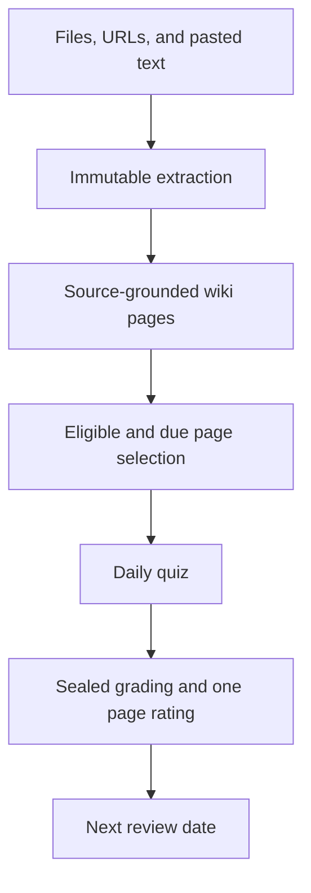

# Pi Scholar

<p align="center">
  
</p>

<!--
Original author notes preserved from the working draft:

Pi Scholar turns a personal source library into a local, evidence-grounded wiki and a bounded daily review practice using research based methods.

Pi Scholar v0.0.1 is usable but extremely primitive, the methods are good but not frontier level, and interfaces may change. The plan is to establish a roadmap after v0.0.1 toward the optimal system intended for v1.0.0.

Pi Scholar is intended to automate the learning process and remove the friction of typical learning. At the University of Pittsburgh, I noticed that even very capable students often found it difficult to begin studying for an exam or project. The v0.0.1 goal is to remove that friction; later versions should apply stronger research-backed learning methods.

Think of the project in relation to Engram, but with less friction for the learner. Engram is a wonderful project that works well but asks more of the user in deciding what to learn and initiating the experience.

For now, Oh My Pi is recommended. The project is still primitive in how it approaches its architecture, and Oh My Pi simplifies context-management problems that are harder under bare Pi, such as fanning ingestion work out to subagents so one model context does not become too large.

Future versions should fully support bare Pi. For v0.0.1, recommending Oh My Pi is a reasonable tradeoff.

A high-quality model is recommended because model quality affects wiki quality, which affects quiz quality.

During initialization, keep Pi Scholar in maintenance mode while adding, extracting, ingesting, and linting sources. The goal is to make the wiki stable enough to begin learning. Once initialization is complete, turn maintenance mode off.

The recommended routine is to extract up to three sources every day. Run daily quizzes and grading from Monday through Saturday. On Sunday, use maintenance mode to ingest the week’s extracted material and lint the wiki. Seven daily extraction batches can prepare up to 21 sources, although ingestion itself has no hard cap. Freezing quiz publication during larger wiki changes avoids difficult cases where a page changes between quiz publication and grading.
-->

**Pi Scholar is a local-first learning system that turns a personal source library into a sourced wiki and a manageable daily study practice.**

It is built for people who want to learn from their own books, papers, notes, websites, and code without planning every study session by hand.

> **Status for v0.0.1:** Pi Scholar is usable but still primitive. Its current learning methods are sound but not state of the art. Its interfaces may change after v0.0.1. After the release of v0.0.1, the project will establish a public roadmap towards my ideal learning system for v1.0.0.

## What is Pi Scholar, and why does it exist?

The idea came from my time at the University of Pittsburgh. I noticed that very capable students often struggled with actually beginning to study for an exam or project. The problem was not that they were unable to understand the material. The problem was that useful studying required a chain of smaller decisions before the learning could even begin.

You have to decide what matters, find the relevant material, organize it, choose what to study first, and then decide how to test yourself. By the time all of that is done, it is easy to lose the time or energy that was supposed to go toward learning.

Pi Scholar is intended to take responsibility for more of that process. The learner should be able to collect worthwhile material and then return to a system that has a reasonable answer to **"What should I work on today?"**

In practical terms, the system tries to:

1. preserve the material you collect and where it came from;
2. turn that material into a durable, source-grounded wiki;
3. determine which pages are ready and worth reviewing;
4. prepare a focused quiz from the relevant evidence;
5. grade the result and schedule the next review.

For v0.0.1, the main goal is to make this loop reliable enough that it genuinely reduces the friction of studying. Later versions will focus more heavily on improving the learning process and increasing the reliability of the wiki system.

### Learning foundation

The learning side of Pi Scholar began with Dunlosky et al.’s 2013 review, *Improving Students’ Learning With Effective Learning Techniques*. The paper evaluates various common learning techniques across different learners, materials, learning conditions, and types of assessment.

The authors rated **practice testing** and **distributed practice** as high-utility techniques because their benefits generalized across a wide range of conditions. Those findings shaped Pi Scholar’s central decisions: learners regularly retrieve knowledge through quizzes, and wiki pages are scheduled for review over time rather than simply reread.

> John Dunlosky, Katherine A. Rawson, Elizabeth J. Marsh, Mitchell J. Nathan, and Daniel T. Willingham, [“Improving Students’ Learning With Effective Learning Techniques: Promising Directions From Cognitive and Educational Psychology”](https://www.wku.edu/senate/documents/improving_student_learning_dunlosky_2013.pdf), *Psychological Science in the Public Interest* 14, no. 1 (2013): 4–58. [DOI: 10.1177/1529100612453266](https://doi.org/10.1177/1529100612453266)

## What Pi Scholar can do today

Pi Scholar is still early, but the full source-to-review path already exists:

- It can stage files, URLs, pasted text, notes, code, directories, and repositories. Document inputs include PDF, EPUB, DOCX, PPTX, XLSX, HTML, and common image formats.
- It preserves provenance instead of treating extracted text as anonymous model context. Wiki knowledge remains connected to immutable source chunks and retained attachments.
- It builds a Markdown wiki through guarded ingest and lint workflows. The model can propose changes, but the application validates and commits the durable result.
- It chooses daily material from pages that are active, due, free of unresolved drift, and no longer blocked by prerequisites.
- It requires every published quiz question to point back to authorized page and source evidence.
- It schedules wiki pages rather than creating a second collection of permanent question cards. Each covered page receives at most one bundled FSRS rating per quiz, and every resulting interval is day-scale to match the daily quiz cadence.
- It keeps the durable work local in the vault: Markdown pages, source records, quizzes, SQLite state, and local Git checkpoints.
- It includes a browser interface for the normal workflow, with Today, Notes, Add sources, History, Workflows, Settings, and Health.

## How I recommend using v0.0.1

### Use Oh My Pi for now

At least for v0.0.1, I recommend running Pi Scholar through **Oh My Pi** rather than relying on a bare Pi setup. This is a practical recommendation, not a statement that Scholar should depend on Oh My Pi forever.

For example, one of the difficult part sof ingestion is preventing the model's context from exploding while ingesting 21 sources. As a weekly batch may contain many unrelated sources and wiki changes, Oh My Pi can reasonably fan that work out to subagents. Each agent receives a smaller and more relevant context, so no single model session has to carry the entire ingestion job.

I plan to support a simpler bare Pi workflow more fully in a later version. For v0.0.1, using Oh My Pi is a reasonable tradeoff because it solves several context-management problems that Scholar would otherwise need to solve itself.

### Use a high-quality model

I also recommend using one of the strongest models available to you. Pi Scholar asks the model to make important judgments during extraction, ingestion, linting, quiz generation, and grading. Those judgments compound: the quality of the model affects the quality of the wiki, and the quality of the wiki affects the quality of the quiz.

A better scheduler cannot rescue poorly extracted knowledge or a weakly written page. At this stage of the project, model quality has a direct effect on the usefulness of the final learning experience.

### Starting Out

Before beginning your actual system, I would recommend starting a smaller couple source system to understand how to utilize Pi Scholar to the fullest benefit without potentially damaging the main system.

## Install

Pi Scholar uses the same npm package for its CLI and Pi integration:

```sh
npm install --global pi-scholar
pi install npm:pi-scholar
```

Initialize a vault and start its local browser interface:

```sh
mkdir -p ~/pi-scholar-vault
pi-scholar init ~/pi-scholar-vault
pi-scholar serve --vault ~/pi-scholar-vault
```

Then open [http://127.0.0.1:4816](http://127.0.0.1:4816).

## Initialize a new vault

A new vault begins in maintenance mode. That is intentional: quiz publishing should remain paused while you add the first sources, build the initial wiki, and repair obvious problems.

Start a Pi-compatible session inside the vault:

```sh
cd ~/pi-scholar-vault
pi
```

Then stage a representative group of sources and run the initial extraction, ingestion, and linting workflows:

```text
/scholar-add ~/Books/example.pdf
/skill:extract
/skill:ingest
/skill:lint
```

This initial setup is still fairly manual in v0.0.1. Use **Notes** to read through the resulting wiki, **Workflows** to confirm that each operation finished, and **Health** to catch missing dependencies or vault problems. The goal is not to create a perfect wiki before learning begins; it is to make the wiki stable and trustworthy enough that its pages can support real quizzes.

When you are satisfied with the initial state, turn maintenance mode off from another terminal:

```sh
pi-scholar maintenance off --vault ~/pi-scholar-vault
```

Then publish the first daily quiz from Pi:

```text
/skill:daily
```

Open **Today** in the browser, answer the quiz, and submit it. The submission is sealed before grading so that the answers and grading context cannot change before the result is settled. Settle that submission from Pi:

```text
/skill:quiz-grader
```

The settled result appears in **Today** and **History**. Pi Scholar applies one bundled rating to each covered wiki page, and those page-level ratings determine the future review dates.

## The weekly routine I recommend

This schedule is not enforced by the application. It is the routine I think makes the most sense for v0.0.1 because it separates ordinary learning from larger changes to the wiki.

### Every day: extract a small batch

Run `/skill:extract` every day, even on days when you are not ingesting. Extraction processes at most three sources at a time. The limit is deliberate: a smaller batch is easier for the model to inspect carefully and less likely to turn one context into an unmanageable collection of documents.

### Monday through Saturday: learn and grade

Run `/skill:daily`, complete the quiz in **Today**, and then run `/skill:quiz-grader`. This keeps the normal learning loop predictable: Scholar selects material from the stable wiki, you answer one focused quiz, and the settled page ratings update the review schedule.

### Sunday: maintain the wiki

On Sunday, run `pi-scholar maintenance on --vault ~/pi-scholar-vault` from a terminal, run `/skill:ingest` in Pi to incorporate the sources extracted during the week, and then run `/skill:lint` to inspect the final wiki and repair accepted issues. Check **Health** when the maintenance work is complete, then run `pi-scholar maintenance off --vault ~/pi-scholar-vault` from a terminal to resume daily quiz publishing.

If extraction runs every day, the three-source limit can prepare as many as 21 sources in one week. Ingestion itself does not have the same hard cap. Twenty-one sources is still a manageable weekly batch when Oh My Pi fans independent work out to subagents, while the daily limit keeps the individual extraction jobs small.

The maintenance day also avoids an awkward learning-state problem. If a quiz is published from one version of a page and that page changes substantially before grading, the system has to reconcile the quiz, the evidence, and the newer page state. Pi Scholar includes revision and drift checks, but it is still simpler and safer to keep the wiki stable during the Monday-through-Saturday learning cycle and reserve larger changes for a clear maintenance window.

## How the learning loop works



Imported material is always treated as untrusted data and never as executable instructions. Pi skills receive limited contexts through typed Scholar tools. Durable changes pass through `ScholarApplication`, which owns validation, locking, SQLite checkpoints, health checks, and local commits.

## Pi commands and skills

| Command | Purpose |
| --- | --- |
| `/scholar-add` | Stage one URL, pasted source, or one or more filesystem paths |
| `/scholar-status` | Show vault, workflow, learning, health, and Git facts |
| `/scholar-issue` | Report an incorrect, unclear, missing, or badly bounded wiki item |
| `/scholar-lint` | Inspect the wiki and propose guarded repairs |
| `/skill:extract` | Convert and publish stable source chunks |
| `/skill:ingest` | Create guarded, source-grounded wiki knowledge |
| `/skill:lint` | Inspect the final wiki and repair accepted issues |
| `/skill:daily` | Propose one evidence-grounded quiz for the vault’s current date |
| `/skill:quiz-grader` | Grade and settle one sealed quiz submission |

Pi Scholar does not launch Pi or control scheduling. Run these workflows manually while evaluating the project, or invoke them from fresh user-scheduled Pi sessions.

## Browser interface

- **Today** — complete the current review and inspect settled feedback.
- **Notes** — browse, search, read, create, and edit wiki pages.
- **Add sources** — upload files, add a URL, paste text, and preview source-removal impact.
- **History** — revisit submitted and settled quizzes.
- **Workflows** — inspect extraction, ingestion, daily, grading, and maintenance activity.
- **Settings** — manage the timezone and inspect maintenance state.
- **Health** — inspect vault integrity and external dependency checks.

The HTTP server binds to `127.0.0.1` by default. It is a local, single-user interface rather than a hosted multi-user service.

## Vault contents

```text
pi-scholar-vault/
├── sources/              retained source packets and attachments
├── wiki/                 durable Markdown learning pages
├── quizzes/              visible quiz records
├── .pi-scholar/
│   ├── state.sqlite      application and learning state
│   └── snapshots/        durable recovery data
└── .git/                 automatic local checkpoints
```

Transient inbox data, conversion work, SQLite journals, and local search indexes are excluded from Git. Ordinary source removal changes current state but does not rewrite existing Git history.

## Requirements

- Node.js `22.19.0` or newer
- [Pi](https://pi.dev)
- Git
- [Docling](https://github.com/docling-project/docling) for rich document conversion
- [qpdf](https://qpdf.sourceforge.io/) for PDF inspection and bounded batching
- [qmd](https://github.com/tobi/qmd) for semantic wiki ranking

Git is required. Missing optional tools are reported by `pi-scholar doctor`; exact and lexical wiki navigation remain available without qmd.

## CLI

```text
pi-scholar init [path]
pi-scholar doctor [path]
pi-scholar maintenance [on|off] [--vault path]
pi-scholar serve [--vault path] [--port port] [--dev-tools]
pi-scholar sync [--vault path]
```

Without `on` or `off`, `maintenance` reports the current state. Run the command inside a vault to omit `--vault`.

`sync` pushes to an already configured Git remote. Pi Scholar does not create remotes or upload vault data automatically.

## Project boundaries

Pi Scholar is intentionally:

- local-first;
- single-user;
- single-writer;
- source-grounded;
- scheduled at the wiki-page level;
- explicit about external synchronization.

It is not currently a general conversational tutor, a shared hosted notebook, or an autonomous daemon. Its focus is the reliable path from trusted source material to an evidence-backed daily learning decision.

## License

[MIT](./LICENSE)
