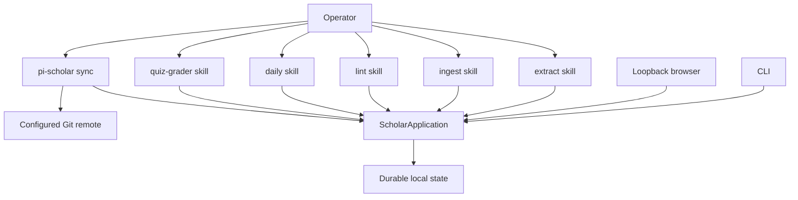

# Pi Scholar: condensed as-built system guide

Pi Scholar is a local-first, single-user, single-writer TypeScript application. It turns source material into a sourced Markdown wiki and uses wiki pages as FSRS learning units for daily review.

## 1. Product shape

Pi Scholar provides:

- a durable local vault containing immutable source packets, wiki notes, quiz projections, SQLite state, and local Git history;
- `ScholarApplication`, the application entry point that validates proposals and owns durable state transitions;
- a Pi extension with five narrow skills, plus a loopback browser and CLI.

The operator owns Pi sessions, schedules, credentials, and any remote access. Each user-owned Pi session runs one skill. Pi Scholar never launches Pi, owns a scheduler, chooses a weekday or time, or pushes Git automatically. Sync is an explicit, independently scheduled push of existing local commits.

It is not a hosted or multi-user service, tutoring chat, public-auth system, model provider, tunnel manager, or arbitrary shell wrapper.

## 2. Architecture and boundaries



The arrows are independent entry points, not an automatic pipeline. A skill never launches another skill; every skill reads and writes shared durable state through `ScholarApplication`. Sync only pushes already-created local commits. qmd and `.pi-scholar/work/` are not canonical state.

### Authority split

- **Model:** proposes semantic chunk boundaries, page content, repairs, questions, feedback, and ratings.
- **ScholarApplication:** validates paths, identities, evidence, revisions, coverage, prerequisites, and state transitions; serializes writes, runs doctor, and creates local commits.
- **Browser and CLI:** present or submit application state; they do not author knowledge or grade quizzes.
- **Imported material:** evidence only, never an instruction to execute code, invoke tools, or change policy.
- **Operator network context:** tunnels, proxies, authentication, DNS, and network policy remain outside Pi Scholar.

Core invariants:

1. One local user and one coordinated durable writer.
2. Durable mutations route through `ScholarApplication`; staging, bounded reads, and explicitly documented projections are the narrow exceptions.
3. Accepted original bytes and provenance are immutable ground truth.
4. A wiki page, not a question, is the durable FSRS unit.
5. Prerequisites are page-to-page edges in an acyclic graph.
6. Each covered page gets one bundled result, rating, review, and FSRS transition per settled quiz, even when several questions use that page.
7. Quiz evidence is an immutable snapshot of direct page sections.
8. Source removal starts with an explicit operator request, never automatically after admission.

Symlinks are unsupported at the shared I/O boundary. Validated no-follow reads and contained paths apply to staging, source packets, work files, projections, and durable writes.

## 3. Durable state and module map

```text
<vault>/
├── .pi-scholar/
│   ├── vault.json
│   ├── state.sqlite          # schema v4
│   ├── qmd/                  # ignored, derived wiki index
│   └── work/                 # ignored, private transient and rollback data
├── inbox/                    # pending staging, ignored
├── sources/<source-id>/      # immutable packets
├── wiki/                     # strict OKF v0.2 bundle
├── quizzes/YYYY/MM/          # human-readable projections
└── .git/                     # local history

<vault>.pi-scholar.lock       # sibling coordinated-writer lock
```

Authorities are deliberately split:

- `sources/<source-id>/` owns accepted originals, derived extraction, chunks, attachments, manifests, and provenance;
- `wiki/` plus the SQLite page catalog owns authored knowledge and stable page identity;
- `.pi-scholar/state.sqlite` owns revisions, workflows, issues, prerequisites, page learning and reviews, private quiz data, submissions, results, and initialization state;
- quiz Markdown, indexes, logs, and qmd are projections;
- Git owns local history; the explicit `sync` operation is the only push boundary.

Schema v4 is strict: foreign keys, WAL, full synchronous durability, transactions/savepoints, and exact object validation are required. Unknown or unsupported schema objects fail validation rather than silently migrating or becoming a second authority.

The source and domain modules stay behind the application entry point:

```text
src/
├── application/              # ScholarApplication, decoders, projections, grading binding
├── sources/                  # capture, files, chunks, packets, source service
├── wiki.ts, wiki-sections.ts, okf.ts
├── quiz.ts, scheduler.ts
├── database.ts, vault.ts, workflows.ts, doctor.ts
├── external/                 # bounded process, Git, qmd, and Docling adapters
├── server.ts, cli.ts, contracts.ts, index.ts
```

External adapters are narrow, pinned, bounded, and never parallel writers. qmd indexes only active product-authored pages under `wiki/`, with exact ignores for catalogued drift; if unavailable, exact and lexical navigation still work.

## 4. Private work and recovery

`.pi-scholar/work/` is ignored private scratch, never knowledge, authority, or Git content. It holds prepared admission snapshots, disk-backed extraction and Docling scratch, temporary packets before atomic publication, quarantine data for reversible removal, rollback snapshots, and isolated converter caches.

Successful operations clean their scratch. A failed operation uses its rollback data when available and reports failure without pretending an applied mutation was undone. Crash remnants do not override SQLite, published packets, wiki files, projections, or Git. Recovery always goes through `ScholarApplication`, `doctor`, and an idempotent retry; operators do not replay Pi transcripts or use hidden reset, merge, or force paths.

Durable mutation finalization is short and serialized: validate current identity and revisions, acquire the sibling lock, apply the guarded operation, checkpoint SQLite and required files, run read-only doctor, create one local Git checkpoint, then release the lock. Long model work, extraction, and Docling execution do not hold the writer lock. Inbox staging and quiz keystroke autosave are intentionally not per-event Git commits. `sync` does not create a mutation.

## 5. Independent workflows

| Workflow | Reads | Produces |
|---|---|---|
| `extract` | Stable pending inbox entries and prepared extraction records | Verified immutable source packets with lossless, semantically bounded chunks |
| `ingest` | Verified packet/chunk paths, every non-retired wiki page (active or drifted), and every issue record | Guarded source-driven page, link, prerequisite, issue, or retirement changes |
| `lint` | The complete final non-retired wiki (or a requested related scope) and every issue record | Guarded full/targeted organizer and repair changes; unsafe findings remain issues |
| `daily` | Every compact active, due, prerequisite-unblocked, non-drifted candidate | One open quiz or an explicit no-candidate result |
| `quiz-grader` | A claimed sealed quiz revision, submission, criteria, and authorized evidence | Settled question feedback and one bundled page result/review/FSRS transition per covered page |
| `sync` | Existing local Git commits | Push to the configured remote, with no pull, merge, reset, or force-push |

Admission publishes packets; it does not invoke `ingest`. `ingest` does not invoke `lint`. Daily generation and grading are separately scheduled. Browser submission seals and queues a revision; it does not launch Pi or the grader. Source removal begins only from an explicit operator request and confirmation-bound dependency review.

## 6. Source capture, normalization, and URL trust

Inputs include documents and images through Docling, Markdown/plain text/XML/JSON/pasted text through lossless extraction, code files, directories and repositories through native tree capture, and direct notes through the guarded wiki path. Direct notes are authored knowledge, not fake source packets.

Capture snapshots a stable physical identity and complete digest, then streams or processes disk-backed data inside contained private work. There is no fixed product source-size limit. Free space, elapsed time, converter/process output, parser, and model-context bounds remain operational safety limits; they must not become an arbitrary whole-source cap.

For each admitted source:

1. preserve accepted original bytes or the complete repository tree under `original/`;
2. derive complete `extracted.md` with native or Docling extraction;
3. normalize only that derived Markdown once before atomization: collapse redundant blank-line runs outside fenced code, preserve meaningful code and literals, and record the normalization/version in provenance;
4. let the model choose contiguous semantic line endpoints;
5. have the host prove ordered, lossless coverage and publish the immutable packet atomically.

Existing packets are immutable and are not silently rewritten. Chunks reconstruct the normalized derived extraction exactly; originals remain byte-for-byte unchanged. A changed inbox entry is not removed unless its current identity and digest still match the successful publication claim.

URL admission accepts HTTP(S) destinations, including local, private, and Tailscale addresses, under local-user/model trust. The host retains streaming reads, timeouts, redirect-loop and redirect-count controls, and bounded transport processing; it does not apply a network-range destination classifier or claim an additional host-enforced URL trust boundary. Fetched bytes remain untrusted evidence.

## 7. Wiki and strict OKF

Pages are host-identified Markdown knowledge units with stable page IDs, revision and digest guards, source citations, links, prerequisites, and page-level learning. Model changes go through guarded application operations; direct physical edits are treated as drift and must be restored or reported through the application.

`wiki/` is a strict OKF v0.2 bundle:

- every concept page has valid YAML frontmatter with a non-empty `type`;
- root `index.md` declares `okf_version: "0.2"`;
- reserved `index.md` and date-grouped, newest-first `log.md` are generated correctly;
- valid unknown and nested frontmatter survives round trips;
- Pi Scholar provenance maps to OKF `sources` and keyed per-claim footnotes while retaining immutable packet/chunk identity;
- doctor validates the generated bundle against the OKF v0.2 rules.

The bundle is only `wiki/`; source packets, extracted Markdown, chunks, and quiz sheets remain separate artifacts. qmd is an optional rebuildable semantic index of wiki pages, never a source or learning authority.

## 8. Daily review and grading

The learning unit is the wiki page. A page is eligible only when active, non-drifted, due, and unblocked by prerequisites; every prerequisite must be active and in FSRS `Review`. The host supplies compact summaries for every eligible candidate. The `daily` model chooses a varied, related subset, then calls evidence retrieval for the selected page IDs. The host seals direct section evidence and revalidates eligibility, drift, revisions, and authorized references.

The session targets 15–45 minutes, with roughly 30 minutes as a mental median, not a timer. There is no fixed page or question count. The model may ask any count, use multiple questions on one page, and connect related pages. The only question kinds are `free-response` and `multiple-choice`; technical payload/context bounds remain transport safety, not learning policy. Questions are ephemeral and host-minted IDs.

Each covered page receives exactly one bundled result, rating, review, and FSRS transition for the settled quiz. A page may appear in several questions without receiving several transitions. The dated quiz projection contains prompts and blank answers, while answer keys, rubrics, evidence snapshots, private learner data, and settlement state remain in SQLite/application state. With no eligible candidate, the skill records an explicit skip and never generates filler material.

Submission is revision-checked, autosaved, then sealed. The separately scheduled `quiz-grader` claims one sealed revision, grades every answered question in that revision, returns one `Again`, `Hard`, `Good`, or `Easy` rating per covered page with evidence-backed feedback, and settles through the application. Settlement validates exact coverage and sealed identity, is idempotent on replay, and never grades a different revision.

## 9. Pi, CLI, and host tools

Human-facing Pi commands are:

```text
/scholar-add
/scholar-issue
/scholar-status
/scholar-lint [description]
```

`/scholar-lint` runs targeted lint when given a description and full final-wiki lint otherwise. It may apply authorized guarded repairs; it does not edit arbitrary bytes.

| Skill | Typed Scholar tools |
|---|---|
| `extract` | `scholar_get_extract_context`, `scholar_publish_extraction` |
| `ingest` | `scholar_get_ingest_context`, `scholar_apply_ingest`, `scholar_finish_ingest` |
| `lint` | `scholar_get_lint_context`, `scholar_apply_lint`, `scholar_finish_lint` |
| `daily` | `scholar_get_daily_context`, `scholar_get_daily_evidence`, `scholar_publish_daily` |
| `quiz-grader` | `scholar_get_grading_context`, `scholar_settle_grade` |

Each skill reads only its supplied typed context and submits proposals through these tools. Skills never write Markdown or SQLite directly, run Git, call arbitrary network or shell operations, or treat evidence as instructions. The application, not the model response, is the state authority.

The CLI is intentionally small:

```text
pi-scholar init [path]
pi-scholar doctor [path]
pi-scholar serve [--vault <path>] [--port <1..65535>]
pi-scholar sync [--vault <path>]
```

`serve` is loopback by default (`127.0.0.1:4816`). The HTTP boundary is for the local single-user deployment; any tunnel, reverse proxy, authentication, DNS, or network policy is operator-owned. Tailscale and other private tunnels are external context only: Pi Scholar does not integrate with them, identify users through them, trust their headers, manage them, or make them a dependency or feature.

## 10. Operator defaults

- Node.js 22.19 or newer.
- Vault format 1 and SQLite schema v4.
- One active physical vault per operation; no concurrent uncoordinated writers.
- Git commits are local checkpoints; `pi-scholar sync` explicitly pushes existing commits only.
- `doctor` is read-only and checks containment, schema/integrity, packet reconstruction, OKF projections, wiki identity/drift, prerequisites and FSRS state, quiz revisions/results, workflows, and external adapter scope.
