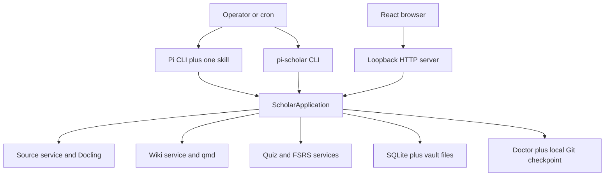
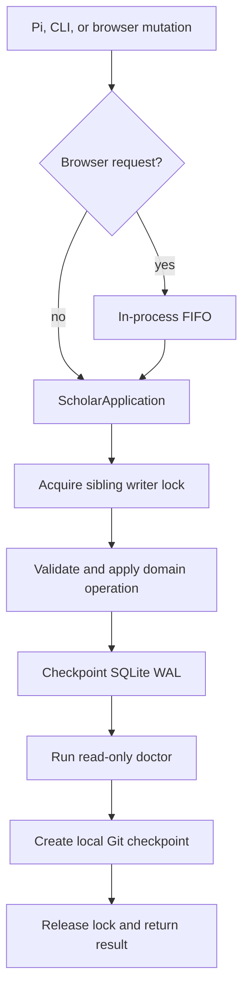
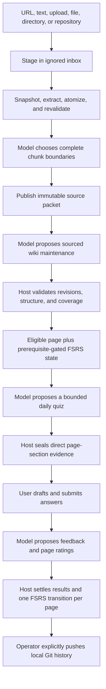

# Pi Scholar: condensed as-built system guide

> Condensed companion to `pi-scholar-system.md`, based on the repository as of 2026-08-09.
> Executable source is the as-built truth; `pi-scholar.md` remains the product and architecture intent.
> Use the full guide for exact tables, routes, tools, edge cases, and the complete discrepancy inventory.

## 1. Product shape

Pi Scholar is a local-first, single-user TypeScript application. It turns source material into a sourced Markdown wiki, then uses wiki pages as FSRS learning units for daily quizzes.

It is four things:

- a durable local vault containing sources, notes, quiz projections, SQLite state, and Git history;
- a deterministic host that validates model proposals and owns every state transition;
- a Pi extension with narrow skills for admission, maintenance, quiz generation, and grading;
- a loopback browser for staging sources, reading notes, answering quizzes, and inspecting state.

It is not a hosted service, multi-user system, tutoring chat, public-auth system, job scheduler, model provider, or arbitrary shell wrapper. The operator starts Pi, schedules skills, configures credentials outside the vault, starts the browser, and explicitly pushes Git state.

## 2. Architecture



### Authority split

- **Model:** proposes semantic choices—chunk boundaries, note content, quiz questions, feedback, and ratings.
- **Host:** validates proposals, mints IDs, checks evidence and revisions, serializes durable writes, updates files and SQLite, applies FSRS, runs doctor, and commits locally.
- **Browser:** presents host state and submits user actions; it does not author knowledge or grade quizzes.
- **Imported content:** evidence only. It is never an instruction to execute code or invoke tools.

### Core invariants

1. One local user and one coordinated durable writer.
2. Durable operations route through `ScholarApplication`, except documented bootstrap, staging, draft, and read-shaped paths.
3. Accepted source bytes and provenance are immutable ground truth.
4. A wiki page—not a question—is the durable FSRS unit.
5. Prerequisites are page-to-page edges in an acyclic graph.
6. Each covered page receives at most one bundled rating and FSRS transition per quiz.
7. Quiz evidence is an immutable snapshot of a specific page section.
8. Pi Scholar does not launch Pi, own provider credentials, or push Git automatically.

## 3. Durable state

```text
<vault>/
├── .pi-scholar/
│   ├── vault.json
│   ├── state.sqlite
│   ├── snapshots/wiki/
│   ├── qmd/                 # derived, ignored
│   └── work/                # temporary, ignored
├── inbox/                   # unaccepted staging, ignored
├── sources/<source-id>/     # immutable packets
├── wiki/                    # authored notes and projections
├── quizzes/YYYY/MM/         # human-readable quiz projections
└── .git/

<vault>.pi-scholar.lock      # sibling writer lock
```

Authority is deliberately split:

- source packets preserve canonical accepted bytes, extraction, chunks, attachments, and provenance;
- wiki Markdown plus the page catalog form canonical knowledge;
- SQLite owns identity, revisions, workflows, prerequisites, FSRS, private quiz data, and results;
- quiz Markdown, wiki indexes, and qmd are projections;
- Git is durable local history and the explicit sync boundary, not the live database.

SQLite schema v3 uses foreign keys, WAL, `synchronous=FULL`, immediate outer transactions, nested savepoints, and a truncating checkpoint during durable finalization. The schema is exact: unsupported or unknown objects fail validation rather than migrate automatically.

Paths must remain normalized and contained. Sensitive I/O rejects symlinks and uses no-follow checks. File replacement is atomic where the domain requires it. The sibling lock is removed as stale only after verifying that its recorded process is gone and its bytes still match.

## 4. Durable mutation path



Composite wiki maintenance snapshots affected rows and files and restores them when operation or pre-commit finalization fails. If an operation without rollback has already applied and later finalization fails, the host reports `MUTATION_APPLIED_FINALIZATION_FAILED`; it does not pretend the mutation was undone.

Intentional exceptions:

- source staging writes only to ignored `inbox/` and does not checkpoint or commit;
- quiz autosave uses the writer lock but avoids a Git commit per keystroke;
- some wiki/context reads lazily create missing learning rows;
- removal preview lazily refreshes dependency rows;
- `init` bootstraps before the application facade exists;
- `sync` locks and safely pushes existing commits without creating a mutation.

## 5. Product flow



### Source admission

The browser stages URL, text, or upload inputs; Pi tools can also stage local files, directories, and repositories. Each source is capped at 100 MiB. URL fetching is HTTP(S)-only, pins and rechecks DNS across at most five redirects, rejects private/metadata networks, and bounds response reads. Local capture uses no-follow copies; repository capture includes tracked and untracked non-ignored files.

Admission snapshots identity and digest, copies into isolated work storage, extracts text natively or through Docling, collects bounded attachments, and splits Markdown into ordered newline atoms. The model may choose only contiguous endpoints that cover extraction exactly once. The host then revalidates the live claim and sealed preparation before atomically publishing the packet and catalog rows.

Removal requires a preview-bound confirmation token. The host rejects stale previews and unsettled submitted-quiz conflicts, quarantines the packet, drifts citation-dependent pages, opens issues, expires affected open quizzes, and records removal.

### Wiki and learning

A note is Markdown with host-owned identity, title, timestamps, and quiz-worthiness. Page IDs survive renames; revisions and paths change. Product-authored writes update the file, SQLite row, authored snapshot, deterministic indexes, and qmd when available.

Search has exact, lexical, and semantic modes. qmd is vault-scoped and rebuildable; exact and lexical search continue without it. Direct edits are drift, not automatically accepted: the operator may restore the authored snapshot or record an issue and then restore it.

Eligible active pages receive one FSRS state. A page becomes due only when every prerequisite is active and has reached FSRS `Review`. Prerequisite updates reject missing pages, self-edges, ineligible pages, cycles, and stale learning revisions.

### Quiz and grading

The daily-quiz skill receives at most four due pages and immutable evidence from direct ATX-heading sections. The model may propose at most four questions, including at most two multi-page synthesis questions. The host requires exact selected-page coverage, authorized references, and direct evidence, then mints all IDs and keeps answer keys, rubrics, evidence snapshots, and FSRS state private.

An open quiz supports revisioned autosave. Submission requires a complete current-revision answer set, seals the answers, and queues a grader workflow in the same transaction. Sealed or expired quizzes cannot be edited.

A grader claim is tied to the exact quiz revision and submission, with a 15-minute renewable lease. Settlement validates exact question/page coverage and commits question feedback, one page result, one page review, one FSRS transition per covered page, and workflow success. Exact replay is idempotent; invalid grading does not change learning state.

## 6. Interfaces

### Pi

Packaged skills are intentionally separate runs:

- source admission;
- wiki maintenance;
- daily quiz generation;
- quiz grading.

General Pi tools stage sources, create notes, preview/confirm source removal, search, report issues, and show status. Skill tools expose only the context and proposal endpoints required by that skill. Every skill treats source text as evidence and forbids direct filesystem, database, Git, network, and shell manipulation.

### CLI

```text
pi-scholar init [path]
pi-scholar doctor [path]
pi-scholar serve [--vault <path>] [--port <1..65535>]
pi-scholar sync [--vault <path>]
```

`serve` binds `127.0.0.1:4816` by default. `sync` performs only a safe push and refuses divergence; it does not pull, merge, reset, or force-push.

### Browser and HTTP

The React SPA provides Today, Notes, Add, History, Workflows, Settings, and Health views. The Node HTTP server exposes the same application facade over a versioned JSON API.

The boundary is loopback protection, not authentication: Host and Origin must match loopback, cross-site fetches are rejected, mutations require a custom marker, bodies are bounded, and responses carry CSP/frame/content-type/referrer protections. Another process running as the same OS user is inside the assumed trust boundary.

Markdown does not render raw HTML, execute Mermaid, or fetch images. Internal note links stay inside the Notes UI; external HTTP(S) links receive safe attributes.

## 7. External tools, health, and recovery

Git, qmd, and Docling run without a shell through pinned executable paths, closed argument shapes, bounded output, isolated environments, and timeouts. Git hooks and prompts are disabled. qmd is restricted to the vault wiki collection. Docling reads and writes only validated work-relative paths.

`doctor` is read-only. It checks vault containment, exact SQLite schema/integrity, source packet reconstruction, workflows and leases, wiki identity/snapshots/drift, prerequisites and quiz projections, and external dependency identity/scope. Missing qmd or Docling is a warning; unsafe roots, malformed durable state, and Git divergence fail health.

Recovery stays boring:

1. run `doctor`;
2. rerun the idempotent operation or skill;
3. push only after local state is healthy;
4. never replay Pi transcripts or use hidden reset/merge/force paths.

## 8. Important current limits

The full guide contains the exhaustive discrepancy list. The limits most likely to affect behavior are:

- staging and several read-shaped writes sit outside the full durable mutation path;
- source dependency rows are rebuilt lazily during removal preview;
- wiki maintenance grounding is partly a skill/model contract rather than host-verified packet citations;
- prerequisite maintenance lacks the unresolved-quiz guard used by page edits;
- scheduler due-date conversion can disagree with the configured quiz timezone;
- due selection is first-four deterministic order, without topical interleaving or submitted-unsettled overlap filtering;
- quiz projection and SQLite updates are protected against ordinary operation failure but are not one crash-atomic filesystem/database commit;
- missing wiki files do not enter the normal drift-recovery flow, and ordinary qmd refresh failure can leave semantic search stale;
- loopback HTTP checks are not same-user authentication, and uncategorized errors currently map to 400 with their message/code;
- CI covers static, unit, package, and mocked HTTP checks—not a full provider, Pi, Docling, qmd, or browser end-to-end.

## 9. Defaults and verification

| Item | Value |
|---|---|
| Node | 22.19 or newer |
| Vault / SQLite schema | 1 / 3 |
| Bind address | `127.0.0.1:4816` |
| Source limit | 100 MiB |
| HTTP redirects | 5 |
| JSON request limit | 1 MiB |
| Quiz questions / synthesis questions | 4 / 2 maximum |
| Grader lease | 15 minutes |
| Quiz autosave | about 800 ms |
| Generic child timeout/output | 120 seconds / 64 KiB |
| Docling timeout | 300 seconds |

Local verification:

```sh
npm run verify
npm pack --dry-run --json
```

Black-box evals use disposable vaults and a real Pi actor plus an optional model judge. Full release validation also exercises real qmd/Docling/provider/browser flows, restart and replay behavior, failure paths, prompt injection, and credential leakage. Destructive validation must never target a real user vault.
