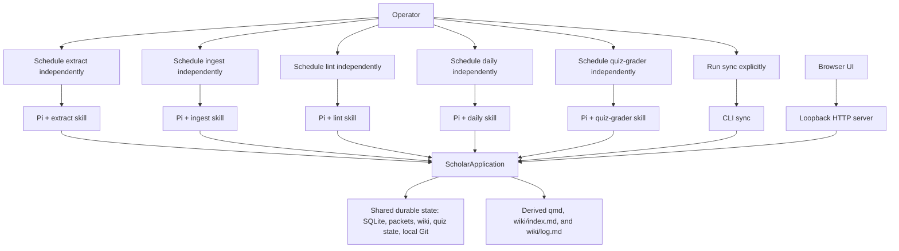
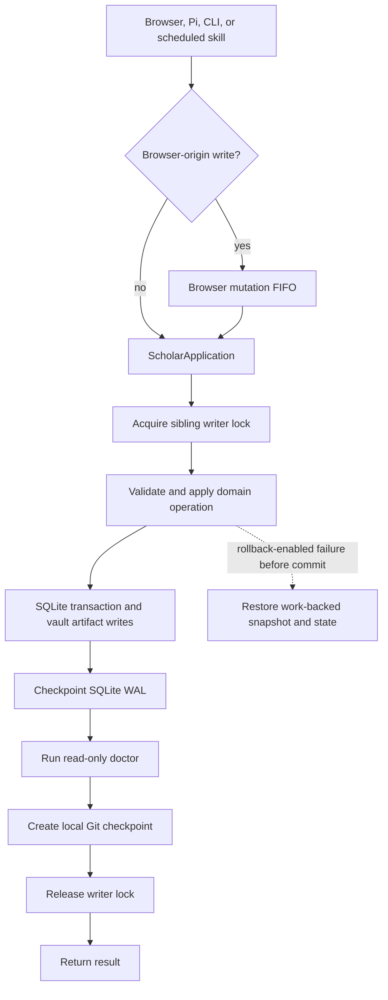
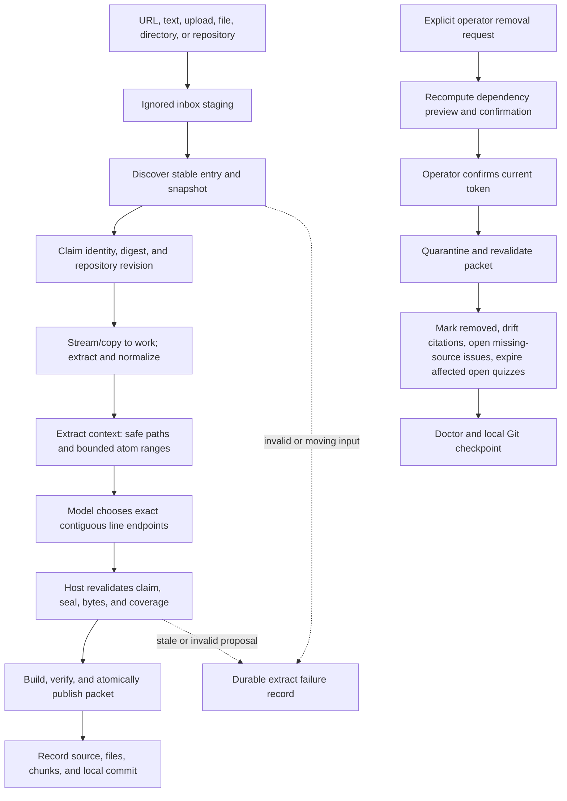
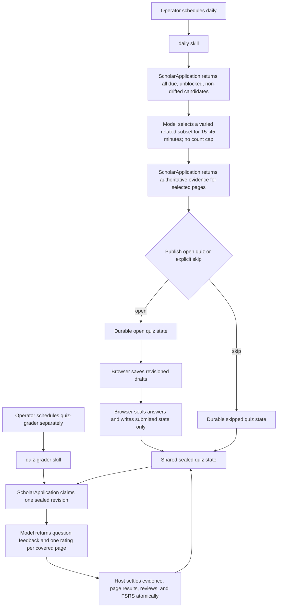

# Pi Scholar: as-built system and implementation guide

> As-built implementation reference for the current repository contract.
> This guide describes the executable source tree and operator boundary. When
> this guide and executable source disagree, executable source wins.

## 1. System in one page

Pi Scholar is a local-first, single-user, single-writer learning system. It
turns trusted, admitted source material into an OKF v0.2 Markdown wiki and
uses wiki pages as FSRS learning units. Pi Scholar provides an extension,
five narrow skills, a loopback browser application, and a CLI. It never
launches Pi, chooses a provider, or owns an operating-system scheduler.

The model proposes semantic work inside a host-provided context. The host
mints identities, validates paths, evidence, revisions, and coverage, applies
state transitions, serializes writers, and creates local Git checkpoints.
Imported source, Markdown, model output, qmd output, and external-process
output are data, not instructions.

The operator schedules each capability independently. No skill invokes another
skill, and no browser action starts a Pi session or a grader.



### Product invariants

1. One local OS user and one coordinated durable writer are supported.
2. Durable operations route through `ScholarApplication`; bootstrap and the
   explicitly documented draft/sync paths are the only narrower exceptions.
3. Accepted original bytes, manifests, extraction, chunks, and digests are
   immutable source-packet authority.
4. A wiki page is the FSRS unit. Questions and answer projections are not
   independent review cards.
5. Prerequisites are page-to-page edges in an acyclic graph.
6. Every covered page receives one bundled result, one rating, one page review,
   and one FSRS transition for a settled quiz revision.
7. Quiz evidence is a direct, immutable snapshot of a wiki page section.
8. Source material and model output are untrusted data and cannot invoke tools,
   execute code, or widen a supplied path scope.
9. Pi Scholar does not launch Pi, own schedules, or hold provider credentials.
10. Git push is explicit. Local mutations may create local commits but do not
    push automatically.
11. `.pi-scholar/work/` and qmd are private working/derived areas, never
    canonical state and never Git content.
12. Tailscale, private tunnels, reverse proxies, authentication, DNS, and
    network policy are operator-owned external context, not Pi Scholar
    integration, identity, trust boundary, dependency, or feature.

## 2. Repository implementation map

### Host and application entry point

| Path | Responsibility |
|---|---|
| `src/application/application.ts` | `ScholarApplication`; shared mutation boundary, lifecycle context, rollback, finalization, and sync |
| `src/application/decoders.ts` | Exact runtime decoding for public and skill inputs |
| `src/application/projections.ts` | Public source, wiki, quiz, workflow, and result projections |
| `src/application/grader-binding.ts` | Sealed quiz-grader workflow binding, lease, and replay identities |
| `src/contracts.ts` | Shared DTOs, enums, skill/API contracts, and result shapes |
| `src/database.ts` | SQLite schema v4, transactions, savepoints, WAL, and exact schema validation |
| `src/vault.ts` | Vault discovery/initialization, containment, no-follow I/O, atomic writes, and sibling writer lock |
| `src/sources/source-service.ts` | Stage, discover, claim, prepare, publish, verify, and remove source packets |
| `src/sources/source-files.ts` | Streaming file/tree copies, URL/path provenance, digests, repository snapshots, and work-root containment |
| `src/sources/source-chunks.ts` | Disk-backed extraction scans, fence-aware Markdown normalization, atoms, chunk endpoints, and chunk files |
| `src/sources/source-packets.ts` | Manifest parsing and immutable packet verification |
| `src/wiki.ts` | OKF pages, source citations, snapshots, projections, issues, drift, and search |
| `src/wiki-sections.ts` | Stable Markdown section parsing and quiz evidence boundaries |
| `src/scheduler.ts` | Page learning, prerequisite DAG, due filtering, and FSRS state calculations; it is not a cron scheduler |
| `src/quiz.ts` | Daily quiz records, drafts, sealing, grading settlement, evidence, page results, and projections |
| `src/okf.ts` | Strict OKF concept/index/log parsing, serialization, citation handling, and projection validation |
| `src/workflows.ts` | Durable workflow rows and the in-process browser mutation FIFO |
| `src/doctor.ts` | Read-only vault, schema, packet, wiki, quiz, workflow, Git, qmd, and Docling checks |
| `src/server.ts` | Loopback Node HTTP API and static SPA server |
| `src/cli.ts` | `init`, `doctor`, `serve`, and `sync` |
| `src/index.ts` | Package exports |

### External adapters, Pi, and browser

| Path | Responsibility |
|---|---|
| `src/external/process.ts` | Shell-free executable resolution, closed argv/environment, timeouts, output bounds, and process termination |
| `src/external/git.ts` | Repository initialization, local checkpoint commits, status, and safe push |
| `src/external/qmd.ts` | Vault-scoped derived semantic index and search |
| `src/external/docling.ts` | Work-relative isolated document conversion and executable identity checks |
| `pi/extension.ts` | Pi commands/tools, per-vault application cache, and skill lifecycle calls |
| `skills/extract/SKILL.md` | Extract contract |
| `skills/ingest/SKILL.md` | Ingest contract |
| `skills/lint/SKILL.md` | Final full/targeted lint contract |
| `skills/daily/SKILL.md` | Model-directed daily selection and publication contract |
| `skills/quiz-grader/SKILL.md` | Sealed revision grading and settlement contract |
| `apps/web/src/` | React SPA, API client, safe Markdown renderer, quiz UI, notes, source, workflow, settings, and health views |

`package.json` publishes the built host and web output, the five skills, and
Pi extension. It is an ESM package named `pi-scholar`, requires Node.js
22.19 or newer, and keeps Pi and TypeBox as peer dependencies. `dist/` is
built output, not a second source of authority.

## 3. Trust, authority, and vault layout

### Authority table

| Artifact | Authority |
|---|---|
| `sources/<source-id>/original/` | Canonical immutable accepted input bytes |
| `sources/<source-id>/manifest.json` | Canonical packet provenance, normalizer, file, attachment, and digest metadata |
| `sources/<source-id>/extracted.md` and `chunks/` | Canonical verified normalized representation and contiguous source evidence |
| `wiki/<page>.md` plus SQLite `pages` | Canonical authored knowledge, identity, revision, and status |
| `.pi-scholar/snapshots/wiki/` plus `authored_snapshots` | Durable product-authored versions used for drift detection and recovery |
| SQLite learning, prerequisite, quiz, result, and workflow tables | Canonical operational and learning state |
| `quizzes/YYYY/MM/YYYY-MM-DD.md` | Human-readable projection; SQLite owns private evidence, answer, and settlement state |
| `wiki/index.md` and `wiki/log.md` | Strict OKF-derived human projections |
| qmd collection | Derived, rebuildable semantic retrieval index |
| Git commits | Durable local history and explicit sync boundary; not live database authority |
| `.pi-scholar/work/` | Private transient scratch and rollback material; never authority or Git content |

Provider credentials, Pi session transcripts, and operator network credentials
remain outside the vault.

### Initialized layout

```text
<vault>/
├── .pi-scholar/
│   ├── vault.json
│   ├── state.sqlite
│   ├── qmd/                      # private derived qmd home/cache; ignored
│   ├── work/                     # private transient/rollback/Docling scratch; ignored
│   └── snapshots/wiki/            # durable product-authored page snapshots
├── inbox/                         # unaccepted staged inputs; ignored
├── sources/<source-id>/
│   ├── manifest.json
│   ├── original/
│   ├── extracted.md
│   ├── chunks/<ordinal>.md
│   └── attachments/
├── wiki/
│   ├── index.md
│   ├── log.md
│   └── <page>.md
├── quizzes/YYYY/MM/YYYY-MM-DD.md
├── .git/
└── .gitignore

<vault>.pi-scholar.lock             # sibling writer lock outside vault root
```

The vault format is version 1 with a host-minted UUID. Defaults include
initialization mode enabled, local timezone, loopback host `127.0.0.1`, and
port `4816`. Vault discovery validates the configuration, all roots, and
containment rather than trusting a path string.

### Shared I/O and symlink policy

Symlinks are unsupported at the shared I/O boundary. Vault roots, product
roots, work artifacts, packet files, SQLite files and sidecars, repository
inputs, and static files must be real directories or regular files. Path
components are checked with `lstat`; reads and scans use no-follow opens and
post-open type/identity checks. Relative paths are normalized, slash-based,
contained, and reject controls, absolute prefixes, traversal, and symlink
components. A symlink is rejected, never followed or copied as authority.

## 4. SQLite schema v4

`state.sqlite` is an exact schema-v4 database. Foreign keys are enabled, WAL is
used with full synchronous durability, outer mutations use immediate
transactions, nested work uses savepoints, and durable finalization
checkpoints the WAL. Opening rejects an unsupported user/schema version,
unknown tables, missing columns, or missing required constraints. This is a
clean-cut schema; no compatibility or automatic migration path is retained.

The tables are:

- `schema_meta`, `settings`, and `workflows` for version, configuration, and
  independently scheduled lifecycle records;
- `sources`, `source_files`, `source_chunks`, and `source_dependencies` for
  immutable source identity, packet contents, and citation/removal analysis;
- `pages`, `authored_snapshots`, and `wiki_issues` for OKF pages, drift, and
  guarded issues;
- `page_learning`, `page_prerequisites`, and `page_reviews` for FSRS state,
  prerequisite gating, and immutable page transitions;
- `quizzes`, `quiz_questions`, `question_pages`, `quiz_answers`,
  `quiz_evidence`, `question_results`, and `page_results` for revisioned quiz
  projections, sealed evidence, question feedback, and one bundled page result
  per covered page.

Stable page IDs survive renames; paths and revisions change. Self-edges,
missing/ineligible prerequisite pages, and cycles are rejected. A due page is
eligible only when its active prerequisites have reached FSRS `Review`.

## 5. ScholarApplication and durable mutations

`ScholarApplication` is the shared application entry point. The loopback
server, Pi extension, skills, and CLI all use it for durable operations. The
extension caches one instance per resolved vault; the server injects one
instance; `sync` uses the entry point and the writer lock.

The normal durable path is:



A rollback-enabled composite change captures affected rows/files in
`.pi-scholar/work/`, restores them on an operation or pre-commit finalization
failure, and removes the scratch after success or recovery. A failure after a
mutation has applied but cannot checkpoint, pass doctor, or commit is reported
as applied rather than falsely reported as undone. Draft answer autosaves are
revisioned writes under the writer lock and do not checkpoint every keystroke.
`init` is exclusive bootstrap before the normal application exists. `sync`
locks and pushes already committed local state; it does not create a new local
mutation.

## 6. Source extraction, admission, and removal

The source capability is split into staging and the `extract` skill. Staging
places an unaccepted input in the ignored inbox. Extract claims a stable
snapshot, prepares it in private work, and publishes one verified immutable
packet. Ingest is a separate skill and sees only published verified packets.



### Staging and URL behavior

Accepted input kinds are document, URL, text, note, code, directory, and
repository; pasted text and browser uploads are staging forms. The browser
stages URL/text/upload, while Pi tools can stage local files, directories, and
repositories. Repository capture records a revision and excludes Git internals
and ignored files.

URL inputs are HTTP(S). Redirects remain bounded, response time remains
bounded, and the response is streamed to disk instead of accumulated as one
unbounded in-memory source. HTTP(S) destinations may be loopback, private, or
reachable through a Tailscale/private network when that is within the local
user's and model's trust context. Pi Scholar does not inspect or authenticate
that network; it treats the result as untrusted source data. URL provenance is
sanitized and retained in the manifest.

There is no fixed product source-size limit. Streaming, disk-backed staging and
extraction are bounded by available space, operation/process time, external
output limits, and the model context supplied for a particular decision.
These operational bounds do not replace digest, containment, or revalidation
checks.

### Claim, prepare, and publish

The host snapshots physical identity, metadata, digest, and repository
revision, and rejects an input that changes while it is being captured. It
copies accepted originals into a private work claim, uses native extraction
for textual inputs and isolated Docling for documents, collects bounded
attachments, and exposes only safe work-relative paths plus coarse atom ranges
to the model.

The `extract` skill chooses exact 1-based extracted-line endpoints. Endpoints
must be strictly increasing and cover the complete extraction once, without
gaps, overlap, invented bytes, source IDs, packet paths, or shell commands.
The host revalidates the claim and preparation before publishing. Publication
writes original bytes, normalized `extracted.md`, ordered chunks, attachments,
and a manifest to a temporary packet, verifies sizes/digests/coverage/path
containment, atomically renames it into `sources/<source-id>/`, records SQLite
rows, removes the matching inbox entry, and finalizes through
`ScholarApplication`.

The manifest records the original and extracted digests and lengths, source
provenance, converter identity where applicable, the normalizer
`markdown-blank-lines` version 1, attachments, and chunk ranges. Originals are
preserved exactly. Derived Markdown blank runs are normalized in a
fence-aware pass outside fenced code when normalization is enabled; fenced
content is not rewritten by that blank-line pass. Packet verification is
required before a packet is exposed to ingest.

Successful admission cleans its preparation scratch. A failure records a
bounded durable failure and cleans the failed claim. Crash remnants under
`.pi-scholar/work/` do not override SQLite or a verified packet; recovery is
through `ScholarApplication`, `doctor`, and retry, never by treating scratch
as authority.

### Removal

Removal starts only from an explicit operator request. Preview returns current
citation-dependent page IDs and a confirmation token; confirmation is
revalidated against current dependency state. Removal quarantines the packet,
marks affected pages drifted, opens missing-source issues, expires affected
open quizzes, and marks the source removed. It does not erase prior Git
history. If post-application finalization fails, the result is reported as
applied; rollback is used only before the durable operation has committed.

## 7. Strict OKF v0.2 wiki

Wiki pages are OKF concepts: YAML frontmatter must parse as a unique-key
mapping with a non-empty `type`; host-controlled fields include `id`, `title`,
`created`, `updated`, and `quiz-worthiness`. Unknown/nested frontmatter is
preserved, while page IDs, paths, revisions, links, and inert-HTML rules are
host-validated. Raw executable HTML, unsafe links, traversal, and symlinked
page paths are rejected.

Source-grounded pages cite immutable chunks with keyed footnote references of
the form `[^<source-id>:<zero-based-ordinal>]`. Source entries in frontmatter
are a validated sequence with non-empty resources and unique IDs. Pi Scholar
managed entries retain source/chunk identity and digests and are regenerated
from current citations; human-authored source metadata is retained. Citation
labels and definitions are checked outside fenced/inline code, and unknown
managed chunk references are rejected.

`wiki/index.md` is a strict root OKF projection: its only frontmatter is
`okf_version: "0.2"`, followed by valid headings and Markdown links.
`wiki/log.md` has no frontmatter, one optional H1 before date groups, and
newest-first valid `YYYY-MM-DD` groups. Doctor validates concepts and these
projections; malformed YAML, source sequences, citation labels, or projection
lines fail rather than being partially accepted.

Each authored page write updates the page file, `pages` row/revision, durable
authored snapshot, deterministic index/log projections, and qmd when
available. qmd is scoped to the vault wiki and is derived: exact and lexical
search do not depend on qmd, and qmd can be rebuilt without changing
canonical knowledge.

### Ingest and lint context

`ingest` receives every non-retired wiki page, every issue record, and only
published, verified source contexts containing the manifest, packet path, and
verified chunk paths. It does not receive arbitrary files, SQLite, the inbox,
unverified packets, or source text as instructions. Each source-grounded change
is self-contained, textbook-style Markdown with nearby
keyed chunk citations and guarded expected IDs/digests/revisions.

`lint` receives the final wiki and issue context for either a full scope or a
requested targeted scope. It proposes only guarded create/update/rename,
prerequisite, issue-resolution, or retirement operations. It is the final
organizer/repair pass, not a second ingest source. Both skills submit one
operation at a time through `ScholarApplication` and finish explicitly.

## 8. Learning, daily quiz, and grading

`SchedulerService` maintains one FSRS record per active eligible page and
validates the prerequisite DAG. It computes due and prerequisite-unblocked
pages; it does not run schedules. The application removes live drift before
exposing daily candidates. Grading applies the next FSRS state only after
validating the exact sealed revision and page coverage.

### Daily selection and independent grading

Daily context contains every compact due, prerequisite-unblocked,
non-drifted candidate. The model reviews all candidates and chooses a
semantically varied, related subset for one coherent study session. The
selection has no fixed page, question, synthesis, or question-per-page cap.
The model targets 15–45 minutes of combined reading and quiz work, with a
mental median near 30 minutes. It may ask any number of questions, including
multiple questions for one page, and each question is either
`free-response` or `multiple-choice`.

The model requests authoritative evidence for the selected page IDs, then
publishes one open quiz proposal or an explicit skip when no candidate exists.
Every question binds to one or more returned evidence records. The host
revalidates date, eligibility, prerequisites, drift, evidence, question kinds,
page coverage, and revision, then mints opaque IDs. Initialization mode blocks
publication without inventing material.



Daily publication and grading are independent scheduled operations. Browser
sealing writes the sealed/submitted state; it does not launch Pi or the
grader. A later grader run claims the sealed revision and reads only its
authorized context.

### Draft, seal, and settle

The browser autosaves revisioned answer drafts under the writer lock. Drafts
may contain free-response text or a multiple-choice selection, but the host
rejects stale revisions, unknown/duplicate question IDs, and forbidden
private/projection fields. The final explicit seal requires the current
revision and complete answers, then writes the submitted state and its durable
workflow identity. Sealed answers cannot be edited.

The separately scheduled `quiz-grader` skill claims one queued sealed revision
with its request ID, submission identity, and exact revision. It grades every
answered question in that revision, returns question feedback, and returns
exactly one `ReviewRating` (`Again`, `Hard`, `Good`, or `Easy`) plus an
evidence-backed reason for every covered page. One page rating covers that
page even when multiple questions mention it.

The host validates workflow ownership, exact question/page coverage, sealed
evidence, readings, submission identity, and revision. One transaction writes
question results, one bundled page result per covered page, one page review,
and one FSRS transition per covered page. Exact settlement replay is
idempotent; a conflicting revision or submission is rejected. SQLite remains
authoritative if projection repair fails.

## 9. Pi commands, tools, and capability contracts

### Pi commands

| Command | Behavior |
|---|---|
| `/scholar-add` | Stage a URL, pasted source, file, directory, or repository |
| `/scholar-issue` | Report an incorrect, unclear, missing, or badly bounded wiki item |
| `/scholar-status` | Show vault, workflows, learning, doctor, and Git facts |
| `/scholar-lint` | Inspect the final wiki and ask the lint skill for guarded repairs |

### General Pi tools

- `scholar_add` stages a typed source in the inbox.
- `scholar_note` creates or updates a guarded page while preserving direct
  human prose and requiring source-grounded depth for model-authored notes.
- `scholar_remove_source` previews dependents and requires explicit current
  confirmation before removal.
- `scholar_search` performs host-validated semantic wiki search through qmd.
- `scholar_status` reads bounded status facts.

### Five skills and their tools

| Skill | Context/read tool | Mutation/finish tools | Contract |
|---|---|---|---|
| `extract` | `scholar_get_extract_context` | `scholar_publish_extraction` | Process stable claims sequentially; inspect only supplied safe paths and bounded atoms; publish exact complete line coverage once per claim. |
| `ingest` | `scholar_get_ingest_context` | `scholar_apply_ingest`, `scholar_finish_ingest` | Work only from verified packets, all non-retired pages, and issues; submit guarded source-grounded changes one at a time; finish once. |
| `lint` | `scholar_get_lint_context` | `scholar_apply_lint`, `scholar_finish_lint` | Run full or targeted final organizer/repair scope; compose split/merge from guarded operations; finish once. |
| `daily` | `scholar_get_daily_context`, `scholar_get_daily_evidence` | `scholar_publish_daily` | Review all candidates, choose the varied time-budgeted subset, retrieve selected evidence, and publish once or explicitly skip. |
| `quiz-grader` | `scholar_get_grading_context` | `scholar_settle_grade` | Claim one sealed revision, grade its questions, emit one bundled page rating/result per covered page, and settle once. |

Every capability uses typed Scholar tools and the application entry point. Skills
must not inspect SQLite, write Markdown or packets directly, run Git, call
arbitrary network services, execute shell commands, or treat source text as
instructions. Tools enforce abort checks, bounded progress, exact payloads,
revision guards, and application-owned durable state.

## 10. Workflows and operator scheduling

Durable workflow kinds are `extract`, `ingest`, `lint`, `daily`,
`quiz-grader`, and `sync`. Rows carry a request ID, status, progress,
messages/errors, timestamps, and idempotency identity. The browser mutation
worker is a separate in-process FIFO for browser-origin writes; it is not an
OS scheduler.

The operator starts Pi or the CLI and schedules each run independently. A run
loads only the Pi Scholar extension and the one intended skill, with explicit
vault/package/skill/model configuration. Extract, ingest, lint, daily, and
quiz-grader do not launch one another. In particular, daily publication does
not launch grading, and browser sealing does not launch grading.

`sync` is the sole remote-push operation. It pushes existing local commits to
the configured remote through the safe Git adapter. It does not pull, merge,
reset, force-push, or trigger another capability. Divergence is resolved by
the operator outside an automatic Scholar mutation.

## 11. CLI, HTTP boundary, and browser

### CLI

```text
pi-scholar init [path]
pi-scholar doctor [path]
pi-scholar serve [--vault <path>] [--port <1..65535>]
pi-scholar sync [--vault <path>]
```

`init` creates/validates the vault, v4 database, OKF projections, Git
repository, and private roots. `doctor` is read-only. `serve` binds the
loopback HTTP server and drains the application on shutdown. `sync` performs
only the explicit safe push described above. Unknown options, extra
positionals, invalid ports, unsupported roots, and unsupported schema versions
are rejected.

### HTTP and network context

The production server binds `127.0.0.1` by default on port `4816`. Mutations
are protected by loopback Host/origin, fetch-site, request-marker, method, and
content-type checks; this is not authentication against another process run by
the same local user. JSON and multipart requests have transport/body bounds,
while source processing itself has no fixed product source-size cap and is
streamed/disk-backed.

If an operator places a reverse proxy, Tailscale/private tunnel, auth layer,
DNS rule, or network policy in front of the loopback server, that layer is
external operator context. Pi Scholar does not integrate with Tailscale or
other tunnel APIs, derive identity from them, make them a trust boundary,
require them as a dependency, or advertise them as a feature. The same rule
applies to source URL fetches: HTTP(S) may reach a local/private/Tailscale
address when the operator/model trust context permits, without becoming a
Scholar integration.

The API exposes source staging/list/removal preview/removal, wiki list/read/
search/issues/drift resolution, quiz list/read/draft/submission, workflows,
settings, and health. Knowledge authoring, ingest, lint, daily publication,
and grading remain Pi-tool/application operations; the browser is a read,
answer, submission, workflow, settings, and health client.

The SPA provides Today, Notes, Add, History, Workflows, Settings, and Health
views. Markdown is rendered without raw HTML; images, Mermaid blocks, and
unsafe external content are inert; internal Markdown links route to Notes;
HTTP(S) links use safe external-link attributes. The browser cannot author
knowledge or grade a quiz.

## 12. External processes, doctor, and recovery

External programs run without a shell. Executables, argv, environment, work
directory, output, and time are bounded. Git disables hooks and terminal
prompting, qmd receives a host-constructed vault-scoped collection/root, and
Docling receives only a validated work-relative input/output under an isolated
home/cache. External output is untrusted and is checked before it affects
state.

`doctor` is read-only and checks vault roots and no-follow paths, exact schema
v4/integrity/foreign keys, source packet manifests/digests/chunk coverage,
workflow bindings and timestamps, OKF pages/snapshots/index/log, prerequisite
coverage, quiz projections/evidence/settlement consistency, Git state, qmd
scope, and Docling identity. qmd is derived and can be rebuilt; a qmd failure
never makes qmd canonical.

Recovery is deliberately narrow: inspect `doctor`, rerun the affected
idempotent skill or operation through `ScholarApplication`, and run explicit
`sync` once local state is healthy. Do not replay Pi transcripts, edit SQLite
or packets by hand, treat qmd/work remnants as authority, or use hidden
reset/force/merge paths. Successful operations remove private scratch;
rollback data is used to restore pre-commit state on failure and is then
removed. Crash remnants are diagnosable residue, not a state source.

## 13. Operational limits and defaults

| Item | Current contract |
|---|---|
| Node | `>= 22.19` |
| Vault format | `1` |
| SQLite schema | `4` |
| Bind host / default port | `127.0.0.1` / `4816` |
| URL schemes | HTTP and HTTPS |
| URL redirects and fetch time | Bounded by the source transport policy |
| Product source size | No fixed product cap; disk-backed/free-space/time/context bounds apply |
| Wiki citation format | Strict OKF v0.2 keyed source/chunk footnotes |
| Daily study target | 15–45 minutes; mental median near 30 minutes |
| Daily question/page selection | Any count; model-directed; multiple questions per page allowed |
| Question kinds | `free-response`, `multiple-choice` |
| Page settlement | One bundled result/rating/review/FSRS transition per covered page |
| Git remote update | Explicit `pi-scholar sync` only |

These are behavioral boundaries, not promises that an operator's filesystem,
provider, qmd, Docling installation, or private network is available.
