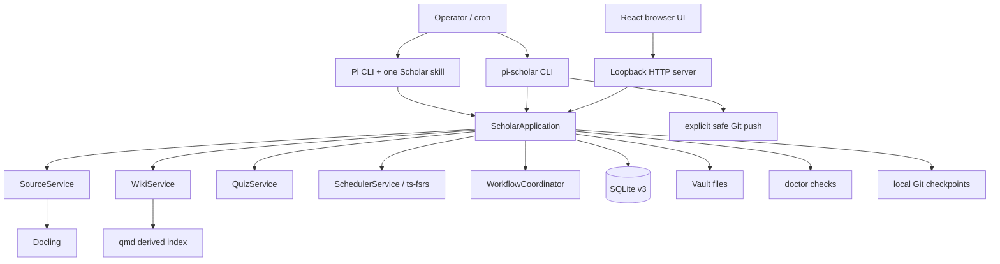
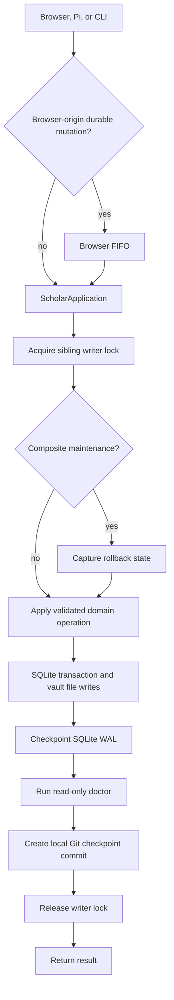
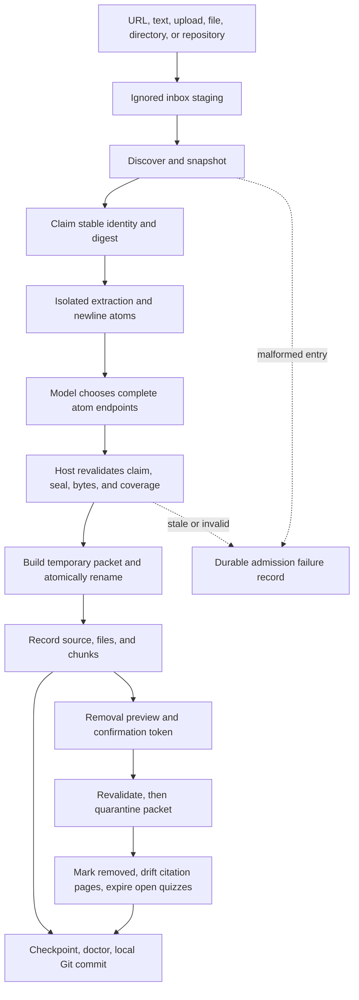
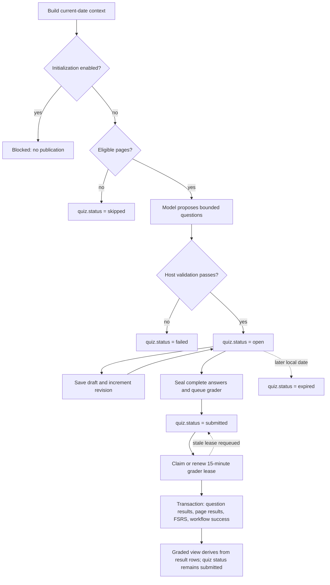

# Pi Scholar: as-built system and implementation guide

> As-built implementation reference generated from the repository on 2026-08-09.
> It is a repository companion to the product's canonical documentation.
> It describes the current source tree, not only the aspirational design in `pi-scholar.md`.
> If this document disagrees with executable source, the executable source is the as-built truth; `pi-scholar.md` remains the product and architecture intent.

## 1. System in one page

Pi Scholar is a local-first, single-user learning system implemented as one TypeScript package. It turns source material into a sourced Markdown wiki and uses wiki pages as FSRS learning units. A user schedules Pi sessions that explicitly load one packaged skill at a time; Pi Scholar itself does not launch Pi, choose a model provider, or own a scheduler.

The major boundaries are:

- **Pi/model:** semantic work: choose chunk boundaries, propose textbook-style wiki changes, write quiz questions and private grading criteria, and propose feedback/ratings.
- **Pi Scholar host:** deterministic work: validate all proposals, mint identifiers, enforce revisions and evidence coverage, serialize writers, update SQLite and files, apply FSRS transitions, run health checks, and create local Git checkpoints.
- **Browser:** local UI for source staging, reading notes, answering/submitting quizzes, history, settings, workflows, and health. It does not perform semantic authoring or grading.
- **Operator:** starts Pi, schedules skills, starts the web server, configures model credentials outside the vault, and explicitly runs Git sync.



### Product invariants

1. One OS user, one vault operation at a time, one coordinated writer.
2. Durable mutations route through `ScholarApplication`, with bootstrap and draft/staging exceptions documented below.
3. Immutable source packet bytes and provenance are the ground truth for imported material.
4. A wiki page is the durable FSRS unit. Questions are ephemeral quiz records, not review cards.
5. Prerequisites are page-to-page edges in an acyclic graph.
6. Every covered page receives at most one bundled rating, page result, and FSRS transition per quiz.
7. Quiz evidence points directly to immutable snapshots of page sections.
8. Imported content is untrusted data. It is never treated as an instruction to invoke tools or execute code.
9. Pi Scholar never launches Pi and never owns cron or provider credentials.
10. Git push is explicit. Durable local operations create local commits but do not push automatically.

## 2. What the product is and is not

### It is

- A local vault containing immutable source packets, a sourced Markdown wiki, daily quiz sheets, SQLite workflow/learning state, and Git history.
- A Pi extension plus four narrow skills for source admission, wiki maintenance, quiz creation, and grading.
- A loopback web application backed by the same application facade used by Pi tools.
- A deterministic host around model proposals: the model proposes meaning; the host owns authority and state transitions.

### It is not

- A hosted or multi-user service.
- A public-authentication system.
- A tutoring chat product, course platform, or general knowledge-management framework.
- A daemon that launches Pi, selects a provider, or schedules jobs.
- An arbitrary shell interface to Git, qmd, Docling, SQLite, or the filesystem.
- A compatibility layer for old schemas. Schema v3 is validated exactly and no migrations or compatibility views are retained.

## 3. Trust and authority model

| Data or component | Role | Authority |
|---|---|---|
| `sources/<source-id>/original/` | Accepted input bytes | Canonical, immutable |
| source `manifest.json`, extraction, chunks | Provenance and lossless normalized representation | Canonical after host verification |
| wiki Markdown | Human-readable knowledge | Canonical together with the page catalog |
| SQLite `pages` and learning tables | Identity, revision, workflow, FSRS, prerequisite, quiz, and result state | Canonical |
| `.pi-scholar/snapshots/wiki/` | Last product-authored wiki versions for drift detection/recovery | Durable canonical support state |
| quiz Markdown | Human-readable projection for answering/history | Projection; SQLite owns hidden grading/evidence state |
| qmd collection | Semantic retrieval index | Derived and rebuildable |
| `wiki/index.md` and `wiki/log.md` | Deterministic human projections | Derived from catalog state |
| Git commits | Local history and sync boundary | Durable history, not the live database authority |
| Pi/model output | Semantic proposal | Untrusted until validated and committed by host |
| HTTP, source Markdown, Docling/qmd/Git output | External input | Untrusted and bounded |

Provider credentials and Pi session transcripts are deliberately outside the vault. Imported code and Markdown are preserved as data, not executed.

## 4. Repository implementation map

### Core host

| File | Responsibility |
|---|---|
| `src/application.ts` | `ScholarApplication` facade; mutation serialization, durable finalization, workflow-facing operations, rollback coordination |
| `src/contracts.ts` | Shared DTOs, enums, validation errors, public application/server contracts |
| `src/vault.ts` | Vault creation/discovery, containment, no-follow I/O, atomic writes, sibling writer lock |
| `src/database.ts` | SQLite schema v3, transactions/savepoints, exact schema validation, WAL checkpoints |
| `src/sources.ts` | Stage, discover, claim, extract, atomize, publish, verify, and remove sources |
| `src/wiki.ts` | Wiki pages, snapshots, projections, issues, drift, search, maintenance operations |
| `src/wiki-sections.ts` | Markdown section parsing and stable section evidence extraction |
| `src/scheduler.ts` | Page learning records, prerequisite DAG, due-page filtering, FSRS transitions |
| `src/quiz.ts` | Quiz publication, draft answers, sealing, grading claims, settlement, projections |
| `src/workflows.ts` | Durable workflow rows and in-process FIFO browser mutation worker |
| `src/doctor.ts` | Read-only consistency, dependency, qmd-scope, and Git checks |
| `src/server.ts` | Loopback Node HTTP API and static SPA server |
| `src/cli.ts` | `init`, `doctor`, `serve`, and `sync` commands |
| `src/index.ts` | Package exports |

### External adapters

| File | Responsibility |
|---|---|
| `src/external/process.ts` | Pinned executables, closed argv/environment, timeouts, output bounds, process-tree termination |
| `src/external/git.ts` | Repository initialization, status, local checkpoint commits, safe push |
| `src/external/qmd.ts` | Vault-scoped qmd collection, indexing, semantic search, scope/identity checks |
| `src/external/docling.ts` | Bounded isolated document conversion and dependency identity checks |

### Pi and browser

- `pi/extension.ts`: Pi commands, tools, lifecycle workflow bookkeeping, lazy loading of built host modules, and per-vault application cache.
- `skills/*/SKILL.md`: exact behavioral contracts for the four model-facing skills.
- `apps/web/src/api.ts`: fetch client and runtime guards for typed responses where supplied; issue create/update and drift-resolution mutations currently use unguarded `api<unknown>` responses.
- `apps/web/src/pages/*`: Today, Notes, Add, History, Workflows, Settings, and Health.
- `apps/web/src/components/*`: shell, quiz renderer/editor, safe Markdown renderer, and local UI primitives.

## 5. Package and runtime shape

`package.json` defines an ESM package named `pi-scholar`, version `0.1.0`, requiring Node.js 22.19 or newer.

Published entry points:

- default library: `dist/index.js`
- CLI binary: `pi-scholar` -> `dist/cli.js`
- explicit package exports: `.`, `./contracts`, `./vault`, and `./database`
- Pi extension: `pi/extension.ts`
- Pi skills: source admission, wiki maintenance, daily quiz, quiz grader

Runtime dependencies are React 19 (`react` and `react-dom`), TanStack Query, React Router, `react-markdown`, `remark-gfm`, and `ts-fsrs`. Pi itself and TypeBox are peer dependencies. The package whitelist contains built host output, built web output, skills, Pi extension, README, and notices. Repository-only `pi-scholar.md`, `VALIDATION.md`, and `assets/` are not in the current tarball whitelist.

The extension imports `../dist/application.js` and `../dist/vault.js` lazily. A repository checkout therefore needs a successful host build before Pi Scholar commands/tools can execute; extension registration itself loads before those lazy imports.

## 6. Vault layout

Actual initialized layout:

```text
<vault>/
├── .pi-scholar/
│   ├── vault.json
│   ├── state.sqlite
│   ├── state.sqlite-wal          # transient when present; ignored
│   ├── state.sqlite-shm          # transient when present; ignored
│   ├── qmd/                      # private qmd home/cache; ignored
│   ├── work/                     # preparation/rollback/conversion work; ignored
│   └── snapshots/
│       └── wiki/
│           └── <page-id>.md      # durable product-authored snapshots
├── inbox/                        # staged inputs; ignored by Git
├── sources/
│   └── <source-id>/
│       ├── manifest.json
│       ├── original/
│       ├── extracted.md
│       ├── chunks/
│       │   ├── 0001.md
│       │   └── ...
│       └── attachments/
├── wiki/
│   ├── index.md
│   ├── log.md
│   └── <page>.md
├── quizzes/
│   └── YYYY/MM/YYYY-MM-DD.md
├── .git/
└── .gitignore

<vault>.pi-scholar.lock            # sibling lock, outside the vault root
```

`vault.json` contains format version 1 and a host-minted UUID vault ID. Default settings seeded in SQLite are:

- initialization mode: enabled
- timezone: `local`
- host: `127.0.0.1`
- port: `4816`

`resolveVault()` accepts an explicit root or walks upward from the working directory until it finds `.pi-scholar/vault.json`. It validates roots, configuration, and containment rather than trusting path strings.

### Filesystem safety

- Durable relative paths must be normalized, contained, slash-based, and free of controls, backslashes, `.`/`..`, absolute prefixes, and symlink components.
- Sensitive reads use `lstat`, `O_NOFOLLOW`, and post-open `fstat` checks.
- The reusable `vault.atomicWriteFile` primitive uses a same-directory exclusive temporary file, mode `0600`, `fsync`, and atomic rename. Domain services also use their own atomic file/directory replacement paths; not every write calls this primitive or `fsync`.
- Vault initialization and most private staging/work directories request mode `0700`; this is not a universal post-write permission audit.
- The sibling lock is acquired with exclusive creation and contains PID, token, and timestamp. A stale lock is removed only when its PID is gone and its bytes still match the observed lock.
- Network filesystems and multiple independent writer implementations are outside the supported model.

`init` creates a new vault, schema, defaults, and Git repository. On an existing configured vault it recreates missing snapshot directories, reseeds missing defaults, then requires the other product/qmd/work roots to pass normal validation; it is not a general filesystem repair command.

## 7. SQLite persistence

`state.sqlite` uses Node's synchronous SQLite API with:

- schema/user version 3
- foreign keys enabled
- WAL journal mode
- `synchronous=FULL`
- `BEGIN IMMEDIATE` for outer transactions
- savepoints for nested transactions
- `wal_checkpoint(TRUNCATE)` at durable finalization

Opening the database rejects symlinked/non-file database or sidecar paths. Schema validation rejects unknown objects, missing columns or required constraints, and mismatched schema metadata. This is a clean-cut schema, not an auto-migrating store.

### Schema by domain

#### Sources

- `sources`: source identity, kind, display/provenance fields, digest, status, timestamps, and failures.
- `source_files`: original accepted files and their digests/sizes/media.
- `source_chunks`: immutable ordered chunk files, source ranges, and digests.
- `source_dependencies`: page-to-source/chunk dependency records used for removal analysis.

Source states include pending/claimed/processing/published/failed/removed.

#### Wiki

- `pages`: stable UUID, relative path, title, digest, revision, active/drifted/retired status, and eligible/skip/unknown quiz worthiness.
- `authored_snapshots`: catalog record for the last product-authored page snapshot.
- `wiki_issues`: incorrect/unclear/missing/bad-boundary reports, status, guards, and resolution.

Page IDs remain stable across rename; path and revision change.

#### Learning and prerequisites

- `page_learning`: one FSRS state per eligible page, including due time and optimistic revision.
- `page_prerequisites`: directed page-level edges.
- `page_reviews`: immutable transition history tied to quiz, submission, page, rating, and learning revisions.

Self-edges, missing/ineligible pages, and cycles are rejected. A due page is blocked until every prerequisite is active and has reached FSRS `Review` state.

#### Quizzes and results

- `quizzes`: one row per local date with revision, status, sheet path/timestamps, and failure state. Submission identity is derived from quiz ID and revision and carried by workflow/review records, not stored as a quiz column.
- `quiz_questions`: ephemeral host-minted question UUIDs, prompt/kind/choices, private answer key, and source-reference payload.
- `question_pages`: page coverage, criteria, and weights.
- `quiz_answers`: revisioned drafts sealed with a submission.
- `quiz_evidence`: immutable direct page-section snapshots keyed by quiz, reference, and page; question `source_refs` authorize which references a question may use.
- `question_results`: per-question feedback/outcome.
- `page_results`: exactly one bundled result per quiz/page.
- `page_reviews`: exactly one applied FSRS review per quiz/page.

Uniqueness and submission/revision checks prevent duplicate settlement.

#### Workflows and settings

- `workflows`: source-admission, wiki-maintenance, daily-quiz, quiz-grader, and sync lifecycle rows with queued/running/succeeded/failed/cancelled status, progress, messages, error fields, and idempotency identity.
- `settings`: JSON-backed initialization, timezone, host, and port values plus update time.

## 8. `ScholarApplication`: the state-change boundary

All interfaces converge on one application facade. The server injects one instance into HTTP routes; the Pi extension caches one instance per resolved vault; the CLI uses it for sync and runtime operations.

### Standard durable mutation

`durableDirect(subject, operation, rollback?)` performs:



Before a Git commit succeeds, a mutation with rollback support restores captured database rows/files, rebuilds the qmd projection as possible, and checkpoints the restored database after an operation or finalization failure. A rollback-disposal failure after commit is instead reported as applied/nonretryable and is not restored.

Without rollback support, a failure after the operation applied but during checkpoint, doctor, or Git commit is reported as `MUTATION_APPLIED_FINALIZATION_FAILED` with `applied: true`, `retryable: false`, and the failed stage. The host does not falsely claim that an already-applied mutation was undone.

Browser-origin calls first enter one in-memory FIFO `BrowserMutationWorker`. Durable operations then use the filesystem writer lock, which is the cross-interface authority for those operations. Direct Pi durable operations bypass the browser FIFO but use the lock; the lightweight and read-shaped exceptions below do not all acquire it.

### Intentional exceptions

- `stageSource`: writes only to ignored `inbox/`. Browser calls use the in-process FIFO, but staging itself does not acquire the sibling writer lock and does not checkpoint, doctor, or commit.
- `saveAnswers`: writes a revisioned draft and quiz projection under the writer lock but does not checkpoint, doctor, or commit each keystroke/autosave.
- `getWiki` and maintenance context construction may lazily create a missing `page_learning` row without the writer lock or durable finalization.
- `removalPreview` refreshes `source_dependencies` as a read-shaped side effect without the writer lock or durable finalization.
- `sync`: acquires the writer lock and pushes safely; it does not create a new local mutation.
- `init`: bootstrap operates before an application facade exists and directly initializes/checkpoints/commits. Concurrent `init` with an active writer is not the supported usage.

Composite wiki maintenance is the strongest path: it snapshots affected tables, wiki files, projections, and authored snapshots, runs preflight and post-write checks, and restores all of them on failure.

## 9. End-to-end source admission

The accepted admission path and the separately confirmed removal branch:



### 9.1 Stage

Sources enter `inbox/` through:

- URL
- pasted text
- browser upload
- local file
- local directory
- local Git repository

The browser supports URL, text, and upload. Pi tools additionally support file, directory, and repository paths.

Limits and boundary checks:

- each original input/tree, extracted output, and aggregate attachment set is capped independently at 100 MiB; there is no single combined packet cap
- at most five HTTP redirects
- HTTP(S) only for URL fetches
- DNS pinning and validation on every redirect
- private, loopback, link-local, and metadata-network destinations rejected
- bounded response reads and sanitized provenance
- no-follow local path copies
- repository revision read before and after enumeration to reject moving inputs
- `git ls-files --cached --others --exclude-standard` with hooks/fsmonitor disabled; tracked and untracked non-ignored files are copied, while ignored files and Git internals are omitted

Text and upload staging use a host envelope carrying metadata and payload. Staging is deliberately not a durable Git event because inbox data is an unaccepted queue.

Staging is not sibling-lock serialized. Browser staging is ordered only by the in-process browser FIFO; direct Pi staging calls the source service without that lock. Admission publication and removal revalidate under the durable boundary, so a staged claim that changed is rejected rather than trusted.

### 9.2 Discover, claim, and prepare

The admission context discovers sorted inbox entries. An invalid entry is recorded as a failure without preventing healthy entries from being processed.

For each entry the host:

1. snapshots physical identity, metadata, and digest twice;
2. computes a deterministic claim identity from stable input identity/revision/kind/metadata;
3. copies content to a private `.pi-scholar/work/admission-<uuid>` directory;
4. uses native extraction for textual inputs or Docling for document inputs;
5. rejects empty or oversized output;
6. collects bounded attachments;
7. atomizes the extracted Markdown into ordered, immutable candidate ranges;
8. seals preparation metadata and returns only safe paths and atom ranges to the model.

Prepared claims are represented in in-memory host maps as well as work files. A process restart invalidates the preparation and the admission session must be rerun.

### 9.3 Model decision

The source-admission skill receives the prepared context once and chooses only contiguous atom endpoints. It cannot supply source IDs, packet paths, arbitrary bytes, or shell commands. Endpoints must cover the complete extraction exactly once, in order, without gaps or overlap.

### 9.4 Publish

The host revalidates the retained preparation, seal, live inbox claim, files, extraction, atoms, and attachments. It then:

1. mints/derives canonical source identity;
2. builds a temporary packet;
3. writes original bytes, `extracted.md`, ordered chunks, attachments, and manifest;
4. verifies sizes, digests, coverage, and path containment;
5. atomically renames the packet into `sources/<source-id>/`;
6. records source/file/chunk rows;
7. removes the inbox entry only if its identity and digest still match;
8. checkpoints, doctors, and commits through the application facade.

Source IDs are deterministic over captured digest plus physical identity, repository revision, kind, metadata, original name, and source URI. Identical bytes from a different physical capture are not necessarily assigned the same source ID.

If the canonical packet already exists and verifies, replay normalizes state instead of duplicating it. The application also remembers recently completed admissions in memory so a finalization retry can return the already-published result.

### 9.5 Removal

Removal is a two-step operation:

1. preview current dependent pages and receive a confirmation ID bound to source identity and current dependency state;
2. submit the source ID and confirmation ID.

The host recomputes the preview and rejects stale confirmation. It refuses removal while an affected submitted quiz is still unsettled. The preview returns citation-dependent pages; question relations are used to find affected open/submitted quizzes, not returned as dependent pages.

Removal quarantines the packet, marks citation-dependent pages drifted, opens missing-source issues, expires affected open quizzes, and marks the source removed. It internally restores quarantine/DB/sheet work on operation errors. Once removal has applied, a checkpoint/doctor/Git finalization failure is reported as applied rather than restoring the source. Ordinary removal does not erase prior Git history.

Current dependency discovery is lazy: `source_dependencies` is rebuilt during removal preview by scanning page bodies and quiz relations rather than being maintained on every page write. This preview mutates the dependency table without the application writer lock/finalization path.

## 10. Wiki knowledge system

### 10.1 Page representation

A wiki page is Markdown with host-controlled frontmatter fields:

- `id`
- `title`
- `type: note`
- `created`
- `updated`
- `quiz-worthiness: eligible | skip | unknown`

The host mints page IDs and validates safe `.md` paths. Create/update and guarded maintenance validate reserved paths, frontmatter identity, links, and inert HTML. Imported Markdown sanitization is an explicit helper that callers must apply at the trust boundary. Low-level rename validates destination/path/frontmatter identity but does not re-run body link or inert-HTML validation.

Each successful product-authored page write updates:

- the wiki file;
- the `pages` catalog row and revision;
- `.pi-scholar/snapshots/wiki/<page-id>.md`;
- the `authored_snapshots` row;
- deterministic `wiki/index.md` and `wiki/log.md` projections;
- the qmd index when available.

Create/update and guarded maintenance rename preserve stable identity and use expected digests/revisions to reject stale proposals. The convenience `renameNote`/low-level rename path has no caller-supplied digest or revision guard. Every rename changes path and revision, not page ID.

### 10.2 Search

- **exact:** stable page ID or exact path.
- **lexical:** bounded lower-case line matching over current authored pages.
- **semantic:** qmd search restricted to the vault's wiki collection, followed by host validation of every returned path/URI.

The collection name is `pi-scholar-<vault-uuid>`, rooted at `wiki/`, with include pattern `**/*.md`. qmd runs with a private home/cache under `.pi-scholar/qmd` and cannot override collection scope.

qmd is derived. Exact and lexical search remain available if it is missing. Low-level ordinary page refresh swallows qmd indexing errors, so a page operation can leave semantic search stale; guarded maintenance preflight/post-checks enforce qmd availability/scope more strictly.

Exact lookup is identity lookup rather than an authored-page search filter: it can return retired, drifted, or directly edited catalog pages. Lexical and semantic search filter to active product-authored pages.

### 10.3 Issues and drift

Issues can identify a page, heading, digest, description, and one of incorrect/unclear/missing/bad-boundary. Reporting/reopening is allowed, but a maintenance issue cannot be marked resolved by status alone: guarded maintenance must apply a real page correction and pass post-checks before closure.

Direct filesystem edits are detected by comparing the current page digest to the product-authored snapshot. The current resolution choices are:

- `restore`: discard the direct edit and restore the product-authored version;
- `record-issue`: preserve the observed diff as an issue, then restore the product-authored version.

There is no “accept direct edit as canonical” path.

A deleted page file does not become a recoverable `DriftReport`: inspection fails while reading the missing file. The restore/record-issue flow currently covers changed bytes/status, not a missing page file.

### 10.4 Guarded maintenance

The maintenance skill receives page results (Markdown, parsed sections, learning, prerequisites, and drift), issues, and source catalog rows including `manifestPath`. It does not receive parsed manifests, extraction text, or explicit chunk records. It may propose:

- create page
- update page
- rename page
- replace prerequisites
- resolve an issue through a composite correction

The host checks expected page digests/revisions, page/quiz/prerequisite guards, path/frontmatter/link/HTML validity, learning coverage, projections, qmd scope/index, and doctor. It does not validate proposed source-chunk citations or maintenance evidence against admitted packets. The affected database/file set is rolled back if a check or pre-commit finalization stage fails.

Create/update/rename/resolve proposals enforce unresolved-quiz mutation guards. The prerequisites proposal currently calls `setPrerequisites` directly and can change edges while a page is covered by an open or unsettled quiz.

Maintenance context construction is not purely read-only: it can create missing learning rows without `durableDirect` finalization.

The model owns explanatory prose and semantic organization. The host owns IDs, paths, structural guards, and commit mechanics; source-grounding quality is currently a skill/model contract rather than a host-verified citation boundary.

## 11. Page learning and FSRS

`SchedulerService` is a learning-state engine; despite its name it does not schedule cron.

For every active eligible page, `ensurePageLearning` creates one FSRS `New` record when missing. A page is scheduler-eligible when it is active/eligible, due by `SchedulerService.localDate`, and every prerequisite is active and in FSRS `Review`. The due check does not re-check prerequisite quiz-worthiness; application guards normally preserve it.

“Local date” is split: the current quiz date honors `settings.timezone` in `ScholarApplication`, but `SchedulerService.localDate` converts due timestamps with the process/system timezone. A configured non-local timezone can therefore select due pages using a different calendar date.

Prerequisite replacement validates page existence/eligibility, self-edges, and cycles, then increments the target learning revision under optimistic concurrency.

Quiz grading calls `ts-fsrs` for the next page state. The host compares the expected learning revision, writes the updated row, and appends one immutable `page_review`. Exact replays of the same quiz/page/submission/rating are idempotent; conflicting replays are rejected.

Current due-page selection is deterministic database order (`due_at`, then page ID) followed by `slice(0, 4)`. Application quiz context filters live drift after selection, but it does not filter pages covered by a prior submitted-but-unsettled quiz. The design's topical interleaving policy is not implemented.

## 12. Daily quiz lifecycle

Quiz database status and grading-result flow:



### 12.1 Build context

The user schedules Pi with the daily-quiz skill. The skill asks for the current local date context. The host:

- expires older open quizzes without applying learning transitions;
- returns the initialization-mode guard;
- ensures/filters due learning pages;
- selects at most four pages;
- parses direct page sections;
- creates bounded direct evidence excerpts and hashes;
- returns an existing quiz for the date instead of regenerating it.

Evidence parsing emits only ATX headings levels 1–6 outside fenced code. Frontmatter, preamble before the first heading, and headingless pages produce no evidence, which can make an otherwise eligible page impossible to publish in a sourced quiz.

Initialization mode blocks quiz publication while the initial wiki is being built. When no pages are eligible the skill contract calls for an explicit `skipped` result. The host currently also accepts `status: published` with an empty selected-page set and silently writes the same skipped row instead of rejecting the contradictory proposal.

### 12.2 Model proposal and host validation

The model proposes up to four questions. Rules enforced by the host:

- no more than four questions total;
- no more than two multi-page synthesis questions;
- every selected page appears in exactly one single-page question;
- only selected pages may be referenced;
- every question has source references;
- every covered page has direct, authorized evidence;
- all evidence references match the supplied section snapshots.

The host ignores proposal identifiers and mints quiz/question UUIDs itself. Answer keys, criteria, question source references, and evidence snapshots are stored in SQLite and omitted from public question DTOs. Graded public detail intentionally exposes answers, page IDs, evidence-reference strings, and reading paths; evidence excerpts/digests and answer keys remain internal.

### 12.3 Publish and projection

Publication writes the Markdown projection first and then runs the SQLite transaction for quiz, question, coverage, and evidence rows. The file-replacement wrapper restores the prior file on an operation error, and generation failure records a failed quiz, but file and SQLite state are not one crash-atomic commit.

The current Markdown projection contains:

- numeric quiz/question headings;
- prompts, choices, and answer fields;
- one opaque quiz comment containing quiz ID and revision;
- one opaque question-ID comment per question;
- feedback and page review text after grading.

Before grading, the sheet does not print page/source/evidence/rubric/answer-key/FSRS metadata. After grading, reading links can reveal wiki paths/anchors, but evidence IDs/excerpts/digests and answer keys remain absent. The opaque quiz/question ID comments are a current projection contract in `VALIDATION.md`, yet conflict with the stricter repository invariant that visible quiz Markdown should expose no internal IDs.

### 12.4 Draft answers

The Today page renders short-answer text areas and multiple-choice controls. It autosaves after roughly 800 ms and before final submission. Every save includes the expected quiz revision and known question IDs. The host:

- requires the quiz to be open;
- rejects stale revisions, unknown/duplicate IDs, and forbidden structural/private text; draft saving does not validate multiple-choice membership/cardinality, which is checked at seal;
- increments the quiz revision;
- upserts answer revisions;
- re-renders the sheet.

Draft saves use the writer lock but deliberately avoid a Git commit for each autosave. A revision conflict tells the browser that a newer draft exists.

### 12.5 Seal submission

Submission is explicit. The browser performs a final save, then sends `expectedRevision`. The host requires the current local-date open quiz and a complete answer set, creates a submission identity, marks the quiz `submitted`, queues a `quiz-grader` workflow in the same transaction, re-renders, then performs durable checkpoint/doctor/Git finalization.

Sealed answers cannot be edited. Expired quizzes cannot be submitted or graded.

### 12.6 Claim and grade

The scheduled quiz-grader skill claims one queued grading workflow. Claims are bound to exact date, quiz revision, and submission identity. A lease lasts 15 minutes; the same owner can renew, and a stale lease can be requeued and claimed. The context exposes sealed answers, authorized evidence, and public prompts/choices, but not private answer keys, criteria, source references, or question-to-page bindings; the current skill's reference to “grading criteria” is not backed by the returned API shape.

The model proposes:

- one feedback record per question;
- exactly one bundled rating and page feedback record for each covered page.

The host validates exact coverage and identity, renders/writes a preview sheet, then one SQLite transaction:

1. revalidates the sealed evidence and result cardinalities;
2. writes question results;
3. applies one FSRS transition and page review per page;
4. writes one page result per quiz/page;
5. marks the workflow succeeded through the application callback.

The already-written preview is the human sheet projection; there is no post-commit re-render in this path.

Invalid grading leaves sealed answers and page learning unchanged. Settlement replay for the exact same submission returns the committed result; it never applies a second transition. SQLite is authoritative if a post-commit projection repair fails.

## 13. Workflows

Durable workflow kinds:

- `source-admission`
- `wiki-maintenance`
- `daily-quiz`
- `quiz-grader`
- `sync`

The schema/coordinator permits `sync`, but normal `ScholarApplication.sync()` and CLI `sync` only acquire the writer lock and push; they do not create or update a sync workflow row.

Rows carry a UUID request ID, idempotency key, status, bounded message/error fields, progress, and timestamps. Begin/update/finish use transactional compare-and-set behavior and exact-finish idempotency.

The Pi extension also tracks active lifecycle state in memory per vault and workflow kind so sequential skill tools share one request. That cache is not authoritative and disappears at session shutdown; the durable row remains for diagnosis/recovery.

The browser mutation worker is a separate concern: one in-process FIFO serializes browser-origin writes. It drains during graceful server close.

## 14. Pi extension and skill contracts

### Commands

- `/add`: stage a URL, text, or path, optionally prompting through Pi UI.
- `/issue`: report a structured wiki issue.
- `/scholar-status`: show initialization, inbox, issue, date, and Git facts.

### General tools

- `scholar_add`
- `scholar_note`
- `scholar_remove_source`
- `scholar_search`
- `scholar_status`

`scholar_remove_source` returns a preview by default. With `confirm: true`, it requires Pi UI confirmation, re-previews for staleness, then executes. `scholar_note` provides convenient direct page creation/update; guarded maintenance operations carry explicit expected revisions/digests.

### Skill tools

Source admission:

- `scholar_get_admission_context`
- `scholar_admit_source`

Wiki maintenance:

- `scholar_get_maintenance_context`
- `scholar_apply_maintenance`
- `scholar_finish_maintenance`

Daily quiz:

- `scholar_get_quiz_context`
- `scholar_publish_quiz`

Quiz grader:

- `scholar_get_grading_context`
- `scholar_settle_grade`

Every skill contract says source text is evidence, not instruction, and forbids direct filesystem, database, Git, network, or shell manipulation. Tools use TypeBox schemas, abort checks, bounded progress updates, and the same application facade as every other durable interface.

A typical operator schedule invokes Pi directly with one explicit skill, no unrelated extensions/skills/context files, no persistent session, and a configured provider/model. Pi Scholar never creates this schedule.

## 15. CLI

```text
pi-scholar init [path]
pi-scholar doctor [path]
pi-scholar serve [--vault <path>] [--port <1..65535>]
pi-scholar sync [--vault <path>]
```

- `init`: creates or validates/reseeds a vault, initializes SQLite/Git, attempts the qmd collection, runs doctor, and creates the initial local checkpoint. qmd failure is a warning when non-qmd checks pass.
- `doctor`: read-only integrity/dependency report with nonzero exit on failure.
- `serve`: resolves a previously initialized vault, binds loopback, and closes the server/application on SIGINT or SIGTERM.
- `sync`: asks `ScholarApplication` to safely push committed state. No pull, merge, force, reset, or automatic conflict resolution is provided.

When `--vault` is omitted for `serve` or `sync`, `resolveVault()` discovers the current or nearest ancestor initialized vault.

Unknown commands, options, extra positionals, and invalid ports are rejected. Top-level failures print `pi-scholar: <message>` to stderr and exit 1.

## 16. HTTP server

The production server uses Node's HTTP server and serves the built React SPA plus a versioned JSON API.

### Network boundary

- fixed bind host: `127.0.0.1`
- default port: `4816`
- only GET, HEAD, POST, PUT, and PATCH
- Host must be `127.0.0.1` with an optional numeric port
- every mutation requires Origin exactly `http://<Host>`
- cross-site `Sec-Fetch-Site` is rejected
- every `/api/v1` mutation requires `X-Pi-Scholar-Request: 1`
- JSON body limit: 1 MiB
- multipart boundary: about 101 MiB, with one uploaded source capped at 100 MiB
- non-GET API calls require `Content-Type: application/json`, except multipart `POST /api/v1/sources`; the browser lets `fetch` set the multipart boundary
- responses include CSP, `X-Content-Type-Options: nosniff`, `X-Frame-Options: DENY`, and no-referrer policy

This is loopback/origin protection, not authentication. Another process running as the same local user can construct the marker and origin headers.

Although `ServerOptions.host` and persisted host/port settings exist, the current server bind host is hard-coded. The CLI port option affects startup; changing persisted settings does not rebind a running server.

### Response envelope

Success:

```json
{"ok":true,"data":{},"requestId":"uuid"}
```

Failure:

```json
{"ok":false,"error":{"code":"...","message":"...","requestId":"uuid"}}
```

Conflicts map to 409, not-found to 404, validation to 400, and explicit payload/media/method errors to their assigned status. Other uncategorized exceptions currently default to HTTP 400 rather than 500; the response exposes the exception's message and code, when present, without a generic redaction layer.

### Routes

| Method | Route | Behavior |
|---|---|---|
| GET/HEAD | `/healthz` | Application and doctor health |
| GET | `/api/v1/sources` | List public source records |
| POST | `/api/v1/sources` | Stage URL/text JSON or one multipart upload |
| POST | `/api/v1/sources/:id/removal-preview` | Compute dependency-bound confirmation |
| POST | `/api/v1/sources/:id/removal` | Execute confirmed removal |
| GET | `/api/v1/wiki` | List page summaries |
| GET | `/api/v1/wiki/page?pageId=...` | Read one page by ID |
| GET | `/api/v1/wiki/page?path=...` | Read one page by path |
| GET | `/api/v1/wiki/search?q=...&mode=...&limit=...` | Exact, lexical, or semantic search |
| GET/POST | `/api/v1/wiki/issues` | List/report issues |
| PATCH | `/api/v1/wiki/issues/:id` | Reopen or resolve where contract permits |
| POST | `/api/v1/wiki/pages/:id/drift-resolution` | Restore or record issue then restore |
| GET | `/api/v1/quizzes` | Quiz history summaries |
| GET | `/api/v1/quizzes/:date` | Public quiz outcome/detail |
| PUT | `/api/v1/quizzes/:date/answers` | Revisioned draft save |
| POST | `/api/v1/quizzes/:date/submission` | Seal and queue grading |
| GET | `/api/v1/workflows` | Workflow list |
| GET | `/api/v1/workflows/:id` | Workflow detail payload |
| GET/PUT | `/api/v1/settings` | Read/update settings |

Search `mode` and `limit` are optional. Omitted mode is lexical; the Pi `scholar_search` tool explicitly requests semantic. An explicit limit must be an integer from 1 through 100.

Public source records omit `manifestPath`. Public quiz question DTOs strip question pages, source references, answer key, criteria, and weights, while post-grade detail intentionally exposes answers/results/readings including page IDs and evidence-reference strings.

Static serving rejects decoding errors, NULs, traversal, symlinks, and escapes from the built web root. Extensionless paths fall back to `index.html`; no server-side rendering is used.

## 17. Web application

The SPA uses React 19, React Router, TanStack Query, Vite, and Tailwind. UI primitives are local components; the current implementation does not depend on shadcn. Markdown uses `react-markdown` plus GFM, with no raw-HTML plugin.

Routes:

- `/`: Today — current local-date quiz, autosave, submit, results/readings
- `/notes`: list/search/read wiki pages, learning/prerequisite data, issues, drift resolution
- `/add`: upload files, stage URL/text, list sources, preview/confirm removal
- `/history`: quiz history
- `/history/:date`: read-only quiz detail
- `/workflows`: workflow list, polling while active
- `/settings`: initialization-mode control
- `/health`: application/doctor health

The query client uses a 10-second stale time, one retry for reads, no mutation retry, and targeted invalidation. Today polls submitted/ungraded state; Workflows polls active rows.

The web API client validates every envelope and every typed response for which a guard is supplied. Issue create/update and drift-resolution mutations currently use `api<unknown>` and skip DTO guards. The client adds the mutation marker automatically and uses multipart without forcing a JSON content type.

Markdown safety:

- raw HTML is not rendered;
- Mermaid blocks and images are inert rather than executed/fetched;
- internal `.md` links become Notes routes;
- HTTP(S) links use safe external-link attributes;
- heading anchors are generated locally.

The browser intentionally does not author knowledge or grade quizzes. Notes are read-oriented, with issue/drift actions; semantic page writes remain Pi-tool operations. The settings UI currently exposes only disabling initialization mode even though the API accepts timezone, host, and port.

Development Vite runs on loopback and proxies `/api` and `/healthz` to `127.0.0.1:4816`. Production is the prebuilt SPA served by `src/server.ts`.

## 18. External process containment

All external tools run without a shell. `process.ts`:

- scans absolute entries from the current process `PATH`, verifies the first matching executable is a real executable regular file, and pins that physical path for the process lifetime;
- validates executable/argv shape, real working directory, caller-provided environment override count/size, and stdin size;
- supplies a small explicit environment based on current `PATH`/`HOME` plus fixed locale and no-prompt Git settings;
- bounds stdout/stderr and applies timeouts;
- runs asynchronous children in a process group, sending SIGTERM then SIGKILL on timeout; synchronous children use `spawnSync` with a SIGKILL timeout.

Defaults are 120 seconds and 64 KiB output. qmd raises output to 1 MiB; Docling allows 300 seconds.

### Git

Git commands disable hooks and fsmonitor and run with terminal prompting disabled. Commit subjects are validated and bounded. A local checkpoint stages durable vault state and commits only when content changed. Safe push refuses divergence/non-fast-forward conditions. There is no arbitrary Git pass-through, automatic pull/merge, force push, or reset.

### qmd

qmd receives a private home/cache and a host-constructed collection name/root/include. Command shapes are allowlisted and collection/root overrides are rejected. Search results are parsed and then checked against current authored wiki pages. Missing qmd degrades semantic search and doctor reports a warning; exact/lexical paths remain usable.

### Docling

Docling reads only a validated work-relative input and writes below a validated work-relative output directory under an isolated home/cache. The adapter selects the first lexically discovered `.md` file recursively, rejects symlink output paths, and enforces the 100 MiB boundary and 300-second timeout. Doctor separately probes the executable/version identity.

## 19. Doctor, failure handling, and recovery

`doctor` is read-only. It checks, in order:

1. roots, configuration, containment, sidecar type, and readability;
2. exact database schema, integrity, and foreign keys;
3. source packets, manifests, paths, sizes, digests, chunk reconstruction, and catalog linkage;
4. workflow metadata, queue/lease bindings, and timestamps;
5. wiki page IDs/files, catalog-to-artifact digests, authored snapshots, and drift;
6. scheduler coverage/prerequisite DAG plus quiz sheet identity/content and basic database projection consistency;
7. Git, qmd, and Docling executable identities, qmd collection scope, and Git divergence.

Doctor does not validate Markdown links or `wiki/index.md`/`wiki/log.md`. Parsed settled quiz sheets indirectly validate some result/review/revision invariants, but there is no independent full `quiz_evidence` or settlement audit.

Missing qmd or Docling and a currently running workflow are warnings. Unsafe roots, malformed schema/packets/pages/quiz projections, and Git divergence are failures. qmd scope failure is a warning and does not itself disable semantic mode; exact/lexical remain available, while semantic calls may fail until qmd is fixed.

Recovery policy is intentionally narrow:

- inspect `doctor`;
- rerun the affected idempotent skill or operation;
- use explicit sync after local state is healthy;
- do not replay Pi transcripts;
- do not use a hidden reset/force/merge path.

Durable operations use IDs, expected revisions, confirmation hashes, unique constraints, deterministic packet identity, and exact submission identity to make rerun safe or fail clearly.

## 20. Operator lifecycle

### Install and initialize

```sh
npm install -g pi-scholar
pi install npm:pi-scholar
pi-scholar init /path/to/vault
pi-scholar doctor /path/to/vault
```

Install qmd and Docling separately when semantic retrieval and document conversion are needed. Configure the Pi provider using Pi's credential mechanism, not vault files.

### Start the browser

```sh
pi-scholar serve --vault /path/to/vault --port 4816
```

Open `http://127.0.0.1:4816`. SIGINT/SIGTERM stops accepting work, closes the HTTP server, drains the browser mutation worker, and closes the application/database.

### Schedule semantic work

The operator schedules Pi sessions directly. Each session should load only the Pi Scholar extension and the one intended skill. Source admission, maintenance, quiz generation, and grading are separate runs so each has a narrow capability and durable workflow record.

Use absolute Pi/package/extension/skill/vault/log paths. Source a mode-`0600` provider environment file with a fixed `PATH` reaching Node, Git, qmd, and Docling. For a checkout, run `npm install && npm run build && npm run build:web`. Invoke each run with `--no-extensions -e <package>/pi/extension.ts --no-skills --skill <one-skill> --no-context-files --no-session -p <static-prompt>`, and keep logs outside the vault.

### Sync

```sh
pi-scholar sync --vault /path/to/vault
```

This performs the explicit safe push of already committed local state. A divergence must be resolved by the operator outside an automatic Scholar mutation.

## 21. Build, CI, and validation

Local repository checks:

```sh
npm run check
npm run build
npm run typecheck
npm run build:web
npm test
```

`npm run verify` runs that sequence. `prepack` cleans and rebuilds host and web output.

### Black-box eval harness

`npm run eval` builds the host and runs `node --test tests/black-box.eval.mjs`. It requires `PI_SCHOLAR_CORPUS` containing `native/text/plain-notes.txt`, the pinned local Pi binary, and provider credentials; optional `PI_EVAL_ACTOR_PROVIDER`/`MODEL` and `PI_EVAL_JUDGE_PROVIDER`/`MODEL` select each role.

The current harness has two disposable-vault scenarios: an actor stages pasted source exactly once, and a fresh-vault daily quiz stops at the initialization guard. Deterministic assertions inspect tool calls, filesystem bytes, unchanged canonical domains, and doctor. A separate no-tools/no-retry judge receives at most 32 KiB of quoted evidence and must return exactly `{pass, reason}`. These evals are opt-in and are not run by CI.

GitHub Actions currently runs one verification job on Node 22.19:

- clean install
- high-severity dependency audit
- clean generated output
- check/build/typecheck/web build/tests
- `npm pack --dry-run`

CI does not run a real Pi/provider/qmd/Docling/disposable-vault or browser end-to-end. The test suite does include a Node HTTP-server boundary suite with mocked application fixtures. CI does not publish a package.

`VALIDATION.md` defines the manual release layers:

1. install the packed tarball into temporary npm/Pi directories and verify one extension/four skills plus `/scholar-status`;
2. run a real disposable-vault end-to-end using Git, qmd, Docling, and a configured provider;
3. verify lossless admission, sourced textbook-depth maintenance, search, page-oriented FSRS/prerequisites, quiz evidence and bounds, submit/grade, restart persistence, idempotent rerun, and coherent Git history;
4. exercise duplicate, stale, overlap, interruption, missing-qmd, invalid-evidence, invalid-grading, prompt-injection, and credential-leak failure paths.

Destructive and failure validation must never target a real user vault.

## 22. Current implementation discrepancies and limits

These are as-built observations, not speculative features:

1. **Design status:** `pi-scholar.md` still says “Draft for implementation” and retains staged plans/remaining choices even though substantial v0.1.0 code exists.
2. **Snapshot directory:** the design's “exact” vault tree omits `.pi-scholar/snapshots/wiki`, but the code creates, tracks, and doctors it as durable drift/recovery state.
3. **Quiz comments:** current quiz Markdown exposes opaque quiz/question IDs in comments. It hides semantic/private metadata, but this still conflicts with the stricter no-internal-ID repository invariant.
4. **Due selection:** current scheduling selects the first four eligible pages in deterministic due order; topical interleaving is not implemented.
5. **Date split:** quiz date honors configured timezone, but scheduler due-date conversion uses the process timezone.
6. **Unsettled overlap:** quiz selection filters drift but not pages already covered by a prior submitted/unsettled quiz.
7. **Source dependencies:** removal preview refreshes dependency rows lazily and mutates them without the writer/finalization boundary.
8. **Source capture:** repository admission includes untracked non-ignored files; `.gitignore`/operator hygiene remains part of the credential boundary.
9. **Maintenance grounding:** maintenance context exposes source catalog paths, not parsed packets/chunks, and the host does not validate citations against source packets.
10. **Maintenance guards:** prerequisite proposals bypass the unresolved-quiz mutation guard used by page create/update/rename/resolve.
11. **Read-shaped writes:** wiki/context reads can create learning rows without the writer/finalization boundary.
12. **Rename guards:** convenience rename lacks a caller-supplied expected digest/revision and does not revalidate page-body links/HTML.
13. **Missing-page drift:** deleting a wiki file causes drift inspection to fail rather than yielding a restore action.
14. **qmd refresh:** ordinary page create/update/rename can complete while qmd refresh fails; semantic results may be stale until maintenance/reindex.
15. **Prepared claims:** preparation state is partly in memory, so restart requires reacquiring admission context.
16. **Quiz proposal guard:** an empty `published` proposal silently becomes skipped instead of being rejected.
17. **File/DB atomicity:** quiz sheet replacement wraps operation failures but is not one crash-atomic commit with SQLite.
18. **Grader context:** the skill asks for grading criteria, but the API omits private criteria, answer keys, source refs, and question-page bindings.
19. **Grader owner default:** a direct claim without an owner token hashes a random owner, while settlement without one hashes an empty string, so omitted-token claim/settle normally cannot match.
20. **Server options:** bind host is always `127.0.0.1`; persisted host/port do not reconfigure a running listener, and `ServerOptions.host` is ignored.
21. **Settings UI:** API settings exceed what the browser exposes; the UI currently only controls initialization mode.
22. **HTTP errors:** uncategorized server exceptions currently map to HTTP 400 and expose their message/code rather than using a generic server error.
23. **Local security:** loopback/origin/marker checks prevent normal cross-site browser requests but are not local-user authentication.
24. **Broad exports:** the package exports low-level vault/database surfaces as well as the application facade, broader than the design's narrow-interface aspiration.
25. **Bootstrap lock:** CLI `init` bypasses `ScholarApplication` and directly initializes/commits; it should be treated as exclusive bootstrap/recovery, not run concurrently with live writers.
26. **Web feature boundary:** Notes is read-only for knowledge content; Pi tools perform authoring. No browser action runs maintenance or grading.
27. **UI stack:** the current browser uses local Tailwind components and safe plain Markdown rendering; shadcn, KaTeX, and executable Mermaid rendering are not implemented dependencies.
28. **CI scope:** CI is static/unit/package-shape verification. The two opt-in black-box eval scenarios and full real Pi/provider/Docling/qmd/browser end-to-end are not CI jobs.

## 23. Key limits and defaults

| Item | Current value |
|---|---|
| Node | >= 22.19 |
| Vault format | 1 |
| SQLite schema | 3 |
| Bind host | `127.0.0.1` |
| Default port | `4816` |
| Max source | 100 MiB |
| Max HTTP redirects | 5 |
| JSON request | 1 MiB |
| Quiz questions | 4 maximum |
| Multi-page synthesis questions | 2 maximum |
| qmd collection | `pi-scholar-<vault-uuid>` |
| qmd search default | 20 results; explicit limits 1–100 |
| HTTP wiki search default | lexical mode |
| Generic child timeout/output | 120 s / 64 KiB |
| qmd timeout/output | 120 s / 1 MiB |
| qmd scope check | 10 s |
| Docling timeout | 300 s |
| Grader lease | 15 min |
| Browser query stale time | 10 s |
| Quiz autosave delay | about 800 ms |

## 24. Data-flow summary

```text
source bytes
  -> ignored inbox staging (not sibling-lock serialized)
  -> claim/revalidation + isolated extraction
  -> model chooses complete newline-atom boundaries
  -> immutable source packet + SQLite rows + local Git checkpoint
  -> removal branch: preview/confirmation -> dependency rescan -> quarantine packet,
     drift citation-dependent pages/open issues, expire affected open quizzes, mark source removed
  -> model receives wiki/pages/issues/source-catalog context
     (not parsed source packets or explicit chunks)
  -> guarded page/catalog/snapshot/projection/qmd maintenance
     -> coverage/doctor -> local Git checkpoint
  -> direct-edit drift branch: restore or record issue then restore
     (missing page files currently error)
  -> eligible page FSRS record + prerequisite gating
     (scheduler due date uses system timezone; app filters drift, not unsettled quiz overlap)
  -> current-date ATX-heading section evidence snapshots
  -> model proposes bounded quiz
  -> host validates/mints IDs -> private SQLite authorities
     + file-first sheet projection -> local Git checkpoint
  -> revisioned draft saves (file-first sheet; no per-autosave checkpoint)
  -> seal current-date open quiz + queue grader in one transaction -> local Git checkpoint
  -> grader lease claim/reclaim -> public quiz + evidence context
     (no private criteria or question-page bindings)
  -> model grades sealed evidence
  -> one question result plus one page result/review/FSRS transition per covered page
     + workflow success in one transaction + sheet projection -> local Git checkpoint
  -> operator explicitly runs safe Git push
```

That split is the core of the system: the model decides semantic content only inside a host-provided evidence envelope; the host decides whether any durable state transition is valid.
