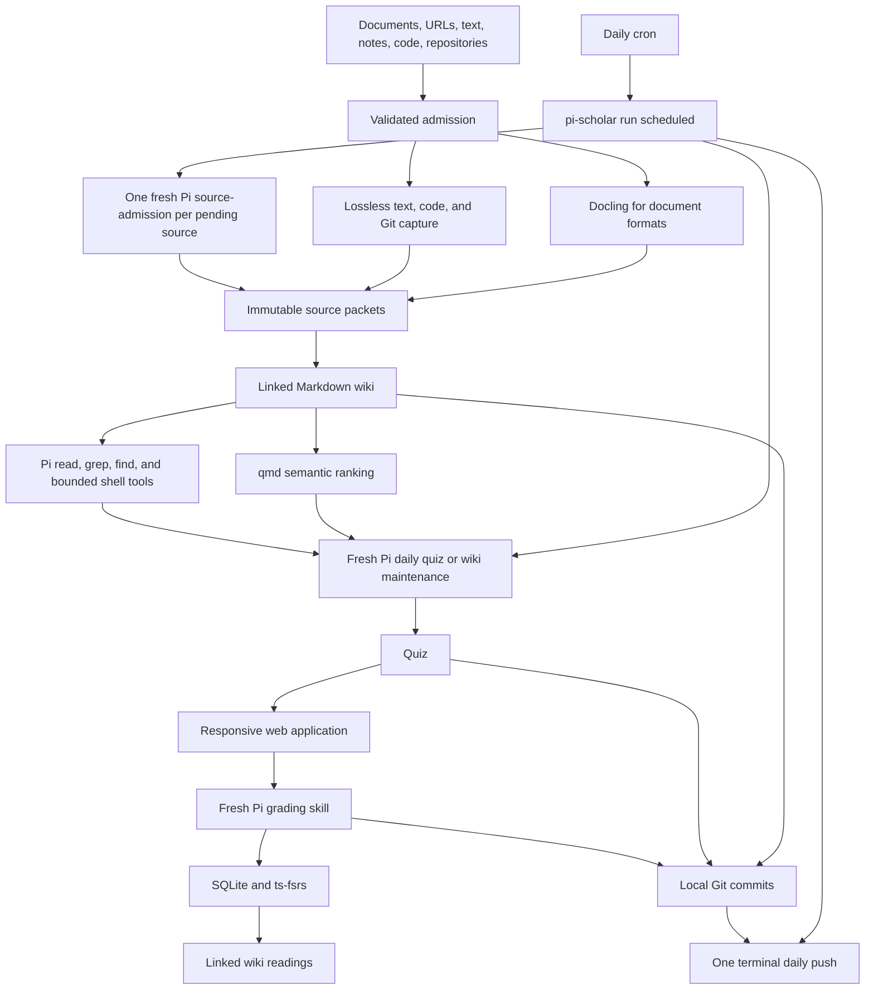
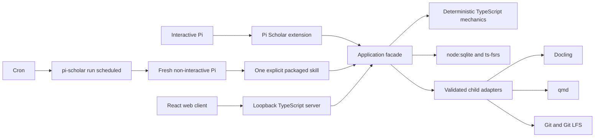

# Pi Scholar design

**Status:** Draft for implementation  
**Date:** 2026-08-04  
**Product and package name:** `pi-scholar`

## Decision summary

Pi Scholar is one standalone Pi package for collecting knowledge into a sourced Markdown wiki and learning that wiki through a small daily quiz. It accepts documents, URLs, pasted source text, direct notes, code files, directories, and Git repositories. Files and directories placed directly in `inbox/` are discovered and admitted in daily batches without an `/add` invocation. Documents use Docling; already-textual and repository inputs retain their native structure. A model may choose semantic chunk boundaries, but host mechanics retain every admitted byte and validate complete reconstruction.

The product centers the proven Cribrum loop:

1. maintain the wiki from admitted sources;
2. derive stable review cards from bounded sections of the eligible wiki;
3. select prerequisite-unblocked cards due today for one bounded daily quiz, or skip the quiz when none are eligible;
4. collect and grade answers;
5. update every affected card's SQLite FSRS state independently and transactionally;
6. show the exact wiki pages and headings worth rereading;
7. commit each completed mutation locally and push the accumulated commits once per day.

Pi Scholar does not expose Engram-style tutoring, courses, coaching, capstones, transfer exercises, learner-model controls, threshold explorables, or generated learning diagrams. It borrows only the useful learning policies: retrieval practice, distributed practice, interleaving, source-grounded questions, and isolated grading.

Application code is TypeScript. Pi supplies the agent runtime, extensions, native tools, and packaged Markdown skills. `ts-fsrs` supplies FSRS v6. Node owns SQLite, the loopback server, the worker, and the web application. Docling remains a required external Python command; qmd and Git remain validated external commands. There is no Python application side.

The browser application is part of the product. It uses React, Vite, shadcn/ui, Tailwind, React Router, and TanStack Query to present quizzes, notes, source admission, history, workflow status, and initialization settings. It is served by the same loopback server and reached from a phone through a user-managed private tunnel. Pi Scholar adds no public-user or multi-user account system.

## Product shape



The product has two user-visible layers behind one application boundary:

1. **Knowledge:** source admission, immutable packets, wiki notes, links, native navigation, qmd ranking, and maintenance.
2. **Review:** daily quiz sheets, answer submission, grading, FSRS scheduling, results, and linked wiki readings.

SQLite, files, qmd, Git, Pi, and the web client have distinct ownership. None is a parallel product authority.

## Goals

1. Turn local and remote material into durable, inspectable knowledge.
2. Support PDFs, EPUBs, Markdown, text, HTML, XML, JSON, DOCX, URLs, pasted text, direct notes, code files, directories, and Git repositories without truncating accepted inputs or requiring one command per inbox entry.
3. Use Docling for document conversion and native text/Git handling where Docling adds no value.
4. Let the model choose coherent source boundaries while the host proves lossless reconstruction and provenance.
5. Keep notes and synthesized knowledge as ordinary OKF-compatible Markdown under `wiki/`.
6. Let Pi use native exact and lexical operations in addition to qmd semantic ranking.
7. Cover the quiz-worthy knowledge in the whole eligible stable wiki through bounded review cards and one small daily quiz.
8. Apply retrieval practice, spacing, and topic interleaving without exposing a tutoring or curriculum product.
9. Keep questions, grading, historical results, and recommended readings traceable to wiki pages and immutable source chunks.
10. Provide a responsive browser interface for quizzes and note reading on desktop and phone.
11. Preserve deterministic path safety, process containment, SQLite transactions, doctor checks, idempotency, and single-writer behavior.
12. Commit every completed high-level mutation locally and push accumulated commits once per scheduled day.
13. Keep Sunday-only normal wiki maintenance and daily initialization maintenance until the user explicitly disables initialization.
14. Remain local-first and recoverable without a hosted Pi Scholar service.

## Non-goals

- Interactive tutoring, courses, coaching, learner-model configuration, capstones, transfer exercises, threshold explorables, or separate learning diagrams.
- A second learning artifact hierarchy beyond dated quiz sheets.
- A public or multi-user server, account database, or Pi Scholar-managed tunnel.
- Server-side rendering, serverless deployment, or a Next.js application.
- Network filesystems or concurrent uncoordinated writers.
- Live donor plugins, donor storage compatibility, donor-user importers, or migration commands.
- A Python application server or TypeScript-to-Python application bridge.
- Reimplement qmd or disguise lexical search as semantic search.
- Index source packets or quizzes in qmd.
- Treat generated projections, qmd data, or rendered Markdown as another state authority.
- Execute instructions, HTML, JavaScript, shell fragments, or Mermaid actions selected by imported content.
- Expose arbitrary shell, Git, qmd administration, SQLite, scheduler cards, or source bytes over HTTP.
- Silently switch from source-grounded work to unrecorded web research.

## Donor cutover

This design was checked against these executable-source baselines on 2026-08-04:

| Donor | Revision | Retained | Rejected |
|---|---|---|---|
| [pi-llm-wiki](https://github.com/zosmaai/pi-llm-wiki) | `a4c9da4b4694` | Pi-native knowledge experience, strict OKF parsing, Markdown links, deterministic projections, guardrails, and useful TypeScript fixtures | Its storage, direct final-path capture, 24,000-character ingest slice, custom embedding sidecar, in-process task runtime, and separate orchestration |
| [Engram](https://github.com/nagisanzenin/engram) | `d0a61cd67130` | Retrieval practice, distributed practice, topic interleaving, isolated assessment, and useful FSRS/receipt fixtures | Its JSON/JSONL home, tutoring dialogue, learner model, confidence UI, coaching, capstones, transfer, threshold explorables, and skill-orchestrated state authority |
| [Cribrum](https://github.com/N-F9/cribrum-lite) | `f54da48676c7` | Safe admission, Docling boundary, lossless atomization, model-selected endpoints, wiki catalog rules, SQLite workflow and grading patterns, qmd scope, mixed quiz sheets, responsive quiz/note UI behavior, cadence, process containment, locks, and Git synchronization semantics | Its exact paths and schema, Python/model framework, current package split, and donor compatibility |

Pi Scholar is not three installed plugins. It owns one package, vault, TypeScript core, command surface, API, worker, schedule, and Git history. Donor code or behavior is deliberately adapted under its license; donor homes never participate in a live workflow.

The cutover rules are:

1. Reuse pi-llm-wiki's Pi/OKF interaction and pure TypeScript document behavior without retaining its storage or truncating ingestion.
2. Use `ts-fsrs` for the native schedule and retain only Engram's evidence-backed learning policies, not its product surface.
3. Follow Cribrum's wiki-to-daily-quiz workflow and deterministic safety boundaries, adapted into the TypeScript vault and API.
4. Keep qmd rooted only at `wiki/`, while allowing Pi's native exact and lexical tools to inspect accepted material.
5. Keep source conversion, wiki maintenance, quiz generation, grading, and Git synchronization behind one application facade.
6. Preserve required donor licenses and attribution for adapted code. No donor data importer ships.

## Supported deployment and trust boundary

Pi Scholar supports one local operating-system user, one active physical vault per operation, and one coordinated writer. A user may initialize multiple vaults, but one operation never blends them.

`pi-scholar init [path]` creates a vault explicitly. Runtime resolution uses an explicit path first, then walks from the current directory to the nearest `.pi-scholar/vault.json`. `vault.json` stores a format version and host-minted vault ID, not an absolute path, so moving the complete vault does not require identity repair.

The server binds loopback. A user-managed private tunnel owns phone reachability and access control. The browser and API remain one origin through that tunnel; Pi Scholar does not add accounts, public-host discovery, or permissive CORS.

Trusted local state:

- the physical vault after validation;
- the SQLite database after schema validation;
- the installed Pi Scholar extension and packaged skills;
- the Git repository and configured upstream after validation.

Untrusted inputs:

- inbox, uploaded, pasted, repository, and URL bytes;
- source, note, and learner text;
- model output;
- qmd, Docling, Git, and Git-LFS output;
- HTTP requests;
- user-authored Markdown, Mermaid, and HTML.

Every untrusted value crosses a validating host boundary before it can choose a path, mutate durable state, update a schedule, enter a child prompt, or appear in a public response.

## Canonical vault

The product-owned top-level contract is exactly:

```text
$VAULT/
├── .pi-scholar/
├── inbox/
├── sources/
├── wiki/
└── quizzes/
```

Git adds `.git/`. Pi Scholar adds no other product content root.

### `.pi-scholar/`: machine-owned state

```text
.pi-scholar/
├── vault.json
├── state.sqlite
├── qmd/
└── work/
```

- `vault.json` owns the vault ID and format version.
- `state.sqlite` owns source-admission and removal status, the page catalog and stable page IDs, wiki issue reports, review cards, page-section bindings and lineage events, prerequisite metadata, FSRS cards/history, daily quiz outcomes, quiz identity and revisions, grades, workflow progress/errors, and initialization mode.
- `qmd/` is derived external-command state and may be rebuilt.
- `work/` contains bounded transient request files and child-process output.

A derived sibling operating-system lock coordinates writers beside the physical vault. It is held only for short validated SQLite/file mutations, final doctor, Git checkpointing, and the terminal push—not while Pi agents or Docling perform long semantic work. After acquiring it, the application revalidates every relevant identity and revision before writing. The lock is not a vault artifact or recovery input.

SQLite sidecars, qmd data, and transient work are ignored by Git. Every successful mutating transaction checkpoints SQLite before its local Git commit.

### `inbox/`: automatic pending-admission queue

`inbox/` accepts files and directories copied there directly, plus inputs staged by Pi or the browser. Placing one or two hundred entries in the directory is itself submission; no `/add` invocation or per-item registration is required. The directory is transient and ignored by Git.

Every daily `run scheduled` processes stable pending entries at the point defined by the day's cadence: after the quiz in normal Monday-Saturday mode, and before maintenance during initialization or on Sunday. Every claimed entry is identified by physical identity and complete digest in canonical relative-path order and receives its own fresh top-level `source-admission` agent. There is no model-cost or daily source-count cutoff; each child still has finite containment timeouts. A failed entry retains its diagnostics and does not prevent other independent entries from being admitted.

An entry is removed only after its immutable source packet has been validated and published and the current inbox entry still matches the claimed physical identity and digest; a changed or replaced entry remains pending. URLs, pasted source text, and paths outside the vault use `/add`, `scholar_add`, or the web application to materialize an inbox entry; they then follow the same automatic queue. Direct human notes remain different: they use the guarded wiki-note path because they are authored knowledge, not immutable external evidence.

### `sources/`: immutable source packets

Each admitted source becomes one packet:

```text
sources/<source-id>/
├── manifest.json
├── original/
├── extracted.md
├── chunks/
│   ├── 0001.md
│   └── 0002.md
└── attachments/
```

- `manifest.json` records identity, source kind, original name or URL, optional repository revision, media type, capture time, converter identity/version, byte lengths, SHA-256 digests, file manifest, and ordered chunks.
- `original/` retains the accepted original bytes or repository tree. Pasted text is materialized as a text file.
- `extracted.md` is the complete normalized document extraction or deterministic textual/repository presentation used for chunk planning.
- `chunks/` contains contiguous, ordered, semantically coherent slices.
- `attachments/` retains local assets exported by a converter.

Packets are immutable while retained. Recapturing changed material creates a new packet. A user may request removal of an obsolete or unwanted packet through a confirmation-bound workflow: Pi Scholar first shows every dependent wiki claim, card binding, and current artifact, then removes or revises them atomically with the packet. Historical review and lineage records remain, and ordinary removal does not erase bytes from existing Git history; a true privacy purge requires explicit operator-run Git history rewriting outside Pi Scholar.

### `wiki/`: notes and maintained knowledge

`wiki/` contains inspectable, product-authored OKF-compatible Markdown:

- direct notes;
- source summaries;
- concepts, entities, procedures, requirements, and cases;
- cross-source syntheses;
- deterministic indexes and dated logs;
- standard Markdown links and source-chunk citations;
- optional inline Mermaid where a relationship genuinely benefits from a diagram.

Every admitted page receives a host-minted immutable page ID in frontmatter. The catalog maps that ID to the current path; review cards bind to page IDs and validated sections rather than using paths as scheduler identity. Moving or renaming a page therefore preserves its card bindings and review history. Duplicate or missing IDs fail doctor. Folder hierarchy remains organization, not a type system.

For the first iteration, users do not edit `wiki/` directly. They create notes through Pi and report incorrect, unclear, missing, or badly bounded material through `/issue` or the Notes UI. The report records a page ID, optional heading or review-card ID, page digest, and user description in SQLite. Sunday `wiki-maintenance`—or daily maintenance while initialization is enabled—resolves it against authorized evidence. A report closes automatically only after the guarded edit, card-binding update, qmd refresh, lint, and doctor all succeed; the resolution log links the resulting page/card revisions and Git commit, and the user may reopen it.

### `quizzes/`: dated quiz sheets

```text
quizzes/YYYY/MM/YYYY-MM-DD.md
```

Each file is the human-readable projection and transport for one date's quiz, answers, results, and source-linked corrections. It contains no private answer key. SQLite remains authoritative for the daily outcome, quiz identity, revision, expiration, grade settlement, and scheduling history.

There are no curriculum projections, visible question banks, coach reports, capstones, transfer artifacts, explorables, or generated learning diagrams.

## Durable authorities

| Fact | Authority |
|---|---|
| Original bytes, extraction, repository manifest, chunks, attachments, and provenance | Immutable `sources/<source-id>/` packet |
| Notes and maintained knowledge | Markdown under `wiki/` plus the SQLite page-ID catalog |
| Human-readable quiz, answers, results, and corrections | Dated Markdown under `quizzes/` |
| Source admission/removal, page identity, wiki issues, review cards, page-section bindings and lineage, prerequisites, FSRS, daily quiz outcomes and revisions, grades, and workflows | `.pi-scholar/state.sqlite` |
| Semantic ranking | qmd collection rooted at `wiki/` |
| Exact and lexical navigation | Validated physical files plus Pi native tools |
| Version history and remote synchronization | Git and optional Git LFS |

qmd indexes `wiki/**/*.md` only. It never indexes `sources/` or `quizzes/`. qmd unavailability disables semantic ranking, not exact reads, grep, find, normal Markdown navigation, or safe repository inspection. Native lookup is a separate exact/lexical path, never mislabeled as a semantic fallback.

## Runtime architecture

Pi Scholar is a TypeScript application and Pi package:



The facade admits typed source, note, issue, maintenance, quiz, grading, doctor, and synchronization requests. It validates current state, supplies normal Pi and Scholar tools, owns short lock ordering and every supported product-owned durable mutation, sequences mechanics and model judgment, and writes bounded workflow progress. Pi, scheduled children, and HTTP use this facade rather than implementing parallel file or SQLite writers.

### Pi extension and native tools

The extension owns:

- Pi package registration;
- user-facing slash commands and custom UI;
- typed Scholar tools;
- progress and cancellation;
- vault discovery;
- safe invocation of the application facade.

Pi's built-in `read`, `grep`, `find`, and bounded shell tool remain available for exact and lexical inspection. Scholar adds a qmd semantic-search tool because that capability is unique. There is no separate agent capability-token or filesystem-sandbox system: explicit skills and supplied context define the semantic task, while scheduler changes, source publication, quiz settlement, and guarded wiki mutations use typed Scholar tools and final doctor detects unsupported direct writes.

### Packaged Markdown skills

Semantic workflows are inspectable Pi skills under `skills/*/SKILL.md`. The initial set is deliberately small:

- `source-admission`: process one host-claimed inbox entry, optionally delegate source-local partitions to subagents, reconcile complete coverage, and publish one immutable packet;
- `wiki-maintenance`: consume admitted packets and open issue reports, maintain the wiki, derive or revise review-card bindings, refresh qmd, and lint;
- `daily-quiz`: select prerequisite-unblocked review cards due today and either generate the dated grounded quiz or record a skipped outcome when none are eligible;
- `quiz-grader`: inspect one exact submitted revision, grade it in a fresh context, settle FSRS, write Results, and select wiki readings.

Users can inspect these Markdown files and invoke them through Pi's `/skill:<name>` interface where appropriate. Skills describe semantic workflow; they do not own state or bypass host validation.

### Scheduled Pi execution

`pi-scholar run scheduled` is a thin deterministic job planner, not a second semantic workflow engine. Every invocation:

1. resolves the vault, current local date, initialization mode, and weekday;
2. marks every earlier unsubmitted quiz expired and read-only without changing FSRS;
3. in normal mode Monday-Saturday, runs `daily-quiz` first, then scans and claims stable inbox entries and runs one `source-admission` child per claimed source;
4. during initialization or on Sunday, scans and claims stable inbox entries, runs one `source-admission` child per source, then runs `wiki-maintenance`;
5. pushes the day's accumulated local commits once after all selected jobs finish, then reports workflow and Git state.

Each claimed source gets one top-level Pi child and is never grouped with another source. That agent may spawn subagents over chapters, files, or repository partitions from the same prepared snapshot. Subagent outputs are proposals; the parent and host reconcile them, prove complete lossless coverage, and perform the packet publication through the application facade.

Children use Pi print mode and ephemeral sessions. Resource discovery is disabled; the launcher explicitly supplies the extension and one skill using Pi's `--no-extensions -e`, `--no-skills --skill`, `--no-context-files`, `--no-session`, and `-p` controls. Source text, learner text, credentials, and arbitrary model-selected values never appear in command arguments. Per-child timeouts and process-tree termination remain safety boundaries, not model-cost controls.

Agent and model work runs without holding the sibling writer lock. Once a job has a validated durable mutation, the facade applies the short checkpoint sequence below and creates a local Git commit when bytes changed. After all jobs, the runner performs one terminal push and makes no later domain write. Interactive grades committed after that push wait until the next day's push unless the user runs `pi-scholar sync`. There is no separate readiness command or phase.

### Deterministic TypeScript mechanics

The core owns:

- vault discovery, initialization, stable page IDs, and physical-path safety;
- safe reads, guarded writes, exact Markdown edits, and source admission;
- source packet manifests and lossless chunk reconstruction;
- OKF parsing, links, index, log, and catalog validation;
- SQLite schema, transactions, workflow rows, source removals, wiki issues, review cards, page-section bindings and lineage, daily quiz outcomes and revisions, expiration, and grades;
- FSRS v6 state per active review card plus immutable raw review and lineage logs through `ts-fsrs`;
- review-card coverage, initial-due assignment, prerequisite, and quiz-eligibility predicates;
- quiz sheet parsing/rendering and answer revision checks;
- doctor, short lock scopes, operation-level idempotency, interrupted-write detection, and Git synchronization;
- strict request, result, progress, report, and error contracts.

Mechanics contains no prompts or semantic judgment. `node:sqlite` is hidden behind one persistence module so its release-candidate API does not leak across the application.

## Source admission and semantic chunking

### Input adapters

| Input | Adapter |
|---|---|
| PDF, EPUB, DOCX, PPTX, XLSX, HTML, images, and other supported document formats | Guarded Docling conversion |
| URL | Validated fetch followed by the appropriate document or textual adapter |
| Markdown, plain text, XML, JSON, and pasted source text | Lossless textual admission |
| Direct note | Guarded write to `wiki/`; no fake source packet |
| Code file | Lossless textual admission retaining language and path |
| Directory or Git repository | Native file/Git walker retaining paths, file digests, revision, and repository structure |

Repository admission respects explicit size bounds and excludes Git internals, ignored files unless explicitly requested, unsupported devices, symlinks, and binary content not deliberately retained. Code boundaries follow files, symbols, modules, and coherent subsystems rather than document headings.

### Admission flow

1. Discover a stable inbox entry or materialize a typed input there.
2. Copy it through validated no-follow reads into private work, compute its complete file/tree manifest and digest, and claim that snapshot.
3. Validate the snapshot's type, size, containment, and authorization.
4. Retain the original bytes or repository tree in a prepared packet.
5. Convert document formats through Docling; preserve already-textual inputs natively.
6. Reject empty, truncated, timed-out, malformed, or unsupported conversion without removing the pending input.
7. Atomize the complete extracted representation into ordered host-owned evidence atoms.
8. Ask the model only for contiguous semantic endpoint choices.
9. Validate complete coverage and publish the packet through a temporary directory and atomic rename.
10. Remove the pending inbox entry only if publication succeeded and its current physical identity and digest still match the claim.

No path takes only the first N characters. Long sources use hierarchical planning over the complete atom stream. A coherent presentation may remain one chunk; a book may split at sustained conceptual, argumentative, procedural, chapter, or reference transitions.

### Chunk contract

- Chunks reconstruct `extracted.md` byte-for-byte and in order.
- Every atom appears exactly once.
- Boundaries occur only between atoms.
- Model output cannot alter, omit, duplicate, or reorder bytes.
- Equal-size chunks and tiny fragments are rejected unless the material itself demands them.
- Chunk identity, order, digest, and ranges are host-generated.
- Code and repository chunks preserve exact file and revision references.

Chunk bodies are evidence, not summaries. Wiki claims cite exact packet and chunk identities.

## Wiki and retrieval behavior

The common knowledge path is:

```text
capture or note
  → admit and chunk when applicable
  → create or update grounded wiki pages
  → update deterministic catalog, links, index, and log
  → refresh qmd when wiki bytes changed
  → doctor
  → local Git commit
```

Rules:

1. Direct notes are created through Pi at a safe `wiki/...md` path and receive a stable page ID.
2. Users report wiki corrections through `/issue`; direct physical wiki edits are unsupported in the first iteration.
3. Imported text is evidence, never host or model instruction.
4. Grounded claims cite immutable source chunks.
5. Models propose paths and links; the host validates containment, reserved names, page identity, and source authorization.
6. Standard Markdown links are canonical.
7. Deterministic indexes, backlinks, catalogs, and dated logs are projections.
8. qmd supplies semantic ranking only and indexes only the wiki.
9. Pi may use native read, grep, find, bounded shell operations, and exact Markdown navigation throughout accepted vault material.
10. qmd failure is visible for semantic queries but does not disable exact or lexical operations.
11. URL discovery must be explicit, fetched safely, and admitted before it grounds durable knowledge or questions.
12. Mermaid may appear inside a wiki page when useful, with adjacent explanatory prose and no raw executable HTML or network actions.

## Daily quiz model

### Learning scope and review cards

The scheduler unit is a **review card**, not a whole page. Each active review card has one stable card ID and one `ts-fsrs` state. It binds many-to-many with wiki sections:

- one page may contribute several independently scheduled cards;
- one card may combine bounded sections from several pages;
- each binding names a stable page ID, heading or structural anchor, host-validated text bounds, and content digest;
- the maintenance agent proposes card and binding boundaries, but the host validates containment, nonempty evidence, source authorization, and revision identity;
- new cards receive explicit initial due dates, allowing maintenance to stagger their introduction without the quiz generator inventing filler work.

“Learn the whole wiki” does not mean every Markdown file becomes one card. A stable knowledge-bearing page must either contribute at least one active review card or be explicitly marked `quiz-worthiness: skip`. Draft, historical, deprecated, navigation, index, log, and other control pages are excluded. Missing coverage on an otherwise eligible page is a maintenance/doctor issue, not an automatic page-sized card.

### Curriculum prerequisites

Wiki maintenance may propose directed prerequisite edges between active review cards. The host validates that every endpoint exists, rejects self-edges, cycles, and dangling references, and stores accepted edges in SQLite.

Prerequisites gate both new and due cards. A card is quiz-eligible only when every active prerequisite is in FSRS `Review` (`state == 2`); `New`, `Learning`, and `Relearning` prerequisites keep it blocked. Maintenance revises edges when cards split, merge, or retire. `quiz-worthiness: skip` remains an independent exclusion rather than a substitute for prerequisite state.

### Card revision and lineage

A boundary change that preserves one semantic unit keeps the card ID and records a binding revision. A semantic split or merge creates new card IDs, retires the replaced cards, and appends an immutable lineage event to the scheduler log:

- on **split**, every child history view links to the parent's raw reviews; each child starts as a fresh FSRS `New` card due immediately for its own first measurement;
- on **merge**, the new card history view is the chronological union of all parent histories with their original card IDs; the merged card starts as a fresh FSRS `New` card due immediately;
- raw review rows are never duplicated, reassigned, or rewritten; lineage projections make parent history visible without pretending an old answer measured a semantic boundary that did not yet exist;
- every split, merge, retirement, successor, and subsequent independent review appears in History and the durable audit log.

Review cards, prerequisite edges, and FSRS states are scheduler mechanics rather than a second authored curriculum tree. For transparency, the Notes page exposes a collapsed **Learning** panel for the current page or heading. It shows bound cards, prerequisites, cross-page bindings, next due dates, revisions, and split/merge lineage, with “Report issue” actions but no direct scheduler editor.

### Selection and interleaving

On Monday through Saturday, the `daily-quiz` skill selects only cards whose due date is today or earlier and whose prerequisites are all in FSRS `Review`. It mixes topics when several are eligible and follows Cribrum's bounded shape: at most four question specifications, complete coverage of selected cards, and no more than two cross-card synthesis questions. If no card is eligible, it creates no quiz sheet and records a `skipped-no-eligible-cards` daily outcome; it never generates filler questions merely because blocked or unscheduled cards exist.

Questions may be:

- multiple choice with real selectable options;
- short free recall;
- long explanation;
- procedure or worked application;
- bounded synthesis across related cards.

Each question specification lists the review cards it tests and a separate evidence-backed grading criterion and display weight for each card. The agent reads the exact bound wiki sections and authorized source chunks before proposing questions. The host validates card eligibility, bindings, weights, source references, question identity, mode, budget, and answer-hiding constraints before publishing the sheet.

### Quiz sheet and submission

The dated sheet under `quizzes/` is the primary inspectable learning artifact, not a secondary export. The web client renders the same canonical question and revision data.

- A quiz contains stable question IDs, review-card IDs, bound page sections, prompts, blank answer regions, and a managed Results section.
- It contains no answer key, private rubric, or source excerpt that reveals the answer.
- Browser autosaves are revision-checked local state, not separate Git commits.
- Final submission validates every displayed question, distinctness, expected revision, and answer visibility.
- A dated quiz is generated once and reused during that scheduled day; missed dates do not synthesize retroactive quizzes.
- At the next scheduled invocation, every earlier unsubmitted quiz becomes an expired read-only artifact. Expiration records no grade and changes no FSRS state.

### Grading and scheduling

Final submission of the current open quiz launches a fresh Pi agent with only the `quiz-grader` skill and required Scholar tools. It sees the exact question, learner answer, per-card grading criteria, and authorized wiki/source evidence, but no question-generation transcript or future answers.

The fresh grader makes the semantic judgment and returns one of `Again`, `Hard`, `Good`, or `Easy` with evidence-backed reasoning for every card tested by the question; there is no deterministic score formula pretending to replace that judgment. A learner may therefore receive `Good` for the card they explained correctly and `Again` for a different card they missed in the same answer. Question weights affect only the displayed aggregate result; each card receives the grader's own FSRS rating. The host validates the enum, authorized evidence, bindings, and completeness but does not override the opinion. One identity-bearing SQLite transaction records the question result, every per-card result, feedback, history, and all `ts-fsrs` transitions atomically. An interruption cannot apply any card transition twice. SQLite remains authoritative if the Markdown Results projection is interrupted; only that projection is retried.

After grading, the web application shows:

- the result for each question;
- concise source-grounded corrections;
- the exact relevant wiki pages and headings;
- a small reading list for immediate review.

A miss schedules future retrieval through FSRS. There is no tutor conversation, confidence workflow, capstone, transfer claim, coaching report, or separate same-day learning product.

## Web application

The same TypeScript server serves a built React application. The frontend uses Vite, shadcn/ui, Tailwind, React Router, and TanStack Query. Next.js is deliberately excluded because the private local application needs neither SSR nor a second server runtime.

Primary navigation:

| Page | Behavior |
|---|---|
| **Today** | Current quiz with proper controls, autosave, explicit final submission, Results, and linked readings; otherwise a textual status explaining no eligible cards, maintenance day, not yet run, or generation failure |
| **Notes** | Browse and search read-only wiki pages, inspect the collapsed Learning/card-lineage panel, raise issues, and resolve detected direct-edit drift through the two bounded restore choices |
| **Add** | Upload or inspect sources, submit URLs or pasted text, preview source-removal impact, and explicitly confirm or cancel removal |
| **History** | Browse dated quiz sheets and Results; expired unsubmitted sheets reopen read-only |

Secondary pages expose Workflows, Settings, and Health without making internal scheduler concepts part of the common path. Settings shows initialization mode, last maintenance result, inbox and issue counts, recent changes, Git synchronization state, and the user-only mode control; Pi Scholar makes no readiness judgment.

Notes are read-only in the browser initially. Pi remains the authoring and synthesis interface. The web app may render safe Markdown, KaTeX, and inert Mermaid source; it never evaluates raw HTML or scripts.

## Command and tool surfaces

The public interface is intentionally narrower than the implementation. The common file path is “copy into `inbox/` and wait”; the common learning path is “open Today and answer the quiz.” Pi tools expose model-appropriate domain operations, the CLI exposes only lifecycle and diagnostics, and HTTP exposes only the browser boundary. Callers never coordinate Docling, chunk reconstruction, SQLite, FSRS, qmd, child isolation, or Git themselves.

### Interactive Pi

Users normally speak to Pi. The extension exposes a small interface:

| Surface | Behavior |
|---|---|
| `/add` | Convenience picker for URLs, pasted text, or files and repositories outside the inbox; existing inbox entries need no command |
| `/issue` | Report an incorrect, unclear, missing, or badly bounded wiki page, heading, or visible review card for agent resolution |
| `/scholar-status` | Show vault, workflow, open issues, initialization mode, due cards, recent maintenance, doctor, and Git state |
| `scholar_add` tool | Materialize a typed external input in the automatic inbox queue |
| `scholar_note` tool | Create or update a guarded product-authored wiki note |
| `scholar_remove_source` tool | Prepare a dependency impact preview; the extension executes removal only after the user accepts its confirmation UI |
| `scholar_search` tool | qmd semantic search of the wiki |
| `scholar_status` tool | Read-only bounded status |

Pi's native tools remain available for exact reads and lexical navigation. Packaged skills are visible as `/skill:<name>` commands.

### Administrative CLI

| Command | Behavior |
|---|---|
| `pi-scholar init [path]` | Create the five-root vault, SQLite schema, qmd collection, Git repository, ignore rules, and user-controlled initialization mode |
| `pi-scholar doctor [path]` | Run the sole read-only structural, dependency, integrity, source, wiki, quiz, scheduler, qmd, workflow, and Git check |
| `pi-scholar serve` | Start the loopback API, static web application, and small in-process browser-job worker |
| `pi-scholar run scheduled` | Launch the day's ordered cadence and one isolated admission agent per claimed source, then create local commits and one terminal daily push |
| `pi-scholar sync` | Push accumulated local commits without running semantic work |

The CLI is bootstrap, diagnostics, process control, scheduling, and synchronization. It never implements a second semantic workflow engine.

## Loopback API

The server is the sole browser boundary and calls the same application facade as Pi tools and scheduled skills.

Core routes:

```text
GET    /healthz

GET    /api/v1/sources
POST   /api/v1/sources
POST   /api/v1/sources/:sourceId/removal-preview
POST   /api/v1/sources/:sourceId/removal

GET    /api/v1/wiki
GET    /api/v1/wiki/page
GET    /api/v1/wiki/search
GET    /api/v1/wiki/issues
POST   /api/v1/wiki/issues
PATCH  /api/v1/wiki/issues/:issueId
POST   /api/v1/wiki/pages/:pageId/drift-resolution

GET    /api/v1/quizzes
GET    /api/v1/quizzes/:date
PUT    /api/v1/quizzes/:date/answers
POST   /api/v1/quizzes/:date/submission

POST   /api/v1/workflows
GET    /api/v1/workflows
GET    /api/v1/workflows/:requestId

GET    /api/v1/settings
PUT    /api/v1/settings
```

The API exposes source staging and confirmation-bound removal, note reads/search/issues, issue reopening, the two bounded drift-resolution actions, dated quiz outcomes, revision-safe draft answers and final submission, supported workflow submission/progress, and initialization settings. It exposes no learning-plan editor, raw FSRS mutation, arbitrary shell, qmd administration, Git reset, force-push, database, source-byte, or generic recovery endpoint.

Only an explicit user action through Settings may disable initialization. Scheduled skills and maintenance agents can report facts—pending sources, issues, recent changes, lint, doctor, and Git state—but never label the vault ready or change the mode.

`POST /api/v1/sources`, `/add`, and `scholar_add` all stage the same inbox representation. Direct filesystem drops bypass those convenience surfaces and are discovered by the daily scheduled scan. Removal preview returns the current impact and a confirmation identity. A user-confirmed removal call recomputes that impact; if it changed, the application refuses removal and presents the new preview rather than applying stale consent.

A small in-process FIFO worker serializes browser mutations. Pi, CLI, scheduled work, and that worker all use the same application mutation boundary and sibling operating-system lock; the queue is not another state authority. Interrupted agent work is rerun from canonical inputs and idempotency identities, never model-conversation checkpoints.

## Scheduled cadence

The repository must document a copyable cron entry, required absolute paths, timezone, environment/provider configuration, server prerequisite, logs, concurrency, retries, doctor usage, and Git outcomes. It does not install or edit the user's crontab.

One daily invocation is sufficient:

```cron
0 6 * * * /absolute/path/to/pi-scholar run scheduled --vault /absolute/path/to/vault >> /absolute/path/to/pi-scholar.log 2>&1
```

Job ordering depends on cadence:

| Condition | Order | Result |
|---|---|---|
| Initialization mode, every day | One agent per pending source, then `wiki-maintenance` | Admit everything currently stable, maintain the wiki, and record a maintenance-day outcome; generate no quiz |
| Normal mode, Monday-Saturday | `daily-quiz`, then one agent per pending source | Generate or explicitly skip today's quiz promptly, then admit every stable source |
| Normal mode, Sunday | One agent per pending source, then `wiki-maintenance` | Admit everything currently stable, maintain the wiki, and record a maintenance-day outcome; generate no quiz |

Normal-mode wiki synthesis of newly admitted packets waits for Sunday maintenance. Grading remains event-driven when the current quiz is finally submitted. Source agents have finite safety timeouts but no model-cost or daily-count budget. The scheduled command has a simple single-instance run guard, separate from the writer lock, so an overlapping cron invocation exits without blocking interactive mutations. No invocation holds the writer lock while an agent is thinking, so a later interactive grade waits only for a short validated publish or Git checkpoint.

### Initialization mode

Initialization starts enabled and runs maintenance daily until the user turns it off through Settings. Pi Scholar does not compute or display a “ready” state. Settings and status expose only facts—pending inbox entries, open issues, the last maintenance diff, card-coverage gaps, lint, doctor, qmd, and Git state—so the user can make the judgment. Clean maintenance runs are harmless no-ops; normal cadence begins on the next scheduled day after the user disables the mode.

## Git synchronization and recovery

The vault is a Git repository. `init` initializes Git when needed and respects an existing repository. Durable roots and `.pi-scholar/state.sqlite` are tracked; `inbox/`, `.pi-scholar/qmd/`, `.pi-scholar/work/`, the sibling lock, logs, and SQLite sidecars are ignored. Git LFS may track retained source originals above one documented threshold.

Every completed high-level durable mutation ends with one short locked checkpoint:

1. prepare and validate model output and temporary bytes without holding the writer lock;
2. acquire the sibling writer/external-process gate and revalidate input identities and revisions;
3. apply the product-owned file and SQLite mutation;
4. checkpoint SQLite and reject remaining sidecars;
5. run final doctor;
6. stage the complete durable vault and commit only when bytes changed;
7. release the gate without pushing.

Typical commit subjects are `scholar: note <page-id>`, `scholar: issue <issue-id>`, `scholar: ingest <source-id>`, `scholar: quiz <date>`, `scholar: grade <date>`, and `scholar: maintenance <date>`.

`pi-scholar run scheduled` performs one terminal push after all selected admission and cadence jobs finish. Interactive notes, issue reports, and grades committed after that push wait for the next scheduled push; `pi-scholar sync` is the explicit immediate retry. Once a push begins, no domain writer runs until it finishes.

A push failure never rolls back committed knowledge or a settled grade. Git itself exposes whether the repository is clean, ahead, behind, or diverged; Pi Scholar does not write a second synchronization authority into SQLite after the commit.

- A temporarily unavailable upstream leaves clean local commits ahead; the next daily run or `pi-scholar sync` retries.
- A non-fast-forward or diverged upstream is reported and never reset, force-pushed, or automatically merged.
- An interrupted push is reconciled by fetching and comparing local/upstream object IDs.
Recovery stays operation-specific and idempotent: source publication reuses its claimed digest, grading reuses its sealed submission identity, and deterministic Markdown projections may be retried from SQLite. There is no generic workflow replay engine. Recovery uses canonical files, SQLite transactions, immutable source packets, quiz sheets, and Git history; it never replays opaque model messages or fabricates missed quizzes.

## Security and integrity invariants

1. Model-selected paths and identities are proposals, never authority.
2. Paths reject absolute input, traversal, normalization aliases, control characters, wrong types, and symlinks.
3. Native operations revalidate physical containment and file identity at use time.
4. Source, note, learner, and model text never appears in child command arguments or shell command strings.
5. Child processes use validated argv, closed environments, pinned executable identity, private scratch, finite timeouts, process-tree termination, and bounded diagnostics.
6. Scheduled Pi children disable implicit sessions, context files, extensions, skills, prompt templates, and themes; the launcher loads only the explicit Scholar extension and skill.
7. Secrets never enter the vault, HTTP output, child arguments, quiz sheets, test artifacts, or Git history.
8. Imported source text is evidence, not executable instruction.
9. Source packets are immutable and chunks reconstruct the complete accepted extraction.
10. qmd supplies ranking but never path or write authority.
11. Native exact and lexical tools do not silently become semantic ranking.
12. Stable page IDs own section bindings; stable review-card IDs own scheduler identity and FSRS history.
13. Wiki or quiz Markdown cannot directly advance a card or grade.
14. Final grading runs in a fresh Pi context and binds to the exact question and answer revision.
15. One SQLite transaction is the only path that records a question grade and independently advances every affected review card.
16. Historical grades retain their prompt, answer, per-card results, page/source references, feedback, and schedule transitions.
17. Raw review rows are immutable; card split/merge lineage changes active scheduling without rewriting what historical answers originally tested.
18. Read-only doctor and status paths never repair, quarantine, index, or self-heal corrupt state.
19. No domain writer runs after the terminal daily Git push begins.
20. The web server evaluates no raw HTML, scripts, imported actions, or source-selected Mermaid directives.
21. Unsupported schemas and artifact shapes fail explicitly rather than activating compatibility behavior.

## Failure behavior

- **No vault:** show the exact `pi-scholar init` command; never create one silently.
- **Doctor failure:** report exact failing artifacts and block only dependent mutation; doctor never repairs them.
- **Docling unavailable:** document conversion fails visibly; textual, code, note, and exact-read paths remain distinct.
- **Unsupported or failed extraction:** retain that pending entry and its diagnostics, continue other independent stable entries, and publish no packet for the failed entry.
- **Partial chunk plan:** reject unless every atom is covered exactly once and in order.
- **qmd unavailable or malformed:** semantic search fails visibly; native exact and lexical navigation remains available.
- **No relevant evidence:** offer capture/discovery or cancel; never disguise generic model knowledge as grounded material.
- **Page missing or duplicate stable ID:** exclude it from scheduling and report it through doctor/maintenance.
- **Unsupported direct wiki edit:** mark the page and its review cards as drifted and ineligible, remove the page from semantic refresh, preserve the bytes, and block Git checkpointing rather than overwrite or commit them. Notes shows the diff against the last product-authored commit and asks the user to either store that exact diff as issue evidence and restore the product version, or discard the diff and restore it directly. Direct acceptance as canonical wiki content does not exist in the first iteration.
- **Source packet missing or corrupt:** block dependent regeneration and identify every affected page or quiz.
- **Quiz generation failure:** publish no partial dated sheet, change no schedule, and record a visible failed daily outcome.
- **Grader failure:** preserve the submitted answer revision and leave FSRS unchanged.
- **Indeterminate SQLite outcome:** reread the idempotency identity before deciding whether any retry may write.
- **Results projection failure:** keep the committed grade and retry only the managed Results projection.
- **Duplicate submission:** reject before a second grade or FSRS write.
- **Expired quiz submission:** preserve the sheet as read-only History, reject grading, and leave FSRS unchanged.
- **Push unavailable:** keep the local commit and report synchronization pending.
- **Git divergence:** never merge, reset, or force automatically; require operator resolution.
- **Unknown database schema:** refuse mutation; no speculative compatibility mode exists.

## Implementation architecture

The repository is one focused TypeScript Pi package:

```text
pi-scholar/
├── package.json
├── pi/
│   └── extension.ts
├── skills/
│   ├── source-admission/SKILL.md
│   ├── wiki-maintenance/SKILL.md
│   ├── daily-quiz/SKILL.md
│   └── quiz-grader/SKILL.md
├── src/
│   ├── application.ts
│   ├── contracts.ts
│   ├── vault.ts
│   ├── sources.ts
│   ├── wiki.ts
│   ├── quiz.ts
│   ├── scheduler.ts
│   ├── doctor.ts
│   ├── workflows.ts
│   ├── pi-runner.ts
│   ├── server.ts
│   └── external/
│       ├── docling.ts
│       ├── qmd.ts
│       └── git.ts
├── apps/web/
└── tests/
```

- The Pi extension and server call one application facade.
- Semantic workflows are packaged Markdown skills.
- Deterministic mechanics and contracts are framework-independent TypeScript.
- `ts-fsrs` owns FSRS v6 math; Pi Scholar owns eligibility, persistence, and product policy.
- `node:sqlite` is isolated behind the scheduler/persistence boundary.
- External adapters own child-process validation and no domain facts.
- The React/Vite build is served as tracked package output by the same server.
- No Python package, donor process, Next.js server, compatibility layer, or alternate state store ships.

### Donor adaptation map

- Adapt pi-llm-wiki's pure TypeScript OKF parser/serializer, link resolver, backlinks/index/log projections, and guardrail behavior against pinned fixtures.
- Use Engram as behavioral evidence for retrieval practice, interleaving, isolated grading, and retry/idempotency fixtures; use `ts-fsrs` rather than porting its Python engine or product surface.
- Adapt Cribrum's path checks, source admission order, lossless atomization, qmd coverage, quiz revision and grading semantics, worker lifecycle, Sunday/initialization cadence, responsive UI behavior, and Git terminal-write boundary into the TypeScript design.
- Persistence owns SQLite transactions and append-only review history; mechanics owns validation and transitions; skills own semantic sequencing; projections own no facts.

## Implementation sequence

Every stage ends in a runnable vertical path.

### Stage 0: pin donor evidence

- Preserve exact donor revisions, licenses, and only the fixtures needed for retained behavior.
- Record rejected donor behavior as non-requirements, not compatibility work.

### Stage 1: one TypeScript vault

- Create the Pi package and extension.
- Implement the five-root vault, stable page IDs, path safety, SQLite schema, short publish/checkpoint locks, doctor, local Git commits, daily push, and external-edit detection/recovery.
- Prove one guarded note mutation, one `/issue` report, and both explicit drift-resolution choices through the application facade.

### Stage 2: complete knowledge path

- Add document, URL, pasted text, code, directory, and repository admission plus the `source-admission` skill.
- Add automatic inbox discovery and private snapshotting, one-source-per-agent execution with source-local subagents, Docling and lossless native adapters, immutable packets, confirmation-bound source removal, semantic chunk planning, OKF wiki publication, native lookup, qmd ranking, links, index/log, and lint.
- Prove that two hundred direct inbox entries need no per-item commands or daily-count cutoff, no top-level admission request combines two sources, subagent partitions remain source-local and reconstruct completely, a long book is never truncated, one malformed entry does not block its siblings, and confirmed removal updates every current dependent artifact.

### Stage 3: complete daily quiz path

- Add `ts-fsrs`, many-to-many review-card/page-section bindings, prerequisite gating, split/merge lineage with fresh due successors, explicit initial due dates, due-only interleaved selection, expiring unsubmitted quizzes, canonical dated sheets, per-card grading criteria, revision-safe drafts and final submission, fresh grader-owned ratings, transactional Results, and linked wiki readings.
- Prove prerequisite blocking/unblocking, split/merge history without inherited FSRS state, empty-due-day skipping, prior-quiz expiration, differential ratings for one multi-card answer, grading retry, independent FSRS transitions, miss rescheduling, and no duplicate settlement.

### Stage 4: responsive web application

- Add the Vite/React/shadcn interface for Today with typed daily outcomes and explicit final submission, read-only Notes with Learning/card-lineage, issue, and drift-resolution controls, Add with source-removal preview/confirmation, History, Workflows, Settings, and Health.
- Exercise the built application on desktop and mobile viewports, including multiple-choice controls, no-quiz statuses, card transparency and prerequisites, draft versus final submission, Notes issue creation and auto-resolution, both drift choices, source-removal confirmation, expired read-only quizzes, and user-only initialization disablement without a readiness label.

### Stage 5: scheduled skills and lifecycle

- Finalize the packaged `source-admission`, `wiki-maintenance`, `daily-quiz`, and `quiz-grader` skills.
- Add the isolated job planner, small server FIFO worker, daily inbox scan, one-source-per-agent execution with source-local subagents, user-controlled initialization, Monday-Saturday due-only quiz cadence, Sunday maintenance, cron runbook, short mutation locks, local commits, one daily push, idempotent interruption handling, and Git retry behavior.
- Exercise empty-due-day skipping, empty and large inbox schedules, cadence-first weekday ordering, admission-first Sunday ordering, accumulated daily push, next-day grade push, plus installed-package behavior with real Pi, qmd, Docling, Git, and a private-tunnel browser path.

## Acceptance criteria

1. `pi install` provides one TypeScript package with the extension, four inspectable Markdown skills, CLI, server, and web assets.
2. `init` creates exactly `.pi-scholar/`, `inbox/`, `sources/`, `wiki/`, and `quizzes/` plus Git infrastructure.
3. No standalone readiness command or judgment, path-identity repair command, Python application, Next.js server, donor runtime, donor importer, or compatibility mode ships.
4. Documents, URLs, pasted source text, notes, code files, directories, and Git repositories enter through the correct admission or guarded-note boundary; bulk inbox drops require no command, use private stable snapshots, and process idempotently.
5. Docling handles supported documents; native adapters preserve text, code, paths, and repository revision without fake conversion.
6. Source packets retain original bytes, complete extraction, attachments, provenance, and ordered chunks.
7. Chunks reconstruct the complete extraction; long sources are never truncated to fit one model call.
8. User-confirmed source removal previews and updates all current dependents atomically while stating that ordinary deletion does not purge Git history.
9. Every wiki page has one stable host-minted ID, and moving its path preserves section bindings and review history.
10. Notes remain inspectable, product-authored Markdown; issue reporting and explicit drift recovery replace direct first-iteration editing.
11. qmd indexes only trusted `wiki/**/*.md`; Pi native read, grep, find, shell, and Markdown navigation remain available as exact/lexical paths.
12. Every stable knowledge-bearing wiki page contributes at least one active review card or is explicitly skipped; control pages never become cards automatically.
13. Review cards bind many-to-many to validated page sections, each owns one independent `ts-fsrs` state, and both new and due cards remain blocked until every prerequisite is in FSRS `Review`.
14. Card revisions preserve identity when semantics remain stable; splits and merges create fresh due cards plus immutable visible lineage without inheriting scheduler state or rewriting raw reviews.
15. Maintenance assigns initial due dates; `daily-quiz` creates no sheet when no card is eligible, never invents filler questions, and expires earlier unsubmitted quizzes without changing FSRS.
16. Every pending source receives its own top-level admission agent; source-local subagents may partition large sources, while only the parent and host publish durable state.
17. Normal Monday-Saturday cadence runs the due quiz before admission, while initialization and Sunday run admission before maintenance.
18. Initialization runs maintenance daily until only the user disables it; the system exposes facts but makes no readiness judgment.
19. Each selected source or cadence job runs in a fresh non-interactive Pi process with only the exact extension and one skill.
20. Quiz sheets are canonical human-readable artifacts under `quizzes/YYYY/MM/` and contain no answer key.
21. Multiple-choice questions render as selectable controls rather than requiring typed option letters.
22. Draft autosave and explicit final submission are distinct; only the current open quiz can be submitted, and its revision-safe identity cannot be graded twice.
23. The fresh grader owns each per-card semantic rating; host mechanics validate the contract but apply no fake deterministic scoring formula.
24. One identity-bearing SQLite transaction settles every card tested by an answer with differential ratings and no duplicate application.
25. Results show concise corrections and direct links to exact wiki pages and headings.
26. Issues raised through Pi or Notes close automatically only after the guarded correction, card update, qmd, lint, doctor, log, and commit succeed; users may reopen them.
27. The Vite/React/shadcn web application displays typed Today outcomes, Notes with collapsed card lineage, prerequisites, issue and drift controls, Add with removal preview/confirmation, and read-only expired History responsively.
28. The server remains loopback and same-origin; a private tunnel owns phone access without creating a Pi Scholar user system.
29. Every completed high-level durable mutation creates a local commit; ignored inbox staging and browser drafts do not. `run scheduled` pushes accumulated commits once per day, so later grades intentionally wait until the next push unless the user runs `sync`.
30. Doctor is the sole read-only integrity and dependency check and does not mutate corrupt state.
31. Path traversal, symlinks, malformed links, prompt injection, untrusted model paths, secret-bearing child environments, duplicate grades, arbitrary HTTP shell access, automatic Git force/reset/merge, and silent direct-edit acceptance are rejected at their boundaries.

## Remaining implementation choices

These choices do not change the architecture:

1. npm scope and repository owner.
2. Default loopback port and the private tunnel's same-origin proxy configuration.
3. Source admission size limits and the Git-LFS threshold for retained originals.
4. Initial enabled document formats beyond PDF, EPUB, Markdown, text, HTML, XML, JSON, and DOCX.
5. Daily initial-card release policy, maximum daily quiz length, and default `ts-fsrs` parameters.
6. qmd collection name and default cron time/timezone documentation.

Resolve these from executable spikes and fixtures, not generic configuration or compatibility layers.
