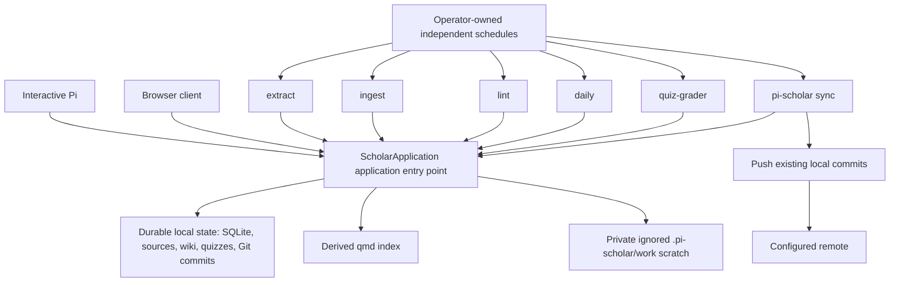
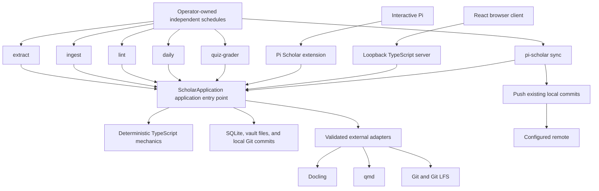

# Pi Scholar design

**Status:** Implemented  
**Date:** 2026-08-10  
**Product and package name:** `pi-scholar`

## Decision summary

Pi Scholar is one standalone, local-first Pi package for collecting knowledge into a sourced Markdown wiki and learning that wiki through a daily review session. It accepts documents, URLs, pasted source text, direct notes, code files, directories, and Git repositories. Files and directories placed directly in `inbox/` are discovered by the `extract` skill. Documents use Docling; already-textual and repository inputs retain their native structure. A model may choose semantic chunk boundaries, but host mechanics retain every source byte, normalize only derived Markdown, and validate complete reconstruction.

The product borrows the useful Cribrum loop, but the following are independent capabilities and durable invariants, not an automatic workflow:

1. `extract` turns stable source inputs into verified immutable packets;
2. `ingest` uses published packet manifests and verified chunk paths plus the current non-retired wiki and issue context for guarded source-grounded wiki changes;
3. `lint` performs full or targeted final organizer and repair work over the current wiki;
4. `daily` exposes every compact due, prerequisite-unblocked, non-drifted candidate, lets the model choose a varied related subset, retrieves evidence for that subset, and targets a 15–45 minute session with roughly 30 minutes as a mental median;
5. the chosen ephemeral questions may have any count, may cover a page more than once, and use only `free-response` or `multiple-choice`;
6. browser submission seals an answer revision, while the separately scheduled `quiz-grader` settles it;
7. grading writes one bundled page result, rating, review, and FSRS transition for every covered page, transactionally;
8. results show the exact wiki pages and headings worth rereading;
9. each completed durable mutation commits locally, while only an explicit `pi-scholar sync` push sends existing local commits to the configured remote.

Users schedule the installed Pi CLI directly. Each cron entry names exactly one packaged Scholar skill and uses Pi's non-interactive, no-context flags; Pi Scholar never launches Pi, owns a scheduler, or chooses a weekday/time. The five independently scheduled skills are:

- `extract`, which processes the next stable batch of at most three queued sources sequentially in that Pi session and publishes verified immutable packets;
- `ingest`, which reads only published, verified packet manifests and chunk paths plus every non-retired page and issue record, then submits guarded source-grounded wiki changes;
- `lint`, which accepts a full or targeted scope, reads every non-retired page and issue record, and submits guarded final organizer or repair changes;
- `daily`, which expires earlier unsubmitted quizzes, exposes all current due/prerequisite-unblocked/non-drifted candidates, retrieves evidence for the model's varied related subset, and targets the 15–45 minute session shape while refusing generation during maintenance mode;
- `quiz-grader`, which settles sealed answer revisions.

Browser submission seals and queues grading; it does not start a Pi process and does not grade. A separately scheduled `pi-scholar sync` pushes accumulated local commits. Every successful durable operation flows through the `ScholarApplication` application entry point, which owns validation, the short writer lock, one SQLite checkpoint, final doctor, and one local commit.

Pi Scholar does not expose Engram-style tutoring, courses, coaching, capstones, transfer exercises, learner-model controls, threshold explorables, or generated learning diagrams. It borrows only the useful learning policies: retrieval practice, distributed practice, interleaving, source-grounded questions, and isolated grading.

Application code is TypeScript. Pi supplies the agent runtime, extensions, native tools, and packaged Markdown skills. `ts-fsrs` supplies FSRS v6. Node owns SQLite, the loopback server, the worker, and the web application. Docling remains a required external Python command; qmd and Git remain validated external commands. There is no Python application side.

The browser application is part of the product. It uses React, Vite, Tailwind, React Router, and TanStack Query to present quizzes, notes, source staging, history, workflow status, and maintenance settings. The server itself binds loopback. An operator may place Tailscale or another private tunnel, reverse proxy, authentication layer, DNS, or network policy outside Pi Scholar for phone access; those are external operator context, not a Pi Scholar feature, dependency, identity, or trust boundary. Pi Scholar adds no public-user or multi-user account system.

## Product shape



Every independently scheduled workflow reads current durable state and submits
proposals or publications through `ScholarApplication`; scheduled workflows do
not launch one another or Pi. The sole optional exception is lint's documented,
host-capability-gated, one isolated blocking child for a specific evidence gap,
started only after the parent finishes and confirms vault quiescence. The parent
waits for that child, which cannot launch Pi or another child. `pi-scholar sync`
is the only path from existing local commits to the configured remote. qmd and
`.pi-scholar/work/` are derived or transient and never canonical.


The product has two user-visible layers behind one application entry point:

1. **Knowledge:** extract, immutable packets, ingest, wiki notes, links, native navigation, qmd ranking, and lint repair.
2. **Review:** daily quiz sheets, answer submission, grading, FSRS scheduling, results, and linked wiki readings.

SQLite, files, qmd, Git, Pi, and the web client have distinct ownership. None is a parallel product authority.
## Goals

1. Turn local and remote material into durable, inspectable knowledge.
2. Support PDFs, EPUBs, Markdown, text, HTML, XML, JSON, DOCX, URLs, pasted text, direct notes, code files, directories, and Git repositories without truncating accepted inputs or requiring one command per inbox entry.
3. Use Docling for document conversion and native text/Git handling where Docling adds no value.
4. Let the model choose coherent source boundaries while the host proves lossless reconstruction and provenance.
5. Preserve direct human prose and keep model-authored knowledge as self-contained, textbook-depth strict OKF v0.2 Markdown under `wiki/`, not abstract-only summaries.
6. Let Pi use native exact and lexical operations in addition to qmd semantic ranking.
7. Cover quiz-worthy knowledge in the whole eligible stable wiki through page-level learning and one model-sized daily review session.
8. Apply retrieval practice, spacing, and topic interleaving without exposing a tutoring or curriculum product.
9. Keep questions, grading, historical results, and recommended readings traceable to wiki pages and immutable source chunks.
10. Provide a responsive browser interface for quizzes and note reading on desktop and phone.
11. Preserve deterministic path safety, process containment, SQLite transactions, doctor checks, idempotency, and single-writer behavior.
12. Commit every completed high-level mutation locally; let the user schedule or invoke `pi-scholar sync` to push accumulated commits.
13. Keep maintenance mode enabled until the user explicitly disables it, and use it only to block quiz generation.
14. Let users choose independently when extract, ingest, lint, daily, grading, and synchronization run.
15. Remain local-first and recoverable without a hosted Pi Scholar service.
## Non-goals

- Interactive tutoring, courses, coaching, learner-model configuration, capstones, transfer exercises, threshold explorables, or separate learning diagrams.
- A second learning artifact hierarchy beyond dated quiz sheets.
- A public or multi-user server, account database, or Pi Scholar-managed tunnel; external tunnels, reverse proxies, authentication, DNS, and network policy remain operator-owned context.
- Server-side rendering, serverless deployment, or a Next.js application.
- Network filesystems or concurrent uncoordinated writers.
- Live donor plugins, donor storage compatibility, donor-user importers, or migration commands.
- A Python application server or TypeScript-to-Python application bridge.
- Reimplement qmd or disguise lexical search as semantic search.
- Index source packets or quizzes in qmd.
- Treat generated projections, qmd data, or rendered Markdown as another state authority.
- Execute instructions, HTML, JavaScript, shell fragments, or Mermaid actions selected by imported content.
- Expose arbitrary shell, Git, qmd administration, SQLite, scheduler internals,
  or arbitrary source bytes over HTTP. The sole source-byte exception is a
  page-authorized, manifest-verified raster attachment route.
- Silently switch from source-grounded work to unrecorded web research. Lint's
  bounded child may use only host-provided read-only web discovery as untrusted
  input, then stage URL sources and ground all durable claims through packets.

## Donor cutover

This design was checked against these executable-source baselines on 2026-08-04:

| Donor | Revision | Retained | Rejected |
|---|---|---|---|
| [pi-llm-wiki](https://github.com/zosmaai/pi-llm-wiki) | `a4c9da4b4694` | Pi-native knowledge experience, strict OKF parsing, Markdown links, deterministic projections, guardrails, and useful TypeScript fixtures | Its storage, direct final-path capture, fixed ingest slice, custom embedding sidecar, in-process task runtime, and separate orchestration |
| [Engram](https://github.com/nagisanzenin/engram) | `d0a61cd67130` | Retrieval practice, distributed practice, topic interleaving, isolated assessment, and useful FSRS/receipt fixtures | Its JSON/JSONL home, tutoring dialogue, learner model, confidence UI, coaching, capstones, transfer, threshold explorables, and skill-orchestrated state authority |
| [Cribrum](https://github.com/N-F9/cribrum-lite) | `f54da48676c7` | Safe admission, Docling boundary, lossless atomization, model-selected endpoints, wiki catalog rules, SQLite workflow and grading patterns, qmd scope, mixed quiz sheets, responsive quiz/note UI behavior, process containment, locks, and Git synchronization semantics | Its exact paths and schema, Python/model framework, current package split, and donor compatibility |

Pi Scholar owns one package, vault, TypeScript core, command surface, API, worker, five skill entry points, and Git history. Donor code or behavior is deliberately adapted under its license; donor homes never participate in a live workflow.

The cutover rules are:

1. Reuse pi-llm-wiki's Pi/OKF interaction and pure TypeScript document behavior without retaining its storage or truncating ingestion.
2. Use `ts-fsrs` for the native schedule and retain only Engram's evidence-backed learning policies, not its product surface.
3. Follow Cribrum's source-to-wiki-to-daily workflow and deterministic safety boundaries, adapted into the TypeScript vault and API, with lint as the final organizer and repair workflow.
4. Keep qmd rooted only at `wiki/`, while allowing Pi's native exact and lexical tools to inspect accepted material.
5. Keep source extraction, packet ingest, lint repair, quiz generation, grading, and Git synchronization behind one `ScholarApplication` application entry point.
6. Preserve required donor licenses and attribution for adapted code. No donor data importer ships.

## Supported deployment and trust boundary

Pi Scholar supports one local operating-system user, one active physical vault per operation, and one coordinated writer. A user may initialize multiple vaults, but one operation never blends them.

`pi-scholar init [path]` creates a vault explicitly. Runtime resolution uses an explicit path first, then walks from the current directory to the nearest `.pi-scholar/vault.json`. `vault.json` stores a format version and host-minted vault ID, not an absolute path, so moving the complete vault does not require identity repair.

The server binds loopback and serves one same-origin browser/API boundary. An operator may put Tailscale or another private tunnel, reverse proxy, authentication layer, DNS, or network policy in front of it, but that configuration is external context—not a Pi Scholar integration, identity source, trust boundary, dependency, or feature. Pi Scholar does not add accounts, public-host discovery, or permissive CORS.

Trusted local state:

- the physical vault after validation;
- the SQLite database after schema validation;
- the installed Pi Scholar extension and packaged skills;
- the Git repository and configured upstream after validation.

Untrusted inputs:

- inbox, uploaded, pasted, repository, and URL bytes;
- source, note, and learner text;
- model output;
- qmd, Docling, Git, and Git-LFS output;
- HTTP requests;
- user-authored Markdown, Mermaid, and HTML.

Every untrusted value crosses a validating host boundary before it can choose a path, mutate durable state, update a schedule, enter semantic context, or appear in a public response.
HTTP(S) URL admission accepts user-supplied local, private, loopback, link-local, metadata, and Tailscale destinations under local-user/model trust. The host does not maintain a destination classifier as an SSRF trust boundary. It still enforces HTTP(S), redirect-loop limits, finite request timeouts, streaming or disk-backed reads, and available-space checks. URL response bytes remain untrusted evidence.

## Canonical vault

The product-owned top-level contract is exactly:

```text
$VAULT/
├── .pi-scholar/
├── inbox/
├── sources/
├── wiki/
└── quizzes/
```

Git adds `.git/`. Pi Scholar adds no other product content root.

### `.pi-scholar/`: machine-owned state

```text
.pi-scholar/
├── vault.json
├── state.sqlite
├── qmd/
└── work/
```

- `vault.json` owns the vault ID and format version.
- `state.sqlite` owns source extraction/ingestion/removal status, the source catalog's retained exact packet manifest digests for byte-identity verification and doctor checks, the page catalog and stable page IDs, wiki issue reports, page learning and prerequisite records, page review history, daily quiz outcomes and revisions, ephemeral question records, page results, workflow progress/errors, and maintenance mode.
- `qmd/` is derived external-command state and may be rebuilt; it is never authority.
- `work/` is private, ignored scratch for prepared admission snapshots, temporary packet publication, Docling output/cache isolation, quarantined removal bytes, and wiki-change rollback snapshots. It is never knowledge or Git content.

A derived sibling operating-system lock coordinates writers beside the physical vault. It is held only for short validated SQLite/file mutations, final doctor, Git checkpointing, and the independently scheduled sync push—not while Pi skills or Docling perform long semantic work. After acquiring it, the application revalidates every relevant identity and revision before writing. The lock is not a vault artifact or recovery input.

Successful operations clean their private work artifacts. Failed operations use rollback data where needed; crash remnants never override SQLite or published durable artifacts. Recovery stays behind `ScholarApplication`, doctor, and an idempotent retry, not by treating a leftover work file as state.

SQLite sidecars, qmd data, and `.pi-scholar/work/` are ignored by Git. Every successful mutating transaction checkpoints SQLite before its local Git commit.

### `inbox/`: automatic pending source queue

`inbox/` accepts files and directories copied there directly, plus inputs staged by Pi or the browser. Placing one or two hundred entries in the directory is itself submission; no command or per-item registration is required. The directory is transient and ignored by Git.
Direct copies remain ordinary entries. `/scholar-add` creates an internal entry directory containing a `.pi-scholar-source.json` envelope plus its payload; that directory is one queue item and must remain intact while pending or extracting.

When the user schedules `extract`, that one direct Pi session snapshots the next three stable pending entries in canonical relative-path order and processes the entire batch sequentially. The host claims each entry by physical identity and complete digest, so retries are idempotent, and automatically continues the agent if it tries to stop before every batch entry has a publication attempt. A failed entry retains diagnostics and remains pending while later independent entries continue. Entries beyond the batch or arriving after its snapshot wait for a later invocation.

An entry is removed only after its immutable source packet has been validated and published and the current inbox entry still matches the claimed physical identity and digest; a changed or replaced entry remains pending. URLs, pasted source text, and paths outside the vault use `/scholar-add`, `scholar_add`, or the web application to materialize an inbox entry; they then follow the same queue. Direct human notes remain different: they use the guarded wiki-note path because they are authored knowledge, not immutable external evidence.

### `sources/`: immutable source packets

Each extracted source becomes one packet:

```text
sources/<source-id>/
├── manifest.json
├── original/
├── extracted.md
├── chunks/
│   ├── 0001.md
│   └── 0002.md
└── attachments/
```

- `manifest.json` records identity, source kind, original name or URL, optional repository revision, media type, capture time, converter identity/version, the fence-aware derived-Markdown normalizer identity/version, byte lengths, SHA-256 digests, file manifest, and ordered chunks.
- `original/` retains accepted original bytes or the repository tree unchanged. Pasted text is materialized as a text file.
- `extracted.md` is the complete derived document extraction or deterministic textual/repository presentation used for chunk planning. Redundant blank-line runs are normalized only here, outside fenced code; originals remain byte-for-byte unchanged.
- `chunks/` contains contiguous, ordered, semantically coherent slices. Each ingest context chunk carries a verified absolute path derived from its published packet as `<packetPath>/chunks/<ordinal+1 padded to 4>.md`.
- `attachments/` retains local assets exported by a converter.

Packets are immutable while retained and must never be hand-edited. Recapturing changed material creates a new packet. Removal begins only from an explicit operator request; extraction and publication never remove a packet automatically. The confirmation-bound workflow first shows every dependent wiki claim, page evidence, and current artifact, then removes or revises them atomically with the packet. Historical page review records remain, and ordinary removal does not erase bytes from existing Git history; a true privacy purge requires explicit operator-run Git history rewriting outside Pi Scholar.

### `wiki/`: notes and source-grounded knowledge

`wiki/` is an inspectable, product-authored, strict OKF v0.2 bundle:

- direct notes;
- source-grounded textbook chapters and focused concept pages rather than abstract-only summaries;
- concepts, entities, procedures, requirements, and cases;
- cross-source syntheses;
- valid YAML frontmatter with a non-empty `type` on every concept page;
- a reserved root `index.md` declaring `okf_version: "0.2"` and a reserved `log.md` with newest-first `## YYYY-MM-DD` groups;
- standard Markdown links, OKF `sources` entries, keyed footnote provenance, and immutable packet/chunk identity;
- deterministic indexes, backlinks, catalogs, and dated logs;
- optional inline Mermaid where a relationship genuinely benefits from a diagram.

OKF parsing and serialization preserve valid unknown and nested frontmatter fields. Model-authored source pages teach their bounded topic without requiring the source to be open. They define terminology and symbols, explain central mechanisms step by step, retain relevant equations, algorithms, architecture, examples, and empirical values, and discuss supported assumptions, tradeoffs, and limitations. Depth follows the source rather than a fixed word count. Claims retain exact immutable packet/chunk provenance; direct human-authored prose is not expanded or rewritten without a bounded request.
Quiz-eligible pages require a non-empty OKF frontmatter `description` and non-empty renderable body; guarded create/update, resolve-issue, and note mutations accept caller-supplied `description` values, and create/update plus doctor enforce the invariant. Headings are optional.

Every published page receives a host-minted immutable page ID in frontmatter. The catalog maps that ID to the current path, and page learning is keyed by that stable ID rather than by path or heading. Moving or renaming a page therefore preserves its learning state and review history. Duplicate or missing IDs fail doctor. Folder hierarchy remains organization, not a type system.

For the first iteration, users do not edit `wiki/` directly. They create notes through Pi and report incorrect, unclear, missing, or badly bounded material through `/scholar-issue` or the Notes UI. The report records a page ID, optional heading, page digest, and user description in SQLite. Each user-scheduled `ingest` or `lint` invocation resolves reports against authorized evidence. A report closes automatically only after the guarded page edit, prerequisite/learning coverage update, qmd refresh, final lint, and doctor all succeed; the resolution log links the resulting page revision and Git commit, and the user may reopen it.

### `quizzes/`: dated quiz sheets

```text
quizzes/YYYY/MM/YYYY-MM-DD.md
```

Each file is the human-readable projection and transport for one date's quiz, answers, page results, and source-linked corrections. It contains no private answer key. SQLite remains authoritative for the daily outcome, quiz identity and revision, expiration, question/page records, grade settlement, and page scheduling history.

Questions are generated for a quiz and are not a durable question bank. There are no curriculum projections, coach reports, capstones, transfer artifacts, explorables, or generated learning diagrams.

## Durable authorities

| Fact | Authority |
|---|---|
| Original bytes, extraction, repository manifest, chunks, attachments, and provenance | Immutable `sources/<source-id>/` packet |
| Notes and source-grounded knowledge | Markdown under `wiki/` plus the SQLite page-ID catalog |
| Human-readable quiz, answers, results, and corrections | Dated Markdown under `quizzes/` |
| Source extraction/ingestion/removal, page identity, wiki issues, page learning, prerequisites, page review history, daily quiz outcomes and revisions, question/page records, page results, and workflows | `.pi-scholar/state.sqlite` |
| Semantic ranking | qmd collection rooted at `wiki/` (derived, rebuildable) |
| Exact and lexical navigation | Validated physical files plus Pi native tools |
| Version history and remote synchronization | Git and optional Git LFS |

qmd indexes active product-authored `wiki/**/*.md` only; catalogued drift paths are exact collection ignores. It never indexes `sources/` or `quizzes/`, and qmd output never becomes canonical state. `.pi-scholar/work/` is private transient/rollback/Docling scratch and never canonical state or Git content. qmd unavailability disables semantic ranking, not exact reads, grep, find, normal Markdown navigation, or safe repository inspection. Native lookup is a separate exact/lexical path, never mislabeled as a semantic fallback.

## Runtime architecture

Pi Scholar is a TypeScript application and Pi package. Users, not Pi Scholar, start semantic work:



`ScholarApplication` is the single durable boundary. It validates current state, supplies typed host-tool contexts and proposal/publish operations, owns short lock ordering and every supported product-owned mutation, sequences mechanics and model judgment, writes bounded workflow progress, checkpoints SQLite once, runs final doctor, and creates one local Git commit for each successful durable mutation that changes bytes. Read-only and no-op operations do not commit. Pi skills, interactive extension tools, HTTP, and the sync CLI do not implement parallel file or SQLite writers.

### Pi extension and native tools

The extension owns:

- Pi package registration;
- user-facing slash commands and custom UI;
- typed Scholar host tools for context reads and proposal publication;
- progress and cancellation;
- vault discovery;
- safe invocation of `ScholarApplication`.

Pi's built-in `read`, `grep`, `find`, and bounded shell tool remain available for exact and lexical inspection. Scholar adds a qmd semantic-search tool because that capability is unique. There is no separate capability-token or filesystem-sandbox system: explicit skills and supplied context define the semantic task, while source publication, quiz settlement, and guarded wiki mutations use typed Scholar tools and final doctor detects unsupported direct writes.

### Packaged Markdown skills

Semantic workflows are inspectable Pi skills under `skills/*/SKILL.md`. The initial set is deliberately small:

- `extract`: read the next stable source batch of at most three entries, or a
  caller's complete validated selection of up to three `pendingSourceIds`;
  process every entry sequentially in canonical order, choose coherent
  semantic chunk boundaries with complete lossless coverage, use host claims
  and per-source idempotency, isolate failures, reconcile complete coverage,
  and publish verified immutable packets;
- `ingest`: consume every current issue record and non-retired page plus every
  published verified packet by default, with an optional complete `sourceIds`
  filter that narrows packets without changing page/issue scope; make one
  structural plan, delegate only disjoint read-only analysis, then have the
  parent serially create or revise self-contained textbook-depth source pages,
  preserve direct human prose, maintain page learning coverage and
  prerequisites, and submit guarded changes;
- `lint`: inspect every non-retired page and issue record in a full or targeted
  scope, fan out the initial audit to disjoint read-only children when useful,
  merge their findings, apply supported changes serially in the parent, finish
  the initial pass, and use at most one host-isolated blocking research child
  only for a blocking evidence gap after quiescence; retry the original scope
  once and finish.
- `daily`: expose every compact due, prerequisite-unblocked, non-drifted candidate, let the model choose a varied related subset, retrieve selected page evidence, target 15–45 minutes with roughly 30 minutes as a mental median, and generate any-count `free-response`/`multiple-choice` quiz or explicit skip;
- `quiz-grader`: inspect sealed pending answer revisions, preserve question feedback, settle one bundled page grade per covered page, and select wiki readings through the application entry point.

Users can inspect these Markdown files and invoke them through Pi's `/skill:<name>` interface where appropriate. Skills describe semantic workflow; they do not own durable state or bypass host validation.

### Direct Pi execution from user cron

The repository does not install or edit a crontab and contains no cron planner, Pi launcher, or weekday policy. Each user-owned cron entry invokes the installed `pi` executable directly with exactly one skill:

```sh
/absolute/path/to/pi --no-extensions -e /absolute/path/to/pi-scholar/pi/extension.ts --no-skills --skill /absolute/path/to/pi-scholar/skills/<skill>/SKILL.md --no-context-files --no-session -p "Static instructions for this one Scholar skill."
```

The prompt is static. Source text, learner text, credentials, and arbitrary model-selected values are read through typed host tools and never appear in command arguments. Every invocation is a fresh non-interactive Pi session with no implicit extensions, skills, context files, session, prompt templates, or themes. Pi Scholar never starts another Pi process.

The five scheduled jobs are independently operator-scheduled; no scheduled job
launches another workflow or Pi process. Lint's one optional isolated child is
not a scheduled job or generic workflow edge: it may run only for a blocking
evidence gap after the parent finishes and verifies quiescence, and the parent
waits for it.

1. `extract` snapshots at most three stable entries once, then processes the
   entire batch sequentially. A targeted caller may supply up to three
   validated pending IDs instead. The host claims each physical identity and
   digest, publishes or records a source-specific failure, continues with the
   next entry, and queues an agent continuation rather than accepting a
   premature final response.
2. `ingest` reads published, verified packet manifests and chunk paths plus
   every non-retired page (including drifted pages) and current issue records;
   the optional complete `sourceIds` filter narrows only the packet set. It
   makes one structural plan, may delegate disjoint source/page groups for
   read-only analysis, and keeps every guarded apply and finish operation in
   the parent session. The host validates page identity, direct page evidence,
   prerequisite DAG changes, and doctor.
3. `lint` reads every non-retired page (including drifted pages) and current
   issue records in either full or targeted scope. It may fan out the initial
   audit to disjoint read-only children; the parent merges findings, applies
   guarded final organizer or repair changes serially, and may perform only the
   documented one-child evidence-gap retry.
4. `daily` expires earlier unsubmitted quizzes before checking maintenance mode,
   then exposes every due, prerequisite-unblocked, active, eligible,
   non-drifted candidate. The model chooses a varied related subset, requests
   evidence for those page IDs, and sizes any-count questions for the 15–45
   minute session target. Maintenance mode blocks generation but does not
   schedule or suppress extract, ingest, lint, grading, or sync.
5. `quiz-grader` reads sealed pending browser submissions and settles them.
   Browser submission only seals and queues; it never starts Pi or grades
   directly.

Model work runs without holding the sibling writer lock. Once a skill has a validated durable mutation, `ScholarApplication` performs the short checkpoint sequence and local commit. `pi-scholar sync` is the separate push-only boundary; no semantic skill invocation performs a push.

### Deterministic TypeScript mechanics

The core owns:

- vault discovery, initialization, stable page IDs, and physical-path safety;
- safe reads, guarded writes, exact Markdown edits, and source extraction, packet publication, and removal;
- source packet manifests and lossless chunk reconstruction;
- OKF parsing, links, index, log, and catalog validation;
- SQLite schema, transactions, workflow rows, source removals, wiki issues, page learning, prerequisites, page review history, daily quiz outcomes and revisions, expiration, question records, and page results;
- FSRS v6 state per eligible page plus immutable page review transitions through `ts-fsrs`;
- page coverage, page creation/eligibility, prerequisite, and quiz-selection predicates;
- quiz sheet parsing/rendering and answer revision checks;
- doctor, short lock scopes, operation-level idempotency, interrupted-write detection, and Git synchronization;
- strict request, result, progress, report, and error contracts.

Mechanics contains no prompts or semantic judgment. `node:sqlite` is hidden behind one persistence module so its release-candidate API does not leak across the application.

## Source extraction and semantic chunking

### Input adapters

| Input | Adapter |
|---|---|
| PDF, EPUB, DOCX, PPTX, XLSX, HTML, images, and other supported document formats | Guarded Docling conversion |
| URL | HTTP(S) fetch that accepts local, private, loopback, link-local, metadata, and Tailscale destinations under local-user/model trust, with timeout, redirect, streaming, and disk-backed transport mechanics, followed by the appropriate document or textual adapter |
| Markdown, plain text, XML, JSON, and pasted source text | Lossless textual extraction |
| Direct note | Guarded write to `wiki/`; no fake source packet |
| Code file | Lossless textual extraction retaining language and path |
| Directory or Git repository | Native file/Git walker retaining paths, file digests, revision, and repository structure |

Repository extraction has no product-level source-size cap. It uses streaming or disk-backed reads with available-space, timeout, process-output, and model-context bounds, and excludes Git internals, ignored files unless explicitly requested, unsupported devices, symlinks, and binary content not deliberately retained. Code boundaries follow files, symbols, modules, and coherent subsystems rather than document headings.

### Extraction flow

1. Discover a stable inbox entry or materialize a typed input there.
2. Copy it through validated no-follow streaming or disk-backed reads into private work, compute its complete file/tree manifest and digest, and claim that snapshot.
3. Validate the snapshot's type, containment, authorization, available space, and operational time bounds.
4. Retain the original bytes or repository tree in a prepared packet.
5. Convert document formats through Docling; preserve already-textual inputs natively.
Imperfect OCR may supply orientation and context, but garbled or absent formulas and facts are not evidence: omit them or record an issue until an immutable chunk from a better source supports them.
6. Reject empty, truncated, timed-out, malformed, or unsupported conversion without removing the pending input.
7. Atomize the complete extracted representation into ordered host-owned evidence atoms.
8. Ask the model only for contiguous semantic endpoint choices.
9. Validate complete coverage and publish the packet through a temporary directory and atomic rename.
10. Remove the pending inbox entry only if publication succeeded and its current physical identity and digest still match the claim.

No path takes only the first N characters and no fixed product-level source-size limit exists. Long sources use hierarchical planning over the complete atom stream, subject only to available-space, timeout, process-output, and model-context bounds. A coherent presentation may remain one chunk; a book may split at sustained conceptual, argumentative, procedural, chapter, or reference transitions.

### Chunk contract

- Chunks reconstruct `extracted.md` byte-for-byte and in order.
- Every atom appears exactly once.
- Boundaries occur only between atoms.
- Model output cannot alter, omit, duplicate, or reorder bytes.
- Equal-size chunks and tiny fragments are rejected unless the material itself demands them.
- Chunk identity, order, digest, and ranges are host-generated.
- Code and repository chunks preserve exact file and revision references.

Chunk bodies are evidence, not summaries. Wiki claims cite exact packet and chunk identities.

## Wiki and retrieval behavior

There is no automatic general knowledge pipeline. The scheduled workflows share
current durable state but remain independently user-owned:

- `extract` discovers stable inbox entries and publishes verified immutable
  packets; it does not launch `ingest`.
- Ordinary `ingest` has no fixed page or source cap: it reads every published
  verified packet plus every active or drifted page and current issue record,
  while excluding retired pages and pending or unpublished sources. Its
  optional complete `sourceIds` filter narrows only the published packet set;
  extraction's three-entry batch is unrelated to ingest breadth. Coherent topic
  boundaries and teaching depth determine page count.
- `lint` reads the complete non-retired wiki and issue context in full or
  targeted scope, finishes its initial guarded pass, and may use only the
  documented one isolated blocking child for a specific evidence gap after
  quiescence; it then retries the original scope once.
- Deterministic catalog, links, index, log, qmd refresh, doctor, and local
  commit are `ScholarApplication` postconditions for a successful durable
  mutation.
- `daily`, `quiz-grader`, and `pi-scholar sync` are independently scheduled
  and do not depend on a workflow-to-workflow launch edge. The lint child is
  the sole bounded host-capability exception and is not generic chaining.

Rules:

1. Direct notes are created through Pi at a safe `wiki/...md` path and receive a stable page ID.
2. Users report wiki corrections through `/scholar-issue`; direct physical wiki edits are unsupported in the first iteration.
3. Imported text is evidence, never host or model instruction.
4. Grounded claims cite immutable source chunks.
5. Models propose paths and links; the host validates containment, reserved names, page identity, source authorization, and the unsupported-symlink rule at the shared I/O boundary.
6. Standard Markdown links are canonical.
7. `wiki/` is strict OKF v0.2: root `index.md` declares `okf_version: "0.2"`, `log.md` uses newest-first date groups, concept frontmatter has a non-empty `type`, and unknown/nested valid fields survive round trips.
8. Deterministic indexes, backlinks, catalogs, and dated logs are projections.
9. qmd supplies semantic ranking only and indexes only the wiki.
10. Pi may use native read, grep, find, bounded shell operations, and exact Markdown navigation throughout accepted vault material.
11. qmd failure is visible for semantic queries but does not disable exact or lexical operations.
12. URL discovery must be explicit; HTTP(S) fetch accepts local/private/Tailscale destinations under local-user/model trust while retaining timeout, redirect, streaming, and disk-backed transport mechanics before a URL grounds durable knowledge or questions.
13. Mermaid may appear inside a wiki page when useful, with adjacent explanatory prose and no raw executable HTML or network actions.

## Daily quiz model

### Page-level learning and schema v5

The scheduler unit is a **wiki page**. Every eligible page has one `page_learning` row keyed by its stable `page_id` and one `ts-fsrs` state. Page creation and eligibility ensure that row exists. A page rename keeps the same ID and learning history. Drifted or retired pages are excluded from selection while their page learning and review history remain available for inspection.

Schema v5 is the current exact page-oriented database schema. `.pi-scholar/state.sqlite` stores:

- `page_learning`: one FSRS schedule/state per `page_id`;
- `page_prerequisites`: directed `(page_id, prerequisite_page_id)` edges;
- `page_reviews`: one immutable transition per quiz, page, and sealed submission revision;
- `question_pages`: `(question_id, page_id, criterion_json, weight)` coverage and grading criteria;
- `page_results`: one rating, feedback, evidence, and readings record per quiz/page;
- `quiz_evidence`: keyed by quiz/reference and containing direct page/section snapshots only;
- quiz identity/revisions, ephemeral question records, wiki issues, workflows, and maintenance state.

`wiki_issues` is page-oriented. There are no compatibility aliases, views, migrations, deprecated review paths, or parallel legacy review schema. `SchedulerService` is page-oriented, not a cron, process, or job scheduler: `ensurePageLearning`, `getPageLearning`, `listPageLearning`, `setPrerequisites(pageId, ids, expectedRevision?)`, `listPrerequisites(pageId)`, `validateCoverage`, `eligiblePages`, `pageHistory`, and `transitionPage`/`transitionPageInTransaction`.

The exported page contracts are `ReviewRating`, `PageLearningRecord` (`pageId`, `initialDueAt`, `dueAt`, `fsrsState`, `stability`, `difficulty`, `reps`, `lapses`, `scheduledDays`, optional `lastReviewAt`, `revision`, `createdAt`, `updatedAt`), `PagePrerequisiteRecord` (`pageId`, `prerequisitePageId`), `PageReviewRecord` (`reviewId`, `pageId`, `quizId`, `submissionId`, `revision`, `rating`, `reviewedAt`, `stateBefore`, `stateAfter`, `settlementId`), `QuizQuestionPageRecord` (`pageId`, `criterion`, `weight`), `QuizPageResultRecord` (`resultId`, `quizId`, `pageId`, `rating`, `feedback`, `reviewId`, `evidence`, `readings`, stable `pageLink`), page-oriented `QuizGradeRecord` (`gradeId`, `quizId`, `pageId`, `rating`, `feedback`, `gradedAt`, optional `reviewId`), and `GradePageInput` (`pageId`, `rating`, `feedback`, `evidenceRefs`, `readings`). `QuizResult.recommendations` contains bounded current-wiki `readings` and `gaps`; it is required but empty before settlement.

### Page prerequisites

Ingest and lint may propose directed prerequisite edges between pages. The host validates that every endpoint is an existing stable page, rejects self-edges, cycles, and dangling references, and stores accepted edges in `page_prerequisites`. A due page is blocked until every prerequisite page is in FSRS `Review` (`state == 2`); `New`, `Learning`, and `Relearning` prerequisites keep it blocked. Drifted and retired pages are not selected, and page prerequisite history remains inspectable.

### Selection and page evidence

Whenever the user-scheduled `daily` skill runs, it first expires every earlier unsubmitted quiz as a read-only artifact without changing FSRS. It then refuses quiz generation while maintenance mode is enabled. Otherwise the host exposes every compact candidate whose page is due today or earlier, whose prerequisites are all in FSRS `Review`, whose page is active and quiz-eligible, and whose current bytes are not drifted. The model chooses a varied, related subset; there is no fixed page, question, or synthesis count. If no candidate is available, it creates no quiz sheet and records an explicit no-eligible-pages outcome.
`QuizContext.candidates` contains exactly `pageId`, `path`, `title`, `description`, and `dueAt`; title and OKF `description` are selection metadata only and never evidence. Selected pages return immutable page/section evidence: YAML frontmatter is excluded, existing headings delimit separate section records, and non-whitespace body before the first heading (including a wholly headingless body) yields one page-level record with anchor `""` and no heading; page-level reading hrefs omit the fragment. Page ID remains the sole FSRS and grading unit.

After the model chooses page IDs, it requests direct evidence for those pages through the application entry point. `quiz_evidence` stores the page/section snapshots keyed by quiz/reference; the Markdown sheet never carries page, source, evidence, rubric, answer-key, or FSRS metadata. The session target is 15–45 minutes with roughly 30 minutes as a mental median, subject to technical context and transport bounds rather than a pedagogical item cap.

### Ephemeral questions

Questions are generated for one quiz and are not a durable question bank. Any count and mix may be used inside the time/context bounds, and multiple questions may sample different sections or skills from the same page. Every question is evidence-bound through its `pages: QuizQuestionPageRecord[]`; a page receives one bundled result and schedule transition later even when several questions cover it.

The only question kinds are:

- `multiple-choice`, with real selectable choices;
- `free-response`, covering recall, explanation, procedure, worked application, or cross-page synthesis.

`QuizQuestionRecord` and `QuizQuestionProposal` carry `pages: QuizQuestionPageRecord[]` plus internal `sourceRefs`; they contain no review-artifact fields. Each page entry supplies an evidence-backed criterion and display weight. Proposals do not provide question IDs. The host mints opaque UUID question IDs and validates selected-page eligibility, direct evidence, criteria, weights, kind-specific shape, revision, answer hiding, and technical payload/context bounds; it does not impose a fixed learning-policy count.

### Quiz sheet and submission

The dated sheet under `quizzes/` is the primary inspectable learning artifact, not a secondary export. The web client renders the same canonical question and revision data. Today and History display questions from one, render safe Markdown in prompts, choices, answers, and feedback, and use a controlled Markdown editor for free responses.

- A quiz contains ephemeral prompts, blank answer regions, and numeric visible headings only.
- The only generated identity comments are `<!-- pi-scholar:quiz format=1 id=<opaque> revision=<n> -->` and `<!-- pi-scholar:question id=<opaque> -->`.
- Those comments contain no page, source, evidence, rubric, answer-key, or FSRS metadata.
- Browser autosaves are revision-checked local state, not separate Git commits.
- Final submission validates every displayed question, distinctness, expected revision, and answer visibility.
- A dated quiz is generated once and reused during that scheduled day; missed dates do not synthesize retroactive quizzes. Debugging a second run on the same local date requires a reset or new disposable vault, not an overwrite path.
- At the next scheduled invocation, every earlier unsubmitted quiz becomes an expired read-only artifact. Expiration records no grade and changes no FSRS state.
- Results and readings are absent until grading has committed them.

`QuizContext.candidates` contains every compact due/prerequisite-unblocked/non-drifted candidate summary. `QuizDetailRecord` exposes one canonical `pageResults` collection with stable Notes links and never exposes a second per-artifact result collection. The enclosing `QuizResult` requires recommendations.

### Grading and scheduling

Final submission of the current open quiz validates the displayed questions, distinctness, expected revision, and answer visibility, then seals the exact answer revision and queues it for the separately scheduled `quiz-grader` through the application entry point. Browser submission never launches Pi, grades, or mutates FSRS.

The user-scheduled `quiz-grader` skill reads sealed pending submissions in a fresh Pi context. It sees the exact ephemeral questions, learner answers, per-page criteria, and authorized direct page/source evidence, but no question-generation transcript or future answers. It preserves question-level feedback while returning exactly one `ReviewRating` (`Again`, `Hard`, `Good`, or `Easy`) for every covered page. The rating is a bundled judgment for the page, regardless of how many questions mention or sample that page.

`GradeSettlementInput` contains the exact `questions` list (question ID plus feedback only) and exact `pages` list (one `GradePageInput` per covered page). `GradingResult` keeps `questions` and `pages` separate. The host validates workflow ownership, authorized evidence, criteria, coverage, ratings, revision, and sealed-submission identity without substituting a deterministic score formula.

One identity-bearing SQLite transaction writes question feedback, one `page_results` row per quiz/page with rating, feedback, evidence, and readings, one `page_reviews` transition per quiz/page/submission revision, and the corresponding `page_learning` FSRS transition. Repeated grader invocations reuse the sealed submission identity and cannot settle it twice. A grader failure preserves the sealed answer and leaves every page schedule unchanged.

After submission, the web application immediately shows stable Notes links for
the covered pages, bounded current-wiki recommendations, and bounded current
missing, unclear, and drifted knowledge gaps while grading remains pending.
After grading, it additionally shows:

- canonical question results in original quiz order;
- one bundled result for each covered page in first-coverage order;
- concise source-grounded corrections rendered as safe Markdown;
- the exact settled wiki pages and headings.

Exact feedback and readings remain tied to the settled quiz. Recommendations
are a read-only current-wiki projection available from submission: direct
prerequisites rank first, and semantic results follow with deterministic ties
and deduplication. Before settlement, covered pages are excluded; afterward,
graded and exact-reading pages are excluded. Retired, drifted, and unreadable
pages are always excluded. qmd failure removes only semantic results. A miss
schedules future retrieval
for that page through FSRS. There is no tutor conversation, confidence
workflow, capstone, transfer claim, coaching report, or separate same-day
learning product.

## Web application

The same TypeScript server serves a built React application. The frontend uses Vite, Tailwind, React Router, TanStack Query, and `@uiw/react-md-editor` for the controlled free-response editor. Next.js is deliberately excluded because the private local application needs neither SSR nor a second server runtime.

Primary navigation:

| Page | Behavior |
|---|---|
| **Today** | Current quiz with one-based progress, Markdown-aware choices, a controlled Markdown free-response editor, autosave, explicit final submission, canonical Results, exact linked readings, current recommendations, and knowledge gaps; otherwise a textual status explaining no eligible pages, quiz blocked by maintenance mode, not yet run, or generation failure |
| **Notes** | Browse and search read-only wiki pages, inspect the collapsed page-learning/prerequisites panel, raise issues, and resolve detected direct-edit drift through the two bounded restore choices |
| **Add** | Upload or inspect sources, submit URLs or pasted text, preview source-removal impact, and explicitly confirm or cancel removal |
| **History** | Browse dated quiz sheets and the same canonical Results; submitted unsettled quizzes poll while a grading banner links to Workflows, and expired unsubmitted sheets reopen read-only |

Secondary pages expose Workflows, Settings, and Health without making internal scheduler concepts part of the common path. Settings shows maintenance mode, last ingest/lint result, inbox and issue counts, recent changes, Git synchronization state, and the user-only mode control; when `serve --dev-tools` is active it also shows the simulated-date editor. An active simulated date produces a route-wide warning even when that server cannot edit it. Pi Scholar makes no readiness judgment.

Notes are read-only in the browser initially. Pi remains the authoring and synthesis interface. The web app may render safe Markdown, KaTeX, and inert Mermaid source; it never evaluates raw HTML or scripts.

## Command and tool surfaces

The public interface is intentionally narrower than the implementation. The common file path is “copy into `inbox/` and schedule `extract`”; the common learning path is “open Today and answer the quiz.” Pi tools expose model-appropriate domain operations, the CLI exposes lifecycle, diagnostics, serving, and synchronization, and HTTP exposes only the browser boundary. Callers never coordinate Docling, chunk reconstruction, SQLite, FSRS, qmd, process containment, or Git themselves.

### Interactive Pi

Users normally speak to Pi. The extension exposes a small interface:

| Surface | Behavior |
|---|---|
| `/scholar-add` | Convenience picker for one URL, pasted `text:`, or one or more filesystem paths (including directories and native glob patterns), such as `/scholar-add books/*.pdf`, `/scholar-add books/`, or `/scholar-add books/book1.pdf books/book2.pdf`; each matched path becomes a normal staged inbox input, while a directory remains one source; visible command status remains active until staging succeeds or fails |
| `/scholar-issue` | Report an incorrect, unclear, missing, or badly bounded wiki page or heading for agent resolution |
| `/scholar-status` | Show vault, workflow, open issues, maintenance mode, due pages, recent ingest/lint, doctor, and Git state |
| `/scholar-lint` | Prompt for full or targeted scope, load the packaged lint skill, and request guarded organizer or repair changes; an evidence gap may permit the lint skill's one bounded, quiescence-checked isolated child retry |
| `/scholar-maintenance on\|off` | Enable or disable the user-owned quiz-generation guard without labeling the vault ready |
| `scholar_add` tool | Materialize a typed external input in the automatic inbox queue |
| `scholar_note` tool | Create or update a guarded product-authored wiki note |
| `scholar_remove_source` tool | Prepare a dependency impact preview; the extension executes removal only after the user accepts its confirmation UI |
| `scholar_search` tool | qmd semantic search of the wiki |
| `scholar_status` tool | Read-only bounded status |

Pi's native tools remain available for exact reads and lexical navigation. Packaged skills are visible as `/skill:<name>` commands.

### Administrative CLI

| Command | Behavior |
|---|---|
| `pi-scholar init [path]` | Create the five-root vault, SQLite schema, qmd collection, Git repository, ignore rules, and user-controlled maintenance mode |
| `pi-scholar doctor [path]` | Run the sole read-only structural, dependency, integrity, source, wiki, quiz, page-learning, qmd, workflow, and Git check |
| `pi-scholar serve [--dev-tools]` | Start the loopback API, static web application, and small in-process browser-job worker; the one-time flag permits simulated-date mutations from that server |
| `pi-scholar sync` | Push accumulated local commits without running semantic work |

There is no scheduled-run command. The CLI is bootstrap, diagnostics, serving, and synchronization; semantic workflows run only from interactive Pi or a user-owned direct Pi cron entry.

## Loopback API

The server is the sole browser boundary and calls the same `ScholarApplication` application entry point as Pi tools and directly scheduled skills.

Core routes:

```text
GET    /healthz

GET    /api/v1/sources
POST   /api/v1/sources
POST   /api/v1/sources/:sourceId/removal-preview
POST   /api/v1/sources/:sourceId/removal

GET    /api/v1/wiki
GET    /api/v1/wiki/page
GET    /api/v1/wiki/search
GET    /api/v1/wiki/issues
POST   /api/v1/wiki/issues
PATCH  /api/v1/wiki/issues/:issueId
POST   /api/v1/wiki/pages/:pageId/drift-resolution

GET    /api/v1/quizzes
GET    /api/v1/quizzes/:date
PUT    /api/v1/quizzes/:date/answers
POST   /api/v1/quizzes/:date/submission

GET    /api/v1/workflows
GET    /api/v1/workflows/:requestId

GET    /api/v1/settings
PUT    /api/v1/settings
```

The API exposes source staging and confirmation-bound removal, note reads/search/issues, issue reopening, the two bounded drift-resolution actions, dated quiz outcomes, revision-safe draft answers and final submission, read-only workflow progress, and maintenance settings. It exposes no browser-triggered semantic workflow runner, learning-plan editor, raw FSRS mutation, arbitrary shell, qmd administration, Git reset, force-push, database, source-byte, or generic recovery endpoint.

Only an explicit user action through Settings or `/scholar-maintenance off` may disable maintenance mode. Scheduled workflows and ingest/lint agents can report facts—pending sources, issues, recent changes, lint, doctor, and Git state—but never label the vault ready or change the mode.

`POST /api/v1/sources`, `/scholar-add`, and `scholar_add` all stage the same inbox representation. For `/scholar-add`, each resolved filesystem match becomes a normal staged inbox input; a directory remains one directory source, while a URL or pasted `text:` input remains one source. Direct filesystem drops bypass those convenience surfaces and are discovered by the next user-scheduled `extract` run. Removal preview returns the current impact and a confirmation identity. A user-confirmed removal call recomputes that impact; if it changed, the application refuses removal and presents the new preview rather than applying stale consent.

A small in-process FIFO worker serializes browser mutations. Pi, CLI, directly scheduled skills, and that worker all use the same application mutation boundary and sibling operating-system lock; the queue is not another state authority. Browser submission seals and queues grading rather than starting Pi. Interrupted skill work is rerun from canonical inputs and idempotency identities, never model-conversation checkpoints.


## Independent cron schedules

The repository documents copyable cron entries, required absolute paths, timezone, environment/provider configuration, server prerequisite, logs, concurrency, retries, doctor usage, and Git outcomes. It does not install or edit the user's crontab. The five leading cron fields are user-owned for every line; the values below are valid examples only and have no product meaning or required ordering. The user may change each entry's minute, hour, day-of-month, month, and weekday independently.

```cron
# Set CRON_TZ and provider variables in the user's crontab or service environment.
CRON_TZ=Etc/UTC

# Example schedule fields are illustrative; choose them independently.
13 02 * * 2 cd /absolute/path/to/vault && /absolute/path/to/pi --no-extensions -e /absolute/path/to/pi-scholar/pi/extension.ts --no-skills --skill /absolute/path/to/pi-scholar/skills/extract/SKILL.md --no-context-files --no-session -p "Process every source in the current extract batch of at most three and publish each immutable source packet through Scholar tools; do not stop early." >> /absolute/path/to/pi-scholar-logs/extract.log 2>&1
27 03 * * 2 cd /absolute/path/to/vault && /absolute/path/to/pi --no-extensions -e /absolute/path/to/pi-scholar/pi/extension.ts --no-skills --skill /absolute/path/to/pi-scholar/skills/ingest/SKILL.md --no-context-files --no-session -p "Review the current ingest context, including verified packet manifests and chunk paths plus every non-retired wiki page and issue, and submit guarded source-grounded changes through Scholar tools." >> /absolute/path/to/pi-scholar-logs/ingest.log 2>&1
41 05 * * 4 cd /absolute/path/to/vault && /absolute/path/to/pi --no-extensions -e /absolute/path/to/pi-scholar/pi/extension.ts --no-skills --skill /absolute/path/to/pi-scholar/skills/lint/SKILL.md --no-context-files --no-session -p "Inspect the final wiki and issue context in full or targeted scope and submit guarded organizer or repair changes through Scholar tools." >> /absolute/path/to/pi-scholar-logs/lint.log 2>&1
07 11 * * 1 cd /absolute/path/to/vault && /absolute/path/to/pi --no-extensions -e /absolute/path/to/pi-scholar/pi/extension.ts --no-skills --skill /absolute/path/to/pi-scholar/skills/daily/SKILL.md --no-context-files --no-session -p "Use today's local-date daily context to expose every eligible candidate, choose a varied related subset, retrieve evidence, and publish a 15–45 minute any-count quiz or explicit skip unless maintenance mode blocks generation through Scholar tools." >> /absolute/path/to/pi-scholar-logs/daily.log 2>&1
29 16 * * 6 cd /absolute/path/to/vault && /absolute/path/to/pi --no-extensions -e /absolute/path/to/pi-scholar/pi/extension.ts --no-skills --skill /absolute/path/to/pi-scholar/skills/quiz-grader/SKILL.md --no-context-files --no-session -p "Settle sealed pending quiz submissions through Scholar tools." >> /absolute/path/to/pi-scholar-logs/quiz-grader.log 2>&1
53 23 * * 0 cd /absolute/path/to/vault && /absolute/path/to/pi-scholar sync >> /absolute/path/to/pi-scholar-logs/sync.log 2>&1
```

Replace every `/absolute/path/to/...` with an absolute path, keep the log directory outside the vault, and configure the Pi provider in the cron environment or an OS credential store. Prompts stay static: source bytes, learner answers, secrets, and source-selected values are never interpolated into a command, argument, or log path. The `--skill` argument appears exactly once in each Pi invocation, and no entry names a second skill.

The entries are independent:

| Entry | Work |
|---|---|
| `extract` | Snapshot the next stable batch of at most three queued sources and publish every entry sequentially with per-source host idempotency and failure isolation |
| `ingest` | Build guarded source-grounded wiki changes from published verified packet manifests and chunk paths plus every non-retired page and issue record |
| `lint` | Inspect the final wiki and issue context in full or targeted scope and propose guarded organizer or repair changes |
| `daily` | Expire earlier unsubmitted quizzes, enforce maintenance mode, expose every compact due, prerequisite-unblocked, non-drifted candidate, choose a varied related subset, and publish a 15–45 minute any-count quiz or explicit skip |
| `quiz-grader` | Settle sealed pending browser submissions with one identity-bearing transaction per submission |
| `pi-scholar sync` | Push accumulated local commits and perform no semantic work |

If an entry is not scheduled, that workflow does not run. New inbox entries arriving after an extract snapshot wait for a later extract invocation. User schedules must serialize Pi skill sessions per vault; Pi Scholar does not add a process launcher or global run guard. The loopback server and explicit CLI operations may still contend with a Pi session on the sibling writer lock, and each operation revalidates identities and revisions. A user may schedule `pi-scholar doctor` separately and should inspect its read-only result before enabling or troubleshooting a workflow. The loopback `pi-scholar serve` process is a separate prerequisite for browser use; it does not run semantic skills.

### Maintenance mode

Maintenance mode starts enabled. Only an explicit user action through Settings or `/scholar-maintenance off` may disable it. Every `daily` invocation expires earlier unsubmitted quizzes, then checks the mode and refuses quiz generation while it remains enabled. Maintenance mode does not choose, delay, or suppress `extract`, `ingest`, `lint`, `quiz-grader`, or `sync` schedules. Pi Scholar does not compute or display a “ready” state. Settings and status expose only facts—pending inbox entries, open issues, the last ingest/lint result, page-coverage gaps, lint, doctor, qmd, and Git state—so the user makes the judgment.

### Simulated learning date

`pi-scholar serve --dev-tools` enables the existing Settings route to apply a date, move to the previous or next day with UTC calendar arithmetic, or return to real time without restarting. The optional date lives in the SQLite `settings` table. Every process reads and respects an active value even without the flag, but only a developer-tools-enabled server may mutate it; a disabled Settings surface instead gives restart guidance, and every route retains the warning. The shared simulated clock governs application local date, scheduler learning timestamps and due defaults, quiz lifecycle timestamps, and FSRS review instants. Workflow leases/results, source/wiki/settings/Git/doctor timestamps, and locks continue to use the real wall clock. `/scholar-status` annotates an active simulation and `doctor` warns; malformed persisted dates fail doctor rather than becoming authoritative.

This capability is only for month-long manual rehearsal in a disposable vault. Clear the setting to return to real time, then discard or reset the vault before another rehearsal or real use because synthetic learning history remains; repeating a date also still requires reset under the one-durable-quiz-per-local-date invariant.

## Git synchronization and recovery

The vault is a Git repository. `init` initializes Git when needed and respects an existing repository. Durable roots and `.pi-scholar/state.sqlite` are tracked; `inbox/`, `.pi-scholar/qmd/`, `.pi-scholar/work/`, the sibling lock, logs, and SQLite sidecars are ignored. Git LFS may track retained source originals above one documented threshold.

Every completed high-level durable mutation ends with one short locked checkpoint:

1. prepare and validate model output and temporary bytes without holding the writer lock;
2. acquire the sibling writer/external-process gate and revalidate input identities and revisions;
3. apply the product-owned file and SQLite mutation;
4. checkpoint SQLite and reject remaining sidecars;
5. run final doctor;
6. stage the complete durable vault and commit when bytes changed;
7. release the gate without pushing.

Typical commit subjects are `scholar: note <page-id>`, `scholar: issue <issue-id>`, `scholar: extract <source-id>`, `scholar: ingest <source-id>`, `scholar: lint <date>`, `scholar: quiz <date>`, and `scholar: grade <date>`.

`pi-scholar sync` is the only Pi Scholar push boundary. It is independently user-scheduled or invoked manually, acquires the external-process gate, pushes accumulated local commits, and performs no semantic or domain mutation. Once a push begins, no domain writer runs until it finishes. A skill never waits for a push and never owns push timing.

A push failure never rolls back committed knowledge or a settled grade. Git itself exposes whether the repository is clean, ahead, behind, or diverged; Pi Scholar does not write a second synchronization authority into SQLite after the commit.

- A temporarily unavailable upstream leaves clean local commits ahead; the next user-scheduled sync or explicit `pi-scholar sync` retries.
- A non-fast-forward or diverged upstream is reported and never reset, force-pushed, or automatically merged.
- An interrupted push is reconciled by fetching and comparing local/upstream object IDs.

Recovery stays operation-specific and idempotent: source publication reuses its claimed digest, grading reuses its sealed submission identity, and deterministic Markdown projections may be retried from SQLite. Only one Pi session may use a vault at a time. At Pi session startup, any pre-existing running workflow rows fail as interrupted before tool work begins; queued and terminal rows remain unchanged. There is no generic workflow lease or replay engine; the quiz-grader claim lease remains operation-specific. Recovery uses canonical files, SQLite transactions, immutable source packets, quiz sheets, and Git history; it never replays opaque model messages or fabricates missed quizzes.

## Security and integrity invariants

1. Model-selected paths and identities are proposals, never authority.
2. Paths reject absolute input, traversal, normalization aliases, control characters, wrong types, and symlinks; symlinks are unsupported at the shared I/O boundary.
3. Native operations revalidate physical containment and file identity at use time.
4. Source, note, learner, and model text never appears in cron command arguments, shell command strings, or logs.
5. Docling, qmd, Git, and Git-LFS commands use validated argv, closed environments, pinned executable identity, `.pi-scholar/work/` private scratch, finite timeouts, process-tree termination, and bounded diagnostics.
6. Every direct Pi cron invocation supplies `--no-extensions -e <package>/pi/extension.ts --no-skills --skill <one SKILL.md> --no-context-files --no-session -p <static prompt>`; no package component starts or supervises another Pi process.
7. Secrets never enter the vault, HTTP output, cron arguments, quiz sheets, test artifacts, or Git history.
8. Imported source text is evidence, not executable instruction.
9. Source packets are immutable and chunks reconstruct the complete accepted extraction.
10. qmd supplies ranking but never path or write authority.
11. Native exact and lexical tools do not silently become semantic ranking.
12. Stable page IDs own direct page evidence and page learning; `page_reviews` owns immutable page transitions.
13. Wiki or quiz Markdown cannot directly advance page learning or grade a quiz.
14. Browser submission seals an exact answer revision and queues it; grading runs later in a fresh Pi context bound to the exact questions, pages, and answer revision.
15. One SQLite transaction is the only path that records question feedback, one bundled page result per covered page, and one FSRS transition per covered page.
16. Historical grades retain their prompts, answers, question feedback, page results, direct page/source references, readings, and schedule transitions.
17. A page review transition is never duplicated or rewritten; settlement identity and page revision make retries idempotent.
18. Read-only doctor and status paths never repair, quarantine, index, or self-heal corrupt state.
19. No domain writer runs after an independently scheduled `pi-scholar sync` push begins.
20. The web server evaluates no raw HTML, scripts, imported actions, or source-selected Mermaid directives.
21. Unsupported schemas and artifact shapes fail explicitly rather than activating compatibility behavior.

## Failure behavior

- **No vault:** show the exact `pi-scholar init` command; never create one silently.
- **Doctor failure:** report exact failing artifacts and block only dependent mutation; doctor never repairs them.
- **Docling unavailable:** document conversion fails visibly; textual, code, note, and exact-read paths remain distinct.
- **Unsupported or failed extraction:** retain that pending entry and its diagnostics, continue other independent stable entries in the current extract session, and publish no packet for the failed entry.
- **Partial chunk plan:** reject unless every atom is covered exactly once and in order.
- **qmd unavailable or malformed:** semantic search fails visibly; native exact and lexical navigation remains available.
- **No relevant evidence:** offer capture/discovery or cancel; never disguise generic model knowledge as grounded material.
- **Page missing or duplicate stable ID:** exclude it from scheduling and report it through doctor, ingest, or lint.
- **Unsupported direct wiki edit:** mark the page as drifted and ineligible, remove it from semantic refresh, preserve the bytes, and block Git checkpointing rather than overwrite or commit them. Notes shows the diff against the last product-authored commit and asks the user to either store that exact diff as issue evidence and restore the product version, or discard the diff and restore it directly. Direct acceptance as canonical wiki content does not exist in the first iteration.
- **Source packet missing or corrupt:** block dependent regeneration and identify every affected page or quiz.
- **Quiz generation failure:** publish no partial dated sheet, change no schedule, and record a visible failed outcome.
- **Grader failure:** preserve the sealed submitted answer revision and leave FSRS unchanged; a later `quiz-grader` invocation may retry it by identity.
- **Indeterminate SQLite outcome:** reread the idempotency identity before deciding whether any retry may write.
- **Results projection failure:** keep the committed page grade and retry only the managed page-results projection.
- **Duplicate submission:** reject before a second grade or FSRS write.
- **Expired quiz submission:** preserve the sheet as read-only History, reject grading, and leave FSRS unchanged.
- **Push unavailable:** keep the local commit and report synchronization pending; a later `pi-scholar sync` retries.
- **Git divergence:** never merge, reset, or force automatically; require operator resolution.
- **Unknown database schema:** refuse mutation; no speculative compatibility mode exists.

## Implementation architecture

The repository is one focused TypeScript Pi package:

```text
pi-scholar/
├── package.json
├── pi/
│   └── extension.ts
├── skills/
│   ├── extract/SKILL.md
│   ├── ingest/SKILL.md
│   ├── lint/SKILL.md
│   ├── daily/SKILL.md
│   └── quiz-grader/SKILL.md
├── src/
│   ├── application/
│   │   ├── application.ts
│   │   ├── decoders.ts
│   │   ├── projections.ts
│   │   └── grader-binding.ts
│   ├── contracts.ts
│   ├── database.ts
│   ├── doctor.ts
│   ├── external/
│   │   ├── docling.ts
│   │   ├── git.ts
│   │   ├── process.ts
│   │   └── qmd.ts
│   ├── index.ts
│   ├── quiz.ts
│   ├── scheduler.ts
│   ├── server.ts
│   ├── sources/
│   │   ├── source-chunks.ts
│   │   ├── source-files.ts
│   │   ├── source-packets.ts
│   │   └── source-service.ts
│   ├── vault.ts
│   ├── wiki-sections.ts
│   ├── wiki.ts
│   └── workflows.ts
├── apps/web/
└── tests/
```

- The Pi extension and server call one `ScholarApplication` application entry point.
- Semantic workflows are packaged Markdown skills started by interactive Pi or user-owned direct Pi cron entries.
- Deterministic mechanics and contracts are framework-independent TypeScript.
- `scheduler.ts` owns page-learning state, due predicates, page prerequisite eligibility, and page transitions only; it is not a cron, process, or job scheduler.
- `ts-fsrs` owns FSRS v6 math; Pi Scholar owns eligibility, persistence, and product policy.
- `node:sqlite` is isolated behind the persistence boundary.
- External adapters own validated Docling, qmd, Git, and Git-LFS commands and no domain facts.
- The React/Vite build is served as tracked package output by the same server.
- No Python package, Pi launcher, process planner, Next.js server, compatibility layer, or alternate state store ships.

### Donor adaptation map

- Adapt pi-llm-wiki's pure TypeScript OKF parser/serializer, link resolver, backlinks/index/log projections, and guardrail behavior against pinned fixtures.
- Use Engram as behavioral evidence for retrieval practice, interleaving, isolated grading, and retry/idempotency fixtures; use `ts-fsrs` rather than porting its Python engine or product surface.
- Adapt Cribrum's path checks, source extraction order, lossless atomization, qmd coverage, quiz revision and grading semantics, worker lifecycle, responsive UI behavior, and Git checkpoint boundary into the TypeScript design. User-owned cron entries replace its scheduler.
- Persistence owns SQLite transactions and append-only review history; mechanics owns validation and transitions; skills own semantic sequencing; projections own no facts.


## Acceptance criteria

1. `pi install` provides one TypeScript package with the extension, five inspectable Markdown skills, CLI, server, and web assets.
2. `init` creates exactly `.pi-scholar/`, `inbox/`, `sources/`, `wiki/`, and `quizzes/` plus Git infrastructure.
3. No standalone readiness command or judgment, path-identity repair command, Python application, Next.js server, donor runtime, donor importer, or compatibility mode ships.
4. Documents, URLs, pasted source text, notes, code files, directories, and Git repositories enter through the correct extraction or guarded-note boundary; bulk inbox drops require no command, use private stable snapshots, and process idempotently.
5. Docling handles supported documents; native adapters preserve text, code, paths, and repository revision without fake conversion.
6. Source packets retain original bytes, complete extraction, attachments, provenance, and ordered chunks.
7. Chunks reconstruct the complete extraction; long sources are never truncated to fit one model call.
8. User-confirmed source removal previews and updates all current dependents atomically while stating that ordinary deletion does not purge Git history.
9. Every wiki page has one stable host-minted ID, and moving its path preserves page learning, direct evidence references, and review history.
10. Notes remain inspectable, product-authored Markdown; issue reporting and explicit drift recovery replace direct first-iteration editing.
11. qmd indexes only trusted `wiki/**/*.md`; Pi native read, grep, find, shell, and Markdown navigation remain available as exact/lexical paths.
12. Every eligible stable knowledge-bearing page has one `page_learning` FSRS record; control pages and explicitly skipped pages are not selected.
13. Page prerequisites form a validated DAG, and both new and due pages remain blocked until every prerequisite is in FSRS `Review`.
14. Page creation/rename preserves the stable page ID; drift and retirement exclude selection while preserving page learning and review history.
15. `daily` expires earlier unsubmitted quizzes, refuses generation during maintenance mode, creates no sheet when no page is eligible, exposes every compact due/prerequisite-unblocked/non-drifted candidate, lets the model choose a varied related subset and retrieve direct evidence, targets 15–45 minutes with roughly 30 minutes as a mental median, permits any question count including multiple questions per page, and supports only `free-response` and `multiple-choice`.
16. A user-scheduled `extract` invocation processes at most three stable queued sources sequentially in canonical order; the extension continues an agent that stops before every claimed entry has a publication attempt, while host claims, idempotency, and per-source failure isolation ensure one malformed entry does not block its siblings.
17. `extract`, `ingest`, `lint`, `daily`, and `quiz-grader` have independent user-owned cron entries; no weekday/time policy, ordering rule, process planner, or package-launched Pi process exists.
18. Maintenance mode starts enabled, only the user can disable it, and it blocks quiz generation without selecting or changing extract, ingest, lint, grading, or sync schedules.
19. Every direct Pi cron entry uses the installed `pi` executable with `--no-extensions -e <package>/pi/extension.ts --no-skills --skill <one SKILL.md> --no-context-files --no-session -p <static prompt>` and passes no source, learner, or secret argv.
20. Quiz sheets are canonical human-readable artifacts under `quizzes/YYYY/MM/` and contain no answer key.
21. Multiple-choice questions render as selectable controls rather than requiring typed option letters.
22. Draft autosave and explicit final submission are distinct; only the current open quiz can be submitted, its revision-safe identity cannot be graded twice, and submission seals and queues grading without starting Pi.
23. The separately scheduled `quiz-grader` skill owns one bundled `ReviewRating` per covered page; host mechanics validate the contract but apply no fake deterministic scoring formula.
24. One identity-bearing SQLite transaction settles one `page_results` row and one `page_reviews` transition per covered page, preserves separate question feedback, and cannot apply a duplicate settlement.
25. Results show concise corrections and direct links to exact wiki pages and headings.
26. Issues raised through Pi or Notes close automatically only after the guarded page correction, prerequisite/learning update, qmd, lint, doctor, log, and local commit succeed; users may reopen them.
27. The Vite/React web application displays typed Today outcomes, Notes with page learning and prerequisites, issue and drift controls, Add with removal preview/confirmation, and read-only expired History responsively.
28. The server remains loopback and same-origin; any private tunnel, reverse proxy, authentication, DNS, or network policy for operator access is external context and does not create a Pi Scholar user system.
29. Every completed high-level durable mutation that changes durable bytes creates one local commit; ignored inbox staging and browser drafts do not. `pi-scholar sync` is separately schedulable and pushes accumulated commits without semantic work.
30. Doctor is the sole read-only integrity and dependency check and does not mutate corrupt state.
31. Path traversal, unsupported symlinks at the shared I/O boundary, malformed links, prompt injection, untrusted model paths, secret-bearing external-command environments, duplicate grades, arbitrary HTTP shell access, automatic Git force/reset/merge, and silent direct-edit acceptance are rejected at their boundaries.

