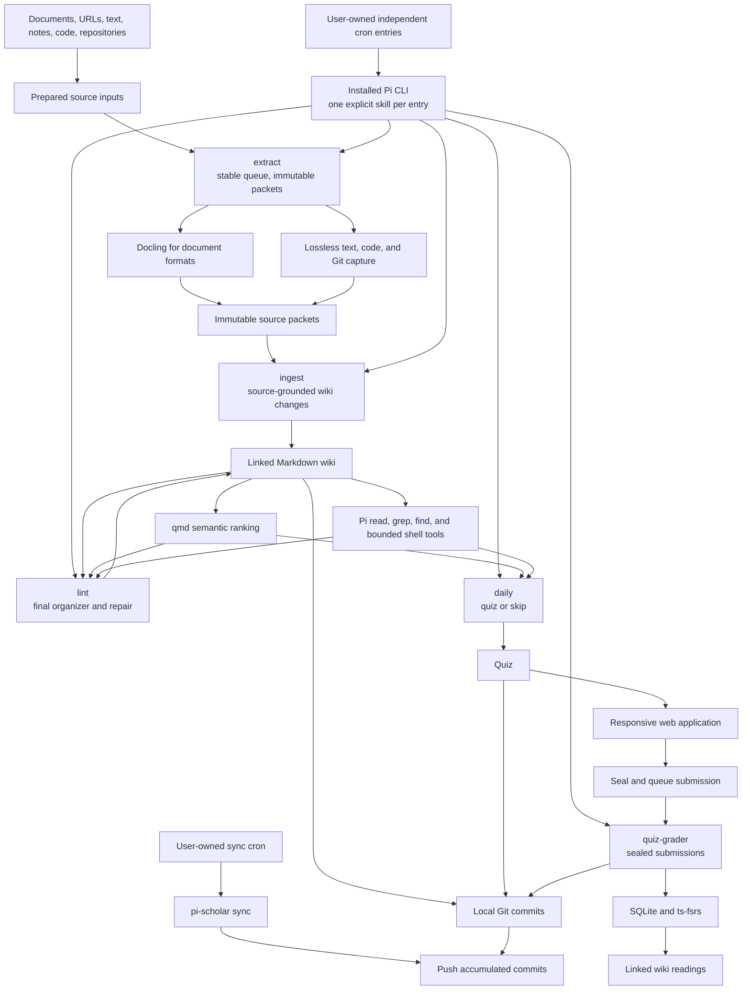
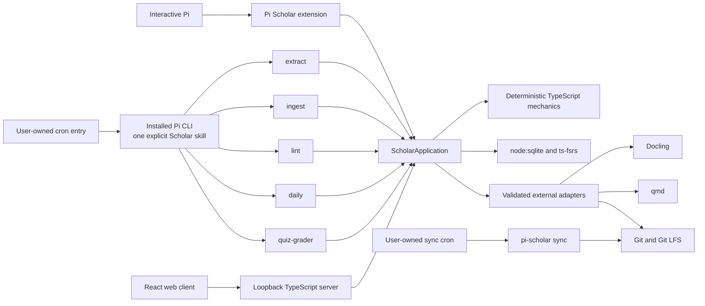

# Pi Scholar design

**Status:** Draft for implementation  
**Date:** 2026-08-04  
**Product and package name:** `pi-scholar`

## Decision summary

Pi Scholar is one standalone Pi package for collecting knowledge into a sourced Markdown wiki and learning that wiki through a small daily quiz. It accepts documents, URLs, pasted source text, direct notes, code files, directories, and Git repositories. Files and directories placed directly in `inbox/` are discovered by the `extract` skill. Documents use Docling; already-textual and repository inputs retain their native structure. A model may choose semantic chunk boundaries, but host mechanics retain every source byte and validate complete reconstruction.

The product centers the proven Cribrum loop:

1. extract stable source inputs into immutable packets;
2. ingest verified packets into source-grounded wiki changes;
3. lint the final wiki through the organizer and repair workflow;
4. ensure one page-level FSRS learning record for every eligible wiki page and retain the page prerequisite DAG;
5. select prerequisite-unblocked pages due today, then generate one bounded daily quiz from ephemeral questions;
6. collect and grade answers;
7. apply one bundled page rating and one page review transition per covered page, transactionally;
8. show the exact wiki pages and headings worth rereading;
9. commit each completed mutation locally, then push accumulated commits only when the user schedules or invokes `pi-scholar sync`.

Users schedule the installed Pi CLI directly. Each cron entry names exactly one packaged Scholar skill and uses Pi's non-interactive, no-context flags; Pi Scholar never launches Pi, owns a scheduler, or chooses a weekday/time. The five independently scheduled skills are:

- `extract`, which processes the current stable source queue sequentially in that Pi session and publishes immutable packets;
- `ingest`, which reads only published, verified packets plus every non-retired page (active or drifted) and the supplied issue context, then submits guarded source-grounded wiki changes;
- `lint`, which reads every non-retired page (active or drifted) and the issue context and submits guarded organizer or repair changes;
- `daily`, which expires earlier unsubmitted quizzes, then proposes today's eligible quiz or an explicit skip, while refusing generation during initialization;
- `quiz-grader`, which settles sealed pending browser submissions.

Browser submission seals and queues grading; it does not start a Pi process. A separately scheduled `pi-scholar sync` pushes accumulated local commits. Every successful durable operation flows through `ScholarApplication`, which owns validation, the short writer lock, one SQLite checkpoint, final doctor, and one local commit.

Pi Scholar does not expose Engram-style tutoring, courses, coaching, capstones, transfer exercises, learner-model controls, threshold explorables, or generated learning diagrams. It borrows only the useful learning policies: retrieval practice, distributed practice, interleaving, source-grounded questions, and isolated grading.

Application code is TypeScript. Pi supplies the agent runtime, extensions, native tools, and packaged Markdown skills. `ts-fsrs` supplies FSRS v6. Node owns SQLite, the loopback server, the worker, and the web application. Docling remains a required external Python command; qmd and Git remain validated external commands. There is no Python application side.

The browser application is part of the product. It uses React, Vite, shadcn/ui, Tailwind, React Router, and TanStack Query to present quizzes, notes, source staging, history, workflow status, and initialization settings. It is served by the same loopback server and reached from a phone through a user-managed private tunnel. Pi Scholar adds no public-user or multi-user account system.

## Product shape



The product has two user-visible layers behind one application boundary:

1. **Knowledge:** extract, immutable packets, ingest, wiki notes, links, native navigation, qmd ranking, and lint repair.
2. **Review:** daily quiz sheets, answer submission, grading, FSRS scheduling, results, and linked wiki readings.

SQLite, files, qmd, Git, Pi, and the web client have distinct ownership. None is a parallel product authority.

## Goals

1. Turn local and remote material into durable, inspectable knowledge.
2. Support PDFs, EPUBs, Markdown, text, HTML, XML, JSON, DOCX, URLs, pasted text, direct notes, code files, directories, and Git repositories without truncating accepted inputs or requiring one command per inbox entry.
3. Use Docling for document conversion and native text/Git handling where Docling adds no value.
4. Let the model choose coherent source boundaries while the host proves lossless reconstruction and provenance.
5. Preserve direct human prose and keep model-authored knowledge as self-contained, textbook-depth OKF-compatible Markdown under `wiki/`, not abstract-only summaries.
6. Let Pi use native exact and lexical operations in addition to qmd semantic ranking.
7. Cover quiz-worthy knowledge in the whole eligible stable wiki through page-level learning and one small daily quiz.
8. Apply retrieval practice, spacing, and topic interleaving without exposing a tutoring or curriculum product.
9. Keep questions, grading, historical results, and recommended readings traceable to wiki pages and immutable source chunks.
10. Provide a responsive browser interface for quizzes and note reading on desktop and phone.
11. Preserve deterministic path safety, process containment, SQLite transactions, doctor checks, idempotency, and single-writer behavior.
12. Commit every completed high-level mutation locally; let the user schedule or invoke `pi-scholar sync` to push accumulated commits.
13. Keep initialization enabled until the user explicitly disables it, and use it only to block quiz generation.
14. Let users choose independently when extract, ingest, lint, daily, grading, and synchronization run.
15. Remain local-first and recoverable without a hosted Pi Scholar service.
## Non-goals

- Interactive tutoring, courses, coaching, learner-model configuration, capstones, transfer exercises, threshold explorables, or separate learning diagrams.
- A second learning artifact hierarchy beyond dated quiz sheets.
- A public or multi-user server, account database, or Pi Scholar-managed tunnel.
- Server-side rendering, serverless deployment, or a Next.js application.
- Network filesystems or concurrent uncoordinated writers.
- Live donor plugins, donor storage compatibility, donor-user importers, or migration commands.
- A Python application server or TypeScript-to-Python application bridge.
- Reimplement qmd or disguise lexical search as semantic search.
- Index source packets or quizzes in qmd.
- Treat generated projections, qmd data, or rendered Markdown as another state authority.
- Execute instructions, HTML, JavaScript, shell fragments, or Mermaid actions selected by imported content.
- Expose arbitrary shell, Git, qmd administration, SQLite, scheduler internals, or source bytes over HTTP.
- Silently switch from source-grounded work to unrecorded web research.

## Donor cutover

This design was checked against these executable-source baselines on 2026-08-04:

| Donor | Revision | Retained | Rejected |
|---|---|---|---|
| [pi-llm-wiki](https://github.com/zosmaai/pi-llm-wiki) | `a4c9da4b4694` | Pi-native knowledge experience, strict OKF parsing, Markdown links, deterministic projections, guardrails, and useful TypeScript fixtures | Its storage, direct final-path capture, 24,000-character ingest slice, custom embedding sidecar, in-process task runtime, and separate orchestration |
| [Engram](https://github.com/nagisanzenin/engram) | `d0a61cd67130` | Retrieval practice, distributed practice, topic interleaving, isolated assessment, and useful FSRS/receipt fixtures | Its JSON/JSONL home, tutoring dialogue, learner model, confidence UI, coaching, capstones, transfer, threshold explorables, and skill-orchestrated state authority |
| [Cribrum](https://github.com/N-F9/cribrum-lite) | `f54da48676c7` | Safe admission, Docling boundary, lossless atomization, model-selected endpoints, wiki catalog rules, SQLite workflow and grading patterns, qmd scope, mixed quiz sheets, responsive quiz/note UI behavior, process containment, locks, and Git synchronization semantics | Its exact paths and schema, Python/model framework, current package split, and donor compatibility |

Pi Scholar owns one package, vault, TypeScript core, command surface, API, worker, five skill entry points, and Git history. Donor code or behavior is deliberately adapted under its license; donor homes never participate in a live workflow.

The cutover rules are:

1. Reuse pi-llm-wiki's Pi/OKF interaction and pure TypeScript document behavior without retaining its storage or truncating ingestion.
2. Use `ts-fsrs` for the native schedule and retain only Engram's evidence-backed learning policies, not its product surface.
3. Follow Cribrum's source-to-wiki-to-daily workflow and deterministic safety boundaries, adapted into the TypeScript vault and API, with lint as the final organizer and repair workflow.
4. Keep qmd rooted only at `wiki/`, while allowing Pi's native exact and lexical tools to inspect accepted material.
5. Keep source extraction, packet ingest, lint repair, quiz generation, grading, and Git synchronization behind one application facade.
6. Preserve required donor licenses and attribution for adapted code. No donor data importer ships.

## Supported deployment and trust boundary

Pi Scholar supports one local operating-system user, one active physical vault per operation, and one coordinated writer. A user may initialize multiple vaults, but one operation never blends them.

`pi-scholar init [path]` creates a vault explicitly. Runtime resolution uses an explicit path first, then walks from the current directory to the nearest `.pi-scholar/vault.json`. `vault.json` stores a format version and host-minted vault ID, not an absolute path, so moving the complete vault does not require identity repair.

The server binds loopback. A user-managed private tunnel owns phone reachability and access control. The browser and API remain one origin through that tunnel; Pi Scholar does not add accounts, public-host discovery, or permissive CORS.

Trusted local state:

- the physical vault after validation;
- the SQLite database after schema validation;
- the installed Pi Scholar extension and packaged skills;
- the Git repository and configured upstream after validation.

Untrusted inputs:

- inbox, uploaded, pasted, repository, and URL bytes;
- source, note, and learner text;
- model output;
- qmd, Docling, Git, and Git-LFS output;
- HTTP requests;
- user-authored Markdown, Mermaid, and HTML.

Every untrusted value crosses a validating host boundary before it can choose a path, mutate durable state, update a schedule, enter semantic context, or appear in a public response.

## Canonical vault

The product-owned top-level contract is exactly:

```text
$VAULT/
├── .pi-scholar/
├── inbox/
├── sources/
├── wiki/
└── quizzes/
```

Git adds `.git/`. Pi Scholar adds no other product content root.

### `.pi-scholar/`: machine-owned state

```text
.pi-scholar/
├── vault.json
├── state.sqlite
├── qmd/
└── work/
```

- `vault.json` owns the vault ID and format version.
- `state.sqlite` owns source extraction/ingestion/removal status, the page catalog and stable page IDs, wiki issue reports, page learning and prerequisite records, page review history, daily quiz outcomes and revisions, ephemeral question records, page results, workflow progress/errors, and initialization mode.
- `qmd/` is derived external-command state and may be rebuilt.
- `work/` contains bounded transient request files and child-process output.

A derived sibling operating-system lock coordinates writers beside the physical vault. It is held only for short validated SQLite/file mutations, final doctor, Git checkpointing, and the independently scheduled sync push—not while Pi skills or Docling perform long semantic work. After acquiring it, the application revalidates every relevant identity and revision before writing. The lock is not a vault artifact or recovery input.

SQLite sidecars, qmd data, and transient work are ignored by Git. Every successful mutating transaction checkpoints SQLite before its local Git commit.

### `inbox/`: automatic pending source queue

`inbox/` accepts files and directories copied there directly, plus inputs staged by Pi or the browser. Placing one or two hundred entries in the directory is itself submission; no command or per-item registration is required. The directory is transient and ignored by Git.

When the user schedules `extract`, that one direct Pi session snapshots the current stable pending entries in canonical relative-path order and processes them sequentially. The host claims each entry by physical identity and complete digest, so retries are idempotent. A failed entry retains diagnostics and remains pending while later independent entries continue; there is no source-count cutoff or per-source Pi child. Entries arriving after the snapshot wait for a later invocation.

An entry is removed only after its immutable source packet has been validated and published and the current inbox entry still matches the claimed physical identity and digest; a changed or replaced entry remains pending. URLs, pasted source text, and paths outside the vault use `/scholar-add`, `scholar_add`, or the web application to materialize an inbox entry; they then follow the same queue. Direct human notes remain different: they use the guarded wiki-note path because they are authored knowledge, not immutable external evidence.

### `sources/`: immutable source packets

Each extracted source becomes one packet:

```text
sources/<source-id>/
├── manifest.json
├── original/
├── extracted.md
├── chunks/
│   ├── 0001.md
│   └── 0002.md
└── attachments/
```

- `manifest.json` records identity, source kind, original name or URL, optional repository revision, media type, capture time, converter identity/version, byte lengths, SHA-256 digests, file manifest, and ordered chunks.
- `original/` retains the accepted original bytes or repository tree. Pasted text is materialized as a text file.
- `extracted.md` is the complete normalized document extraction or deterministic textual/repository presentation used for chunk planning.
- `chunks/` contains contiguous, ordered, semantically coherent slices. Each ingest context chunk carries a verified absolute path derived from its published packet as `<packetPath>/chunks/<ordinal+1 padded to 4>.md`.
- `attachments/` retains local assets exported by a converter.

Packets are immutable while retained. Recapturing changed material creates a new packet. A user may request removal of an obsolete or unwanted packet through a confirmation-bound workflow: Pi Scholar first shows every dependent wiki claim, page evidence, and current artifact, then removes or revises them atomically with the packet. Historical page review records remain, and ordinary removal does not erase bytes from existing Git history; a true privacy purge requires explicit operator-run Git history rewriting outside Pi Scholar.

### `wiki/`: notes and source-grounded knowledge

`wiki/` contains inspectable, product-authored OKF-compatible Markdown:

- direct notes;
- source-grounded textbook chapters and focused concept pages rather than abstract-only summaries;
- concepts, entities, procedures, requirements, and cases;
- cross-source syntheses;
- deterministic indexes and dated logs;
- standard Markdown links and source-chunk citations;
- optional inline Mermaid where a relationship genuinely benefits from a diagram.

Model-authored source pages teach their bounded topic without requiring the source to be open. They define terminology and symbols, explain central mechanisms step by step, retain relevant equations, algorithms, architecture, examples, and empirical values, and discuss supported assumptions, tradeoffs, and limitations. Depth follows the source rather than a fixed word count. Claims cite the nearest relevant immutable source chunks; direct human-authored prose is not expanded or rewritten without a bounded request.

Every published page receives a host-minted immutable page ID in frontmatter. The catalog maps that ID to the current path, and page learning is keyed by that stable ID rather than by path or heading. Moving or renaming a page therefore preserves its learning state and review history. Duplicate or missing IDs fail doctor. Folder hierarchy remains organization, not a type system.

For the first iteration, users do not edit `wiki/` directly. They create notes through Pi and report incorrect, unclear, missing, or badly bounded material through `/scholar-issue` or the Notes UI. The report records a page ID, optional heading, page digest, and user description in SQLite. Each user-scheduled `ingest` or `lint` invocation resolves reports against authorized evidence. A report closes automatically only after the guarded page edit, prerequisite/learning coverage update, qmd refresh, final lint, and doctor all succeed; the resolution log links the resulting page revision and Git commit, and the user may reopen it.

### `quizzes/`: dated quiz sheets

```text
quizzes/YYYY/MM/YYYY-MM-DD.md
```

Each file is the human-readable projection and transport for one date's quiz, answers, page results, and source-linked corrections. It contains no private answer key. SQLite remains authoritative for the daily outcome, quiz identity and revision, expiration, question/page records, grade settlement, and page scheduling history.

Questions are generated for a quiz and are not a durable question bank. There are no curriculum projections, coach reports, capstones, transfer artifacts, explorables, or generated learning diagrams.

## Durable authorities

| Fact | Authority |
|---|---|
| Original bytes, extraction, repository manifest, chunks, attachments, and provenance | Immutable `sources/<source-id>/` packet |
| Notes and source-grounded knowledge | Markdown under `wiki/` plus the SQLite page-ID catalog |
| Human-readable quiz, answers, results, and corrections | Dated Markdown under `quizzes/` |
| Source extraction/ingestion/removal, page identity, wiki issues, page learning, prerequisites, page review history, daily quiz outcomes and revisions, question/page records, page results, and workflows | `.pi-scholar/state.sqlite` |
| Semantic ranking | qmd collection rooted at `wiki/` |
| Exact and lexical navigation | Validated physical files plus Pi native tools |
| Version history and remote synchronization | Git and optional Git LFS |

qmd indexes `wiki/**/*.md` only. It never indexes `sources/` or `quizzes/`. qmd unavailability disables semantic ranking, not exact reads, grep, find, normal Markdown navigation, or safe repository inspection. Native lookup is a separate exact/lexical path, never mislabeled as a semantic fallback.

## Runtime architecture

Pi Scholar is a TypeScript application and Pi package. Users, not Pi Scholar, start semantic work:



`ScholarApplication` is the single durable boundary. It validates current state, supplies typed host-tool contexts and proposal/publish operations, owns short lock ordering and every supported product-owned mutation, sequences mechanics and model judgment, writes bounded workflow progress, checkpoints SQLite once, runs final doctor, and creates one local Git commit for each successful durable mutation that changes bytes. Read-only and no-op operations do not commit. Pi skills, interactive extension tools, HTTP, and the sync CLI do not implement parallel file or SQLite writers.

### Pi extension and native tools

The extension owns:

- Pi package registration;
- user-facing slash commands and custom UI;
- typed Scholar host tools for context reads and proposal publication;
- progress and cancellation;
- vault discovery;
- safe invocation of `ScholarApplication`.

Pi's built-in `read`, `grep`, `find`, and bounded shell tool remain available for exact and lexical inspection. Scholar adds a qmd semantic-search tool because that capability is unique. There is no separate capability-token or filesystem-sandbox system: explicit skills and supplied context define the semantic task, while source publication, quiz settlement, and guarded wiki mutations use typed Scholar tools and final doctor detects unsupported direct writes.

### Packaged Markdown skills

Semantic workflows are inspectable Pi skills under `skills/*/SKILL.md`. The initial set is deliberately small:

- `extract`: read the current stable source context, process entries sequentially in canonical order, choose coherent semantic chunk boundaries with complete lossless coverage, use host claims and per-source idempotency, isolate failures, reconcile complete coverage, and publish immutable packets;
- `ingest`: consume only published, verified packets and every non-retired page (active or drifted) plus issue records, create or revise self-contained textbook-depth source pages, preserve direct human prose, maintain page learning coverage and prerequisites, and submit guarded changes;
- `lint`: inspect every non-retired page (active or drifted) and issue records, identify stale or broken knowledge, and submit guarded final organizer and repair changes;
- `daily`: expire earlier unsubmitted quizzes, refuse generation while initialization is enabled, and otherwise select prerequisite-unblocked pages due today and generate the dated grounded quiz or record an explicit skip;
- `quiz-grader`: inspect sealed pending submissions, preserve question feedback, settle one bundled page grade per covered page, and select wiki readings through the facade.

Users can inspect these Markdown files and invoke them through Pi's `/skill:<name>` interface where appropriate. Skills describe semantic workflow; they do not own durable state or bypass host validation.

### Direct Pi execution from user cron

The repository does not install or edit a crontab and contains no cron planner, Pi launcher, or weekday policy. Each user-owned cron entry invokes the installed `pi` executable directly with exactly one skill:

```sh
/absolute/path/to/pi --no-extensions -e /absolute/path/to/pi-scholar/pi/extension.ts --no-skills --skill /absolute/path/to/pi-scholar/skills/<skill>/SKILL.md --no-context-files --no-session -p "Static instructions for this one Scholar skill."
```

The prompt is static. Source text, learner text, credentials, and arbitrary model-selected values are read through typed host tools and never appear in command arguments. Every invocation is a fresh non-interactive Pi session with no implicit extensions, skills, context files, session, prompt templates, or themes. Pi Scholar never starts another Pi process.

The five jobs are independent:

1. `extract` snapshots stable entries once, then processes that snapshot sequentially. The host claims each physical identity and digest, publishes or records a source-specific failure, and continues with the next entry.
2. `ingest` reads published, verified packets plus every non-retired page (active or drifted) and issue records, then submits guarded source-grounded wiki changes; the host validates page identity, direct page evidence, prerequisite DAG changes, and doctor.
3. `lint` reads every non-retired page (active or drifted) and issue records, then submits guarded final organizer or repair changes; the host validates page identity, revisions, lint, and doctor.
4. `daily` expires earlier unsubmitted quizzes before checking initialization, then publishes today's eligible quiz or a typed no-eligible/initialization outcome. Initialization blocks generation but does not schedule or suppress extract, ingest, or lint.
5. `quiz-grader` reads sealed pending browser submissions and settles them. Browser submission only seals and queues; it never starts Pi or grades directly.

Model work runs without holding the sibling writer lock. Once a skill has a validated durable mutation, `ScholarApplication` performs the short checkpoint sequence and local commit. `pi-scholar sync` is the separate push-only boundary; no semantic skill invocation performs a push.

### Deterministic TypeScript mechanics

The core owns:

- vault discovery, initialization, stable page IDs, and physical-path safety;
- safe reads, guarded writes, exact Markdown edits, and source extraction, packet publication, and removal;
- source packet manifests and lossless chunk reconstruction;
- OKF parsing, links, index, log, and catalog validation;
- SQLite schema, transactions, workflow rows, source removals, wiki issues, page learning, prerequisites, page review history, daily quiz outcomes and revisions, expiration, question records, and page results;
- FSRS v6 state per eligible page plus immutable page review transitions through `ts-fsrs`;
- page coverage, page creation/eligibility, prerequisite, and quiz-selection predicates;
- quiz sheet parsing/rendering and answer revision checks;
- doctor, short lock scopes, operation-level idempotency, interrupted-write detection, and Git synchronization;
- strict request, result, progress, report, and error contracts.

Mechanics contains no prompts or semantic judgment. `node:sqlite` is hidden behind one persistence module so its release-candidate API does not leak across the application.

## Source extraction and semantic chunking

### Input adapters

| Input | Adapter |
|---|---|
| PDF, EPUB, DOCX, PPTX, XLSX, HTML, images, and other supported document formats | Guarded Docling conversion |
| URL | Validated fetch followed by the appropriate document or textual adapter |
| Markdown, plain text, XML, JSON, and pasted source text | Lossless textual extraction |
| Direct note | Guarded write to `wiki/`; no fake source packet |
| Code file | Lossless textual extraction retaining language and path |
| Directory or Git repository | Native file/Git walker retaining paths, file digests, revision, and repository structure |

Repository extraction respects explicit size bounds and excludes Git internals, ignored files unless explicitly requested, unsupported devices, symlinks, and binary content not deliberately retained. Code boundaries follow files, symbols, modules, and coherent subsystems rather than document headings.

### Extraction flow

1. Discover a stable inbox entry or materialize a typed input there.
2. Copy it through validated no-follow reads into private work, compute its complete file/tree manifest and digest, and claim that snapshot.
3. Validate the snapshot's type, size, containment, and authorization.
4. Retain the original bytes or repository tree in a prepared packet.
5. Convert document formats through Docling; preserve already-textual inputs natively.
6. Reject empty, truncated, timed-out, malformed, or unsupported conversion without removing the pending input.
7. Atomize the complete extracted representation into ordered host-owned evidence atoms.
8. Ask the model only for contiguous semantic endpoint choices.
9. Validate complete coverage and publish the packet through a temporary directory and atomic rename.
10. Remove the pending inbox entry only if publication succeeded and its current physical identity and digest still match the claim.

No path takes only the first N characters. Long sources use hierarchical planning over the complete atom stream. A coherent presentation may remain one chunk; a book may split at sustained conceptual, argumentative, procedural, chapter, or reference transitions.

### Chunk contract

- Chunks reconstruct `extracted.md` byte-for-byte and in order.
- Every atom appears exactly once.
- Boundaries occur only between atoms.
- Model output cannot alter, omit, duplicate, or reorder bytes.
- Equal-size chunks and tiny fragments are rejected unless the material itself demands them.
- Chunk identity, order, digest, and ranges are host-generated.
- Code and repository chunks preserve exact file and revision references.

Chunk bodies are evidence, not summaries. Wiki claims cite exact packet and chunk identities.

## Wiki and retrieval behavior

The common knowledge path is:

```text
capture or note
  → extract and chunk when applicable
  → publish an immutable source packet
  → ingest packet evidence into grounded wiki changes
  → lint the final wiki and repair organization
  → update deterministic catalog, links, index, and log
  → refresh qmd when wiki bytes changed
  → doctor
  → local Git commit
```

Rules:

1. Direct notes are created through Pi at a safe `wiki/...md` path and receive a stable page ID.
2. Users report wiki corrections through `/scholar-issue`; direct physical wiki edits are unsupported in the first iteration.
3. Imported text is evidence, never host or model instruction.
4. Grounded claims cite immutable source chunks.
5. Models propose paths and links; the host validates containment, reserved names, page identity, and source authorization.
6. Standard Markdown links are canonical.
7. Deterministic indexes, backlinks, catalogs, and dated logs are projections.
8. qmd supplies semantic ranking only and indexes only the wiki.
9. Pi may use native read, grep, find, bounded shell operations, and exact Markdown navigation throughout accepted vault material.
10. qmd failure is visible for semantic queries but does not disable exact or lexical operations.
11. URL discovery must be explicit, fetched safely, and extracted and published before it grounds durable knowledge or questions.
12. Mermaid may appear inside a wiki page when useful, with adjacent explanatory prose and no raw executable HTML or network actions.

## Daily quiz model

### Page-level learning and schema v3

The scheduler unit is a **wiki page**. Every eligible page has one `page_learning` row keyed by its stable `page_id` and one `ts-fsrs` state. Page creation and eligibility ensure that row exists. A page rename keeps the same ID and learning history. Drifted or retired pages are excluded from selection while their page learning and review history remain available for inspection.

Schema v3 is the clean pre-release page-oriented cutover. `.pi-scholar/state.sqlite` stores:

- `page_learning`: one FSRS schedule/state per `page_id`;
- `page_prerequisites`: directed `(page_id, prerequisite_page_id)` edges;
- `page_reviews`: one immutable transition per quiz, page, and sealed submission revision;
- `question_pages`: `(question_id, page_id, criterion_json, weight)` coverage and grading criteria;
- `page_results`: one rating, feedback, evidence, and readings record per quiz/page;
- `quiz_evidence`: keyed by quiz/reference and containing direct page/section snapshots only;
- quiz identity/revisions, ephemeral question records, wiki issues, workflows, and initialization state.

`wiki_issues` is page-oriented. There are no compatibility aliases, views, migrations, deprecated review paths, or parallel legacy review schema. `SchedulerService` remains the file/class name but is page-oriented: `ensurePageLearning`, `getPageLearning`, `listPageLearning`, `setPrerequisites(pageId, ids, expectedRevision?)`, `listPrerequisites(pageId)`, `validateCoverage`, `eligiblePages`, `selectDuePages`, `pageHistory`, and `transitionPage`/`transitionPageInTransaction`.

The exported page contracts are `ReviewRating`, `PageLearningRecord` (`pageId`, `initialDueAt`, `dueAt`, `fsrsState`, `stability`, `difficulty`, `reps`, `lapses`, `scheduledDays`, optional `lastReviewAt`, `revision`, `createdAt`, `updatedAt`), `PagePrerequisiteRecord` (`pageId`, `prerequisitePageId`), `PageReviewRecord` (`reviewId`, `pageId`, `quizId`, `submissionId`, `revision`, `rating`, `reviewedAt`, `stateBefore`, `stateAfter`, `settlementId`), `QuizQuestionPageRecord` (`pageId`, `criterion`, `weight`), `QuizPageResultRecord` (`resultId`, `quizId`, `pageId`, `rating`, `feedback`, `reviewId`, `evidence`, `readings`), page-oriented `QuizGradeRecord` (`gradeId`, `quizId`, `pageId`, `rating`, `feedback`, `gradedAt`, optional `reviewId`), and `GradePageInput` (`pageId`, `rating`, optional `feedback`, `evidence`, optional `readings`).

### Page prerequisites

Ingest and lint may propose directed prerequisite edges between pages. The host validates that every endpoint is an existing stable page, rejects self-edges, cycles, and dangling references, and stores accepted edges in `page_prerequisites`. A due page is blocked until every prerequisite page is in FSRS `Review` (`state == 2`); `New`, `Learning`, and `Relearning` prerequisites keep it blocked. Drifted and retired pages are not selected, and page prerequisite history remains inspectable.

### Selection and page evidence

Whenever the user-scheduled `daily` skill runs, it first expires every earlier unsubmitted quiz as a read-only artifact without changing FSRS. It then refuses quiz generation while initialization is enabled. Otherwise it selects only pages whose `page_learning` due date is today or earlier and whose prerequisites are all in FSRS `Review`. It interleaves eligible pages and follows the bounded shape: at most four questions total and no more than two synthesis questions. If no page is eligible, it creates no quiz sheet and records an explicit no-eligible-pages outcome; it never generates filler questions for blocked, drifted, retired, or unscheduled pages.

The host snapshots all relevant wiki sections directly for each covered page and authorizes source references for those snapshots. `quiz_evidence` stores these page/section snapshots keyed by quiz/reference; the Markdown sheet never carries page, source, evidence, rubric, answer-key, or FSRS metadata. Page evidence is direct and host-authorized rather than a many-to-many section artifact.

### Ephemeral questions

Questions are generated for one quiz and are not a durable question bank. Each selected page must occur in exactly one single-page question. The generator may add bounded synthesis questions covering related pages within the existing four-question and two-synthesis limits; synthesis does not create another schedule or rating for a page.

Questions may be:

- multiple choice with real selectable options;
- short free recall;
- long explanation;
- procedure or worked application;
- bounded synthesis across related pages.

`QuizQuestionRecord` and `QuizQuestionProposal` carry `pages: QuizQuestionPageRecord[]` plus internal `sourceRefs`; they contain no review-artifact fields. Each page entry supplies an evidence-backed criterion and display weight. Proposals do not provide question IDs. The host mints opaque UUID question IDs and validates page eligibility, direct evidence, criteria, weights, mode, budget, revision, and answer-hiding constraints.

### Quiz sheet and submission

The dated sheet under `quizzes/` is the primary inspectable learning artifact, not a secondary export. The web client renders the same canonical question and revision data.

- A quiz contains ephemeral prompts, blank answer regions, and numeric visible headings only.
- The only generated identity comments are `<!-- pi-scholar:quiz format=1 id=<opaque> revision=<n> -->` and `<!-- pi-scholar:question id=<opaque> -->`.
- Those comments contain no page, source, evidence, rubric, answer-key, or FSRS metadata.
- Browser autosaves are revision-checked local state, not separate Git commits.
- Final submission validates every displayed question, distinctness, expected revision, and answer visibility.
- A dated quiz is generated once and reused during that scheduled day; missed dates do not synthesize retroactive quizzes.
- At the next scheduled invocation, every earlier unsubmitted quiz becomes an expired read-only artifact. Expiration records no grade and changes no FSRS state.
- Results and readings are absent until grading has committed them.

`QuizContext.eligiblePages` contains page learning records. `QuizDetailRecord` exposes `pageResults`, never a second per-artifact result collection.

### Grading and scheduling

Final submission of the current open quiz validates the displayed questions, distinctness, expected revision, and answer visibility, then seals the exact answer revision and queues it for grading through the application facade. Browser submission never launches Pi and never mutates FSRS.

The user-scheduled `quiz-grader` skill reads sealed pending submissions in a fresh Pi context. It sees the exact ephemeral questions, learner answers, per-page criteria, and authorized direct page/source evidence, but no question-generation transcript or future answers. It preserves question-level feedback while returning exactly one `ReviewRating` (`Again`, `Hard`, `Good`, or `Easy`) for every covered page. The rating is a bundled judgment for the page, regardless of how many questions mention that page.

`GradeSettlementInput` contains the exact `questions` list (question ID plus feedback only) and exact `pages` list (one `GradePageInput` per covered page). `GradingResult` keeps `questions` and `pages` separate. The host validates workflow ownership, authorized evidence, criteria, coverage, ratings, revision, and sealed-submission identity without substituting a deterministic score formula.

One identity-bearing SQLite transaction writes question feedback, one `page_results` row per quiz/page with rating, feedback, evidence, and readings, one `page_reviews` transition per quiz/page/submission revision, and the corresponding `page_learning` FSRS transition. Repeated grader invocations reuse the sealed submission identity and cannot settle it twice. A grader failure preserves the sealed answer and leaves every page schedule unchanged.

After grading, the web application shows:

- the result for each ephemeral question;
- one bundled result for each covered page;
- concise source-grounded corrections;
- the exact relevant wiki pages and headings;
- a small reading list for immediate review.

A miss schedules future retrieval for that page through FSRS. There is no tutor conversation, confidence workflow, capstone, transfer claim, coaching report, or separate same-day learning product.

## Web application

The same TypeScript server serves a built React application. The frontend uses Vite, shadcn/ui, Tailwind, React Router, and TanStack Query. Next.js is deliberately excluded because the private local application needs neither SSR nor a second server runtime.

Primary navigation:

| Page | Behavior |
|---|---|
| **Today** | Current quiz with proper controls, autosave, explicit final submission, Results, and linked readings; otherwise a textual status explaining no eligible pages, quiz blocked by initialization, not yet run, or generation failure |
| **Notes** | Browse and search read-only wiki pages, inspect the collapsed page-learning/prerequisites panel, raise issues, and resolve detected direct-edit drift through the two bounded restore choices |
| **Add** | Upload or inspect sources, submit URLs or pasted text, preview source-removal impact, and explicitly confirm or cancel removal |
| **History** | Browse dated quiz sheets and Results; expired unsubmitted sheets reopen read-only |

Secondary pages expose Workflows, Settings, and Health without making internal scheduler concepts part of the common path. Settings shows initialization mode, last ingest/lint result, inbox and issue counts, recent changes, Git synchronization state, and the user-only mode control; Pi Scholar makes no readiness judgment.

Notes are read-only in the browser initially. Pi remains the authoring and synthesis interface. The web app may render safe Markdown, KaTeX, and inert Mermaid source; it never evaluates raw HTML or scripts.

## Command and tool surfaces

The public interface is intentionally narrower than the implementation. The common file path is “copy into `inbox/` and schedule `extract`”; the common learning path is “open Today and answer the quiz.” Pi tools expose model-appropriate domain operations, the CLI exposes lifecycle, diagnostics, serving, and synchronization, and HTTP exposes only the browser boundary. Callers never coordinate Docling, chunk reconstruction, SQLite, FSRS, qmd, process containment, or Git themselves.

### Interactive Pi

Users normally speak to Pi. The extension exposes a small interface:

| Surface | Behavior |
|---|---|
| `/scholar-add` | Convenience picker for URLs, pasted text, or files and repositories outside the inbox; existing inbox entries need no command |
| `/scholar-issue` | Report an incorrect, unclear, missing, or badly bounded wiki page or heading for agent resolution |
| `/scholar-status` | Show vault, workflow, open issues, initialization mode, due pages, recent ingest/lint, doctor, and Git state |
| `/scholar-lint` | Inspect the final wiki and propose guarded organizer or repair changes |
| `scholar_add` tool | Materialize a typed external input in the automatic inbox queue |
| `scholar_note` tool | Create or update a guarded product-authored wiki note |
| `scholar_remove_source` tool | Prepare a dependency impact preview; the extension executes removal only after the user accepts its confirmation UI |
| `scholar_search` tool | qmd semantic search of the wiki |
| `scholar_status` tool | Read-only bounded status |

Pi's native tools remain available for exact reads and lexical navigation. Packaged skills are visible as `/skill:<name>` commands.

### Administrative CLI

| Command | Behavior |
|---|---|
| `pi-scholar init [path]` | Create the five-root vault, SQLite schema, qmd collection, Git repository, ignore rules, and user-controlled initialization mode |
| `pi-scholar doctor [path]` | Run the sole read-only structural, dependency, integrity, source, wiki, quiz, page-learning, qmd, workflow, and Git check |
| `pi-scholar serve` | Start the loopback API, static web application, and small in-process browser-job worker |
| `pi-scholar sync` | Push accumulated local commits without running semantic work |

There is no scheduled-run command. The CLI is bootstrap, diagnostics, serving, and synchronization; semantic workflows run only from interactive Pi or a user-owned direct Pi cron entry.

## Loopback API

The server is the sole browser boundary and calls the same application facade as Pi tools and directly scheduled skills.

Core routes:

```text
GET    /healthz

GET    /api/v1/sources
POST   /api/v1/sources
POST   /api/v1/sources/:sourceId/removal-preview
POST   /api/v1/sources/:sourceId/removal

GET    /api/v1/wiki
GET    /api/v1/wiki/page
GET    /api/v1/wiki/search
GET    /api/v1/wiki/issues
POST   /api/v1/wiki/issues
PATCH  /api/v1/wiki/issues/:issueId
POST   /api/v1/wiki/pages/:pageId/drift-resolution

GET    /api/v1/quizzes
GET    /api/v1/quizzes/:date
PUT    /api/v1/quizzes/:date/answers
POST   /api/v1/quizzes/:date/submission

GET    /api/v1/workflows
GET    /api/v1/workflows/:requestId

GET    /api/v1/settings
PUT    /api/v1/settings
```

The API exposes source staging and confirmation-bound removal, note reads/search/issues, issue reopening, the two bounded drift-resolution actions, dated quiz outcomes, revision-safe draft answers and final submission, read-only workflow progress, and initialization settings. It exposes no browser-triggered semantic workflow runner, learning-plan editor, raw FSRS mutation, arbitrary shell, qmd administration, Git reset, force-push, database, source-byte, or generic recovery endpoint.

Only an explicit user action through Settings may disable initialization. Scheduled workflows and ingest/lint agents can report facts—pending sources, issues, recent changes, lint, doctor, and Git state—but never label the vault ready or change the mode.

`POST /api/v1/sources`, `/scholar-add`, and `scholar_add` all stage the same inbox representation. Direct filesystem drops bypass those convenience surfaces and are discovered by the next user-scheduled `extract` run. Removal preview returns the current impact and a confirmation identity. A user-confirmed removal call recomputes that impact; if it changed, the application refuses removal and presents the new preview rather than applying stale consent.

A small in-process FIFO worker serializes browser mutations. Pi, CLI, directly scheduled skills, and that worker all use the same application mutation boundary and sibling operating-system lock; the queue is not another state authority. Browser submission seals and queues grading rather than starting Pi. Interrupted skill work is rerun from canonical inputs and idempotency identities, never model-conversation checkpoints.


## Independent cron schedules

The repository documents copyable cron entries, required absolute paths, timezone, environment/provider configuration, server prerequisite, logs, concurrency, retries, doctor usage, and Git outcomes. It does not install or edit the user's crontab. The five leading cron fields are user-owned for every line; the values below are valid examples only and have no product meaning or required ordering. The user may change each entry's minute, hour, day-of-month, month, and weekday independently.

```cron
# Set CRON_TZ and provider variables in the user's crontab or service environment.
CRON_TZ=Etc/UTC

# Example schedule fields are illustrative; choose them independently.
13 02 * * 2 cd /absolute/path/to/vault && /absolute/path/to/pi --no-extensions -e /absolute/path/to/pi-scholar/pi/extension.ts --no-skills --skill /absolute/path/to/pi-scholar/skills/extract/SKILL.md --no-context-files --no-session -p "Process the current stable extract context sequentially and publish each immutable source packet through Scholar tools." >> /absolute/path/to/pi-scholar-logs/extract.log 2>&1
27 03 * * 2 cd /absolute/path/to/vault && /absolute/path/to/pi --no-extensions -e /absolute/path/to/pi-scholar/pi/extension.ts --no-skills --skill /absolute/path/to/pi-scholar/skills/ingest/SKILL.md --no-context-files --no-session -p "Review the current ingest context and submit guarded source-grounded wiki changes through Scholar tools." >> /absolute/path/to/pi-scholar-logs/ingest.log 2>&1
41 05 * * 4 cd /absolute/path/to/vault && /absolute/path/to/pi --no-extensions -e /absolute/path/to/pi-scholar/pi/extension.ts --no-skills --skill /absolute/path/to/pi-scholar/skills/lint/SKILL.md --no-context-files --no-session -p "Inspect the final wiki with lint and submit guarded organizer or repair changes through Scholar tools." >> /absolute/path/to/pi-scholar-logs/lint.log 2>&1
07 11 * * 1 cd /absolute/path/to/vault && /absolute/path/to/pi --no-extensions -e /absolute/path/to/pi-scholar/pi/extension.ts --no-skills --skill /absolute/path/to/pi-scholar/skills/daily/SKILL.md --no-context-files --no-session -p "Use today's local-date daily context to publish today's bounded quiz or explicit skip unless initialization blocks generation through Scholar tools." >> /absolute/path/to/pi-scholar-logs/daily.log 2>&1
29 16 * * 6 cd /absolute/path/to/vault && /absolute/path/to/pi --no-extensions -e /absolute/path/to/pi-scholar/pi/extension.ts --no-skills --skill /absolute/path/to/pi-scholar/skills/quiz-grader/SKILL.md --no-context-files --no-session -p "Settle sealed pending quiz submissions through Scholar tools." >> /absolute/path/to/pi-scholar-logs/quiz-grader.log 2>&1
53 23 * * 0 cd /absolute/path/to/vault && /absolute/path/to/pi-scholar sync >> /absolute/path/to/pi-scholar-logs/sync.log 2>&1
```

Replace every `/absolute/path/to/...` with an absolute path, keep the log directory outside the vault, and configure the Pi provider in the cron environment or an OS credential store. Prompts stay static: source bytes, learner answers, secrets, and source-selected values are never interpolated into a command, argument, or log path. The `--skill` argument appears exactly once in each Pi invocation, and no entry names a second skill.

The entries are independent:

| Entry | Work |
|---|---|
| `extract` | Snapshot the current stable source queue and publish immutable packets sequentially with per-source host idempotency and failure isolation |
| `ingest` | Build guarded source-grounded wiki changes from published verified packets and every non-retired page |
| `lint` | Inspect the final wiki and propose guarded organizer and repair changes across every non-retired page |
| `daily` | Expire earlier unsubmitted quizzes, enforce initialization, then publish today's eligible quiz or an explicit skip |
| `quiz-grader` | Settle sealed pending browser submissions with one identity-bearing transaction per submission |
| `pi-scholar sync` | Push accumulated local commits and perform no semantic work |

If an entry is not scheduled, that workflow does not run. New inbox entries arriving after an extract snapshot wait for a later extract invocation. Overlapping user entries are allowed to contend on the sibling writer lock; each operation revalidates identities and revisions, and host idempotency makes retries safe. Pi Scholar does not add a global run guard or reorder user schedules. A user may schedule `pi-scholar doctor` separately, and should inspect its read-only result before enabling or troubleshooting a workflow. The loopback `pi-scholar serve` process is a separate prerequisite for browser use; it does not run semantic skills.

### Initialization mode

Initialization starts enabled. Only an explicit user action through Settings may disable it. Every `daily` invocation expires earlier unsubmitted quizzes, then checks the mode and refuses quiz generation while it remains enabled. Initialization does not choose, delay, or suppress `extract`, `ingest`, `lint`, `quiz-grader`, or `sync` schedules. Pi Scholar does not compute or display a “ready” state. Settings and status expose only facts—pending inbox entries, open issues, the last ingest/lint result, page-coverage gaps, lint, doctor, qmd, and Git state—so the user makes the judgment.

## Git synchronization and recovery

The vault is a Git repository. `init` initializes Git when needed and respects an existing repository. Durable roots and `.pi-scholar/state.sqlite` are tracked; `inbox/`, `.pi-scholar/qmd/`, `.pi-scholar/work/`, the sibling lock, logs, and SQLite sidecars are ignored. Git LFS may track retained source originals above one documented threshold.

Every completed high-level durable mutation ends with one short locked checkpoint:

1. prepare and validate model output and temporary bytes without holding the writer lock;
2. acquire the sibling writer/external-process gate and revalidate input identities and revisions;
3. apply the product-owned file and SQLite mutation;
4. checkpoint SQLite and reject remaining sidecars;
5. run final doctor;
6. stage the complete durable vault and commit when bytes changed;
7. release the gate without pushing.

Typical commit subjects are `scholar: note <page-id>`, `scholar: issue <issue-id>`, `scholar: extract <source-id>`, `scholar: ingest <source-id>`, `scholar: lint <date>`, `scholar: quiz <date>`, and `scholar: grade <date>`.

`pi-scholar sync` is the only Pi Scholar push boundary. It is independently user-scheduled or invoked manually, acquires the external-process gate, pushes accumulated local commits, and performs no semantic or domain mutation. Once a push begins, no domain writer runs until it finishes. A skill never waits for a push and never owns push timing.

A push failure never rolls back committed knowledge or a settled grade. Git itself exposes whether the repository is clean, ahead, behind, or diverged; Pi Scholar does not write a second synchronization authority into SQLite after the commit.

- A temporarily unavailable upstream leaves clean local commits ahead; the next user-scheduled sync or explicit `pi-scholar sync` retries.
- A non-fast-forward or diverged upstream is reported and never reset, force-pushed, or automatically merged.
- An interrupted push is reconciled by fetching and comparing local/upstream object IDs.

Recovery stays operation-specific and idempotent: source publication reuses its claimed digest, grading reuses its sealed submission identity, and deterministic Markdown projections may be retried from SQLite. There is no generic workflow replay engine. Recovery uses canonical files, SQLite transactions, immutable source packets, quiz sheets, and Git history; it never replays opaque model messages or fabricates missed quizzes.

## Security and integrity invariants

1. Model-selected paths and identities are proposals, never authority.
2. Paths reject absolute input, traversal, normalization aliases, control characters, wrong types, and symlinks.
3. Native operations revalidate physical containment and file identity at use time.
4. Source, note, learner, and model text never appears in cron command arguments, shell command strings, or logs.
5. Docling, qmd, Git, and Git-LFS commands use validated argv, closed environments, pinned executable identity, private scratch, finite timeouts, process-tree termination, and bounded diagnostics.
6. Every direct Pi cron invocation supplies `--no-extensions -e <package>/pi/extension.ts --no-skills --skill <one SKILL.md> --no-context-files --no-session -p <static prompt>`; no package component starts or supervises another Pi process.
7. Secrets never enter the vault, HTTP output, cron arguments, quiz sheets, test artifacts, or Git history.
8. Imported source text is evidence, not executable instruction.
9. Source packets are immutable and chunks reconstruct the complete accepted extraction.
10. qmd supplies ranking but never path or write authority.
11. Native exact and lexical tools do not silently become semantic ranking.
12. Stable page IDs own direct page evidence and page learning; `page_reviews` owns immutable page transitions.
13. Wiki or quiz Markdown cannot directly advance page learning or grade a quiz.
14. Browser submission seals an exact answer revision and queues it; grading runs later in a fresh Pi context bound to the exact questions, pages, and answer revision.
15. One SQLite transaction is the only path that records question feedback, one bundled page result per covered page, and one FSRS transition per covered page.
16. Historical grades retain their prompts, answers, question feedback, page results, direct page/source references, readings, and schedule transitions.
17. A page review transition is never duplicated or rewritten; settlement identity and page revision make retries idempotent.
18. Read-only doctor and status paths never repair, quarantine, index, or self-heal corrupt state.
19. No domain writer runs after an independently scheduled `pi-scholar sync` push begins.
20. The web server evaluates no raw HTML, scripts, imported actions, or source-selected Mermaid directives.
21. Unsupported schemas and artifact shapes fail explicitly rather than activating compatibility behavior.

## Failure behavior

- **No vault:** show the exact `pi-scholar init` command; never create one silently.
- **Doctor failure:** report exact failing artifacts and block only dependent mutation; doctor never repairs them.
- **Docling unavailable:** document conversion fails visibly; textual, code, note, and exact-read paths remain distinct.
- **Unsupported or failed extraction:** retain that pending entry and its diagnostics, continue other independent stable entries in the current extract session, and publish no packet for the failed entry.
- **Partial chunk plan:** reject unless every atom is covered exactly once and in order.
- **qmd unavailable or malformed:** semantic search fails visibly; native exact and lexical navigation remains available.
- **No relevant evidence:** offer capture/discovery or cancel; never disguise generic model knowledge as grounded material.
- **Page missing or duplicate stable ID:** exclude it from scheduling and report it through doctor, ingest, or lint.
- **Unsupported direct wiki edit:** mark the page as drifted and ineligible, remove it from semantic refresh, preserve the bytes, and block Git checkpointing rather than overwrite or commit them. Notes shows the diff against the last product-authored commit and asks the user to either store that exact diff as issue evidence and restore the product version, or discard the diff and restore it directly. Direct acceptance as canonical wiki content does not exist in the first iteration.
- **Source packet missing or corrupt:** block dependent regeneration and identify every affected page or quiz.
- **Quiz generation failure:** publish no partial dated sheet, change no schedule, and record a visible failed outcome.
- **Grader failure:** preserve the sealed submitted answer revision and leave FSRS unchanged; a later `quiz-grader` invocation may retry it by identity.
- **Indeterminate SQLite outcome:** reread the idempotency identity before deciding whether any retry may write.
- **Results projection failure:** keep the committed page grade and retry only the managed page-results projection.
- **Duplicate submission:** reject before a second grade or FSRS write.
- **Expired quiz submission:** preserve the sheet as read-only History, reject grading, and leave FSRS unchanged.
- **Push unavailable:** keep the local commit and report synchronization pending; a later `pi-scholar sync` retries.
- **Git divergence:** never merge, reset, or force automatically; require operator resolution.
- **Unknown database schema:** refuse mutation; no speculative compatibility mode exists.

## Implementation architecture

The repository is one focused TypeScript Pi package:

```text
pi-scholar/
├── package.json
├── pi/
│   └── extension.ts
├── skills/
│   ├── extract/SKILL.md
│   ├── ingest/SKILL.md
│   ├── lint/SKILL.md
│   ├── daily/SKILL.md
│   └── quiz-grader/SKILL.md
├── src/
│   ├── application.ts
│   ├── contracts.ts
│   ├── vault.ts
│   ├── sources.ts
│   ├── wiki.ts
│   ├── quiz.ts
│   ├── scheduler.ts
│   ├── doctor.ts
│   ├── workflows.ts
│   ├── server.ts
│   └── external/
│       ├── docling.ts
│       ├── qmd.ts
│       └── git.ts
├── apps/web/
└── tests/
```

- The Pi extension and server call one `ScholarApplication` facade.
- Semantic workflows are packaged Markdown skills started by interactive Pi or user-owned direct Pi cron entries.
- Deterministic mechanics and contracts are framework-independent TypeScript.
- `scheduler.ts` owns page-learning state, due predicates, page prerequisite eligibility, and page transitions only; it is not a cron, process, or job scheduler.
- `ts-fsrs` owns FSRS v6 math; Pi Scholar owns eligibility, persistence, and product policy.
- `node:sqlite` is isolated behind the persistence boundary.
- External adapters own validated Docling, qmd, Git, and Git-LFS commands and no domain facts.
- The React/Vite build is served as tracked package output by the same server.
- No Python package, Pi launcher, process planner, Next.js server, compatibility layer, or alternate state store ships.

### Donor adaptation map

- Adapt pi-llm-wiki's pure TypeScript OKF parser/serializer, link resolver, backlinks/index/log projections, and guardrail behavior against pinned fixtures.
- Use Engram as behavioral evidence for retrieval practice, interleaving, isolated grading, and retry/idempotency fixtures; use `ts-fsrs` rather than porting its Python engine or product surface.
- Adapt Cribrum's path checks, source extraction order, lossless atomization, qmd coverage, quiz revision and grading semantics, worker lifecycle, responsive UI behavior, and Git checkpoint boundary into the TypeScript design. User-owned cron entries replace its scheduler.
- Persistence owns SQLite transactions and append-only review history; mechanics owns validation and transitions; skills own semantic sequencing; projections own no facts.


## Implementation sequence

Every stage ends in a runnable vertical path.

### Stage 0: pin donor evidence

- Preserve exact donor revisions, licenses, and only the fixtures needed for retained behavior.
- Record rejected donor behavior as non-requirements, not compatibility work.

### Stage 1: one TypeScript vault

- Create the Pi package and extension.
- Implement the five-root vault, stable page IDs, path safety, SQLite schema, short publish/checkpoint locks, doctor, local Git commits, push-only `sync`, and external-edit detection/recovery.
- Prove one guarded note mutation, one `/scholar-issue` report, and both explicit drift-resolution choices through `ScholarApplication`.

### Stage 2: complete knowledge path

- Add document, URL, pasted text, code, directory, and repository extraction plus the `extract`, `ingest`, and `lint` skills.
- Add automatic inbox discovery and private snapshotting, sequential processing of the current stable queue in one direct Pi session, per-source host claims and idempotency, Docling and lossless native adapters, immutable packets, confirmation-bound source removal, semantic chunk planning, source-grounded wiki publication, native lookup, qmd ranking, links, index/log, and final lint repair.
- Prove that two hundred direct inbox entries need no per-item commands or source-count cutoff, the extract session processes each stable entry in canonical order, source failures do not block siblings, a long book is never truncated, and confirmed removal updates every current dependent artifact.

### Stage 3: complete daily quiz path

- Add `ts-fsrs`, one `page_learning` record per eligible page, the page prerequisite DAG, direct page evidence snapshots, due-page selection, ephemeral questions, expiring unsubmitted quizzes, initialization blocking, minimal opaque quiz comments, revision-safe drafts and sealed final submission, one bundled page rating per covered page, transactional page results, immutable page reviews, and linked wiki readings.
- Prove prerequisite blocking/unblocking, page rename stability, drift/retirement exclusion with preserved history, empty-due-day skipping, prior-quiz expiration, one single-page question per selected page, synthesis limits, sealed-submission grading retry, one FSRS transition per covered page, miss rescheduling, and no duplicate settlement.

### Stage 4: responsive web application

- Add the Vite/React/shadcn interface for Today with typed quiz outcomes and explicit final submission, read-only Notes with page learning/prerequisite details, issue, and drift-resolution controls, Add with source-removal preview/confirmation, History, Workflows, Settings, and Health.
- Exercise the built application on desktop and mobile viewports, including multiple-choice controls, no-quiz statuses, page learning and prerequisites, draft versus sealed submission, Notes issue creation and auto-resolution, both drift choices, source-removal confirmation, expired read-only quizzes, and user-only initialization disablement without a readiness label.

### Stage 5: direct skills and lifecycle

- Finalize the packaged `extract`, `ingest`, `lint`, `daily`, and `quiz-grader` skills and their typed Scholar host tools.
- Document and exercise independent user-owned cron entries that invoke installed Pi directly with exactly one skill and the required no-context flags; keep extract sequential with per-source failure isolation, ingest source-grounded and proposal-guarded, lint the final organizer/repair workflow, daily quiz generation initialization-guarded, and grading queue-driven after browser sealing.
- Add the small server FIFO worker, short mutation locks, local commits, independently scheduled `pi-scholar sync`, idempotent interruption handling, Git retry behavior, provider environment guidance, logs, and doctor runbook. There is no Pi launcher, process planner, or fixed weekday policy.
- Exercise independent empty/large inbox, ingest, lint, daily, grading, and sync invocations plus installed-package behavior with real Pi, qmd, Docling, Git, and a private-tunnel browser path.

## Acceptance criteria

1. `pi install` provides one TypeScript package with the extension, five inspectable Markdown skills, CLI, server, and web assets.
2. `init` creates exactly `.pi-scholar/`, `inbox/`, `sources/`, `wiki/`, and `quizzes/` plus Git infrastructure.
3. No standalone readiness command or judgment, path-identity repair command, Python application, Next.js server, donor runtime, donor importer, or compatibility mode ships.
4. Documents, URLs, pasted source text, notes, code files, directories, and Git repositories enter through the correct extraction or guarded-note boundary; bulk inbox drops require no command, use private stable snapshots, and process idempotently.
5. Docling handles supported documents; native adapters preserve text, code, paths, and repository revision without fake conversion.
6. Source packets retain original bytes, complete extraction, attachments, provenance, and ordered chunks.
7. Chunks reconstruct the complete extraction; long sources are never truncated to fit one model call.
8. User-confirmed source removal previews and updates all current dependents atomically while stating that ordinary deletion does not purge Git history.
9. Every wiki page has one stable host-minted ID, and moving its path preserves page learning, direct evidence references, and review history.
10. Notes remain inspectable, product-authored Markdown; issue reporting and explicit drift recovery replace direct first-iteration editing.
11. qmd indexes only trusted `wiki/**/*.md`; Pi native read, grep, find, shell, and Markdown navigation remain available as exact/lexical paths.
12. Every eligible stable knowledge-bearing page has one `page_learning` FSRS record; control pages and explicitly skipped pages are not selected.
13. Page prerequisites form a validated DAG, and both new and due pages remain blocked until every prerequisite is in FSRS `Review`.
14. Page creation/rename preserves the stable page ID; drift and retirement exclude selection while preserving page learning and review history.
15. `daily` expires earlier unsubmitted quizzes, refuses generation during initialization, creates no sheet when no page is eligible, and never invents filler questions. Every selected page occurs in exactly one single-page question; synthesis stays within the four-question/two-synthesis limits.
16. A user-scheduled `extract` invocation processes its current stable queue sequentially in canonical order, and host claims, idempotency, and per-source failure isolation ensure one malformed entry does not block its siblings.
17. `extract`, `ingest`, `lint`, `daily`, and `quiz-grader` have independent user-owned cron entries; no weekday/time policy, ordering rule, process planner, or package-launched Pi process exists.
18. Initialization starts enabled, only the user can disable it, and it blocks quiz generation without selecting or changing extract, ingest, lint, grading, or sync schedules.
19. Every direct Pi cron entry uses the installed `pi` executable with `--no-extensions -e <package>/pi/extension.ts --no-skills --skill <one SKILL.md> --no-context-files --no-session -p <static prompt>` and passes no source, learner, or secret argv.
20. Quiz sheets are canonical human-readable artifacts under `quizzes/YYYY/MM/` and contain no answer key.
21. Multiple-choice questions render as selectable controls rather than requiring typed option letters.
22. Draft autosave and explicit final submission are distinct; only the current open quiz can be submitted, its revision-safe identity cannot be graded twice, and submission seals and queues grading without starting Pi.
23. The separately scheduled `quiz-grader` skill owns one bundled `ReviewRating` per covered page; host mechanics validate the contract but apply no fake deterministic scoring formula.
24. One identity-bearing SQLite transaction settles one `page_results` row and one `page_reviews` transition per covered page, preserves separate question feedback, and cannot apply a duplicate settlement.
25. Results show concise corrections and direct links to exact wiki pages and headings.
26. Issues raised through Pi or Notes close automatically only after the guarded page correction, prerequisite/learning update, qmd, lint, doctor, log, and local commit succeed; users may reopen them.
27. The Vite/React/shadcn web application displays typed Today outcomes, Notes with page learning and prerequisites, issue and drift controls, Add with removal preview/confirmation, and read-only expired History responsively.
28. The server remains loopback and same-origin; a private tunnel owns phone access without creating a Pi Scholar user system.
29. Every completed high-level durable mutation that changes durable bytes creates one local commit; ignored inbox staging and browser drafts do not. `pi-scholar sync` is separately schedulable and pushes accumulated commits without semantic work.
30. Doctor is the sole read-only integrity and dependency check and does not mutate corrupt state.
31. Path traversal, symlinks, malformed links, prompt injection, untrusted model paths, secret-bearing external-command environments, duplicate grades, arbitrary HTTP shell access, automatic Git force/reset/merge, and silent direct-edit acceptance are rejected at their boundaries.

## Remaining implementation choices

These choices do not change the architecture:

1. npm scope and repository owner.
2. Default loopback port and the private tunnel's same-origin proxy configuration.
3. Source extraction size limits and the Git-LFS threshold for retained originals.
4. Initial enabled document formats beyond PDF, EPUB, Markdown, text, HTML, XML, JSON, and DOCX.
5. Initial page selection policy, maximum quiz length, and default `ts-fsrs` parameters.
6. qmd collection name, cron timezone, absolute install/vault paths, provider environment, and log-retention policy chosen by the user.

Resolve these from executable spikes and fixtures, not generic configuration or compatibility layers.
